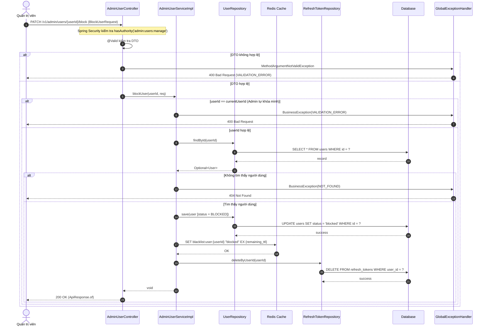
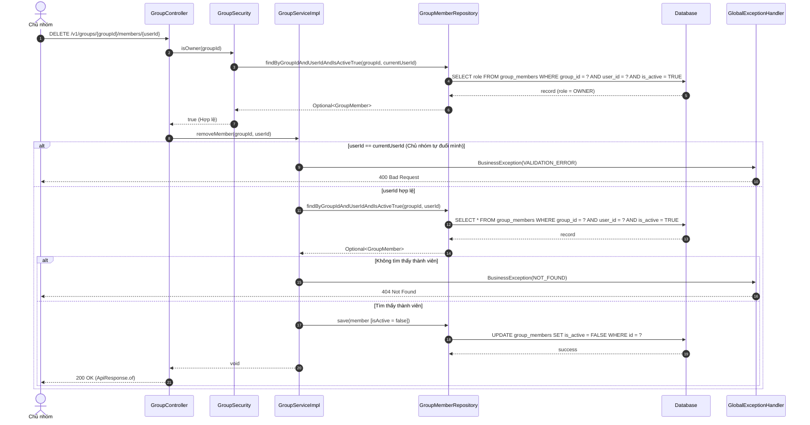
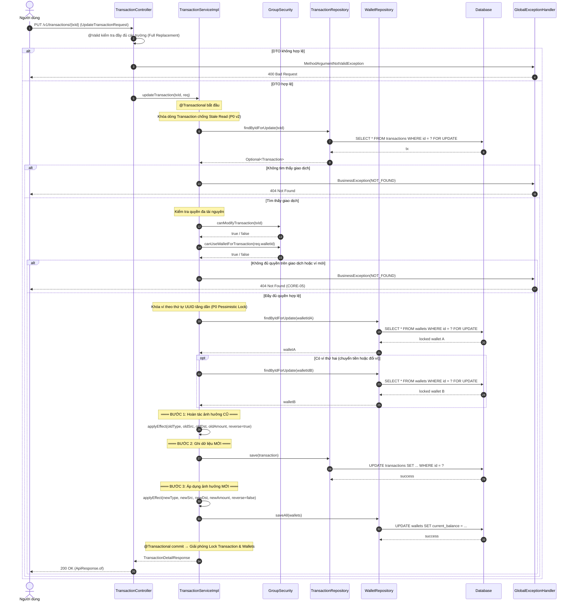
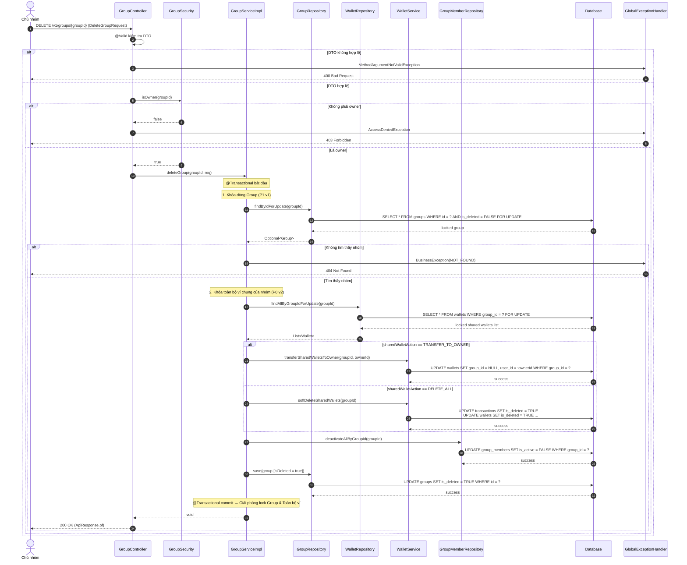

# TÀI LIỆU THIẾT KẾ PHÂN QUYỀN HỆ THỐNG & NHÓM GIA ĐÌNH

**Dự án**: Finance AI Server — Ứng dụng Quản lý Tài chính Cá nhân Thông minh  
**Hạng mục**: Thiết kế Chi tiết Module Phân quyền theo Quy trình Spring Boot (RESTful API & Layered Architecture)  
**Phiên bản**: 5.2 (Bổ sung khóa dòng Transaction chống Stale Read, khóa tập ví chung khi xóa nhóm chống Race Condition,
và chuẩn hóa canUseWalletForTransaction)

---

## MỤC LỤC

1. [TỔNG QUAN KIẾN TRÚC PHÂN QUYỀN](#1-tổng-quan-kiến-trúc-phân-quyền)
    * 1.1. Kiến trúc phân tầng Spring Boot
    * 1.2. Ba tầng phân quyền độc lập
    * 1.3. Bảng ma trận quyền hạn nhóm
    * 1.4. Chính sách mã lỗi bảo mật (403 Forbidden vs 404 Not Found)
2. [THIẾT KẾ CƠ SỞ DỮ LIỆU TỔNG THỂ (DATABASE SCHEMA & ERD)](#2-thiết-kế-cơ-sở-dữ-liệu-tổng-thể-database-schema--erd)
3. [MODULE 1: KHÓA TÀI KHOẢN NGƯỜI DÙNG (ADMIN RBAC)](#3-module-1-khóa-tài-khoản-người-dùng-admin-rbac)
    * Bước 1: Kịch bản Use Case & Thiết kế RESTful API Endpoint
    * Bước 2: Thiết kế Lớp Thực thể (`@Entity`), Enum và DTO
    * Bước 3: Thiết kế Tĩnh — Biểu đồ Lớp Phân tầng (Spring Boot Class Diagram)
    * Bước 4: Thiết kế Động — Biểu đồ Tuần tự (Sequence Diagram)
    * Bước 5: Kịch bản Kiểm thử REST API (Test Cases)
4. [MODULE 2: ĐUỔI THÀNH VIÊN KHỎI NHÓM GIA ĐÌNH (GROUP OWNER)](#4-module-2-đuổi-thành-viên-khỏi-nhóm-gia-đình-group-owner)
    * Bước 1–5 (cấu trúc tương tự)
5. [MODULE 3: SỬA GIAO DỊCH TRÊN VÍ CHUNG (DATA-LEVEL SECURITY & CONCURRENCY)](#5-module-3-sửa-giao-dịch-trên-ví-chung-data-level-security--concurrency)
    * Bước 1: Kịch bản Use Case, Khóa dòng Transaction & Ngăn ngừa Stale Read / Lost Update
    * Bước 2: Thiết kế Lớp Thực thể (`@Entity`), Enum và DTO Full Replacement
    * Bước 3: Thiết kế Tĩnh — Biểu đồ Lớp Phân tầng & Pessimistic Locking
    * Bước 4: Thiết kế Động — Biểu đồ Tuần tự (Sequence Diagram)
    * Bước 5: Kịch bản Kiểm thử REST API (Test Cases & Concurrency Matrix)
6. [MODULE 4: XÓA NHÓM GIA ĐÌNH & GIẢI QUYẾT VÍ CHUNG (GROUP OWNER)](#6-module-4-xóa-nhóm-gia-đình--giải-quyết-ví-chung-group-owner)
    * Bước 1: Kịch bản Use Case & Khóa đồng bộ Tập ví chung chống Race Condition
    * Bước 2: Thiết kế Lớp Thực thể (`@Entity`), Enum và DTO
    * Bước 3: Thiết kế Tĩnh — Biểu đồ Lớp Phân tầng
    * Bước 4: Thiết kế Động — Biểu đồ Tuần tự (Sequence Diagram)
    * Bước 5: Kịch bản Kiểm thử REST API (Test Cases & Race Condition Matrix)
7. [XỬ LÝ CÁC CA BIÊN BẢO MẬT & MÃ NGUỒN THAM KHẢO](#7-xử-lý-các-ca-biên-bảo-mật--mã-nguồn-tham-khảo)
    * 7.1. Xử lý tài khoản bị khóa qua Redis Blacklist (TTL động)
    * 7.2. Mã nguồn Bean kiểm tra quyền động (`GroupSecurity.java`)
    * 7.3. Các Enum phân quyền và kiểu miền dữ liệu

---

## 1. TỔNG QUAN KIẾN TRÚC PHÂN QUYỀN

Hệ thống áp dụng mô hình phân quyền đa tầng (Multi-tier Authorization), bảo đảm nguyên tắc cốt lõi: **Dữ liệu cá nhân
tuyệt đối riêng tư; chỉ dữ liệu ví chung và ngân sách chung mới chia sẻ trong nhóm**.

### 1.1. Kiến trúc phân tầng Spring Boot

```text
 [Client / Frontend] (React, Mobile App, Postman...)
        │  ▲
        │  │ (HTTP Request / Response - JSON Format)
        ▼  │
 [Controller Layer] (@RestController) ──► Nhận HTTP Request, Validate DTO, đóng gói ApiResponse
        │  ▲
        ▼  │
 [Security Layer]   (@PreAuthorize /  ──► Kiểm tra quyền hệ thống (RBAC) & quyền động (GroupSecurity)
                     GroupSecurity)
        │  ▲
        ▼  │
 [Service Layer]    (@Service)        ──► 100% Business Invariant, quản lý Giao dịch (@Transactional)
        │  ▲
        ▼  │
 [Repository Layer] (@Repository)     ──► Kế thừa JpaRepository, Khóa dòng (Pessimistic Locking)
        │  ▲
        ▼  │
 [Database Layer]   (PostgreSQL 16)
```

### 1.2. Ba tầng phân quyền độc lập

* **Tầng 1 — Phân quyền Hệ thống (System RBAC)**: Dùng cho Quản trị viên (`ROLE_ADMIN`) qua
  `@PreAuthorize("hasAuthority('admin:...')")`. RBAC được quản lý bằng dữ liệu qua 4 bảng: `roles`, `permissions`,
  `role_permissions`, `user_roles`.
* **Tầng 1b — Phân quyền Gói cước (Plan Feature Gate)**: Sử dụng trường enum `plan` (`FREE` vs `PREMIUM`) trên `users`
  để kiểm soát hạn mức gọi AI và số nhóm gia đình tối đa được phép tạo.
* **Tầng 2 — Phân quyền Ngữ cảnh Nhóm & Tài nguyên (Group Context & Data-Level Security)**:
    * Một người dùng có thể là `OWNER` của nhóm A nhưng là `MEMBER` của nhóm B. Quyền trong nhóm không phải role toàn
      cục.
    * Phân quyền động được kiểm tra tại boundary thông qua bean `@groupSecurity` kết hợp với Service layer xác thực
      quyền truy cập trên từng tài nguyên cụ thể (`groupId`, `walletId`, `transactionId`).

### 1.3. Bảng ma trận quyền hạn nhóm

| Quyền hạn trong nhóm                                  | Chủ nhóm (`OWNER`) | Thành viên (`MEMBER`) | Ghi chú nghiệp vụ                                 |
|-------------------------------------------------------|:------------------:|:---------------------:|---------------------------------------------------|
| Xem danh sách thành viên                              |         ✅         |          ✅           | Mọi thành viên active đều xem được                |
| Mời thành viên mới                                    |         ✅         |          ❌           | Chỉ chủ nhóm mới phát sinh link/mã mời            |
| Xóa thành viên khỏi nhóm                              |         ✅         |          ❌           | Đặt `is_active = false`, không xóa cứng           |
| Xóa nhóm gia đình                                     |         ✅         |          ❌           | Bắt buộc chọn phương án giải quyết ví chung       |
| Xem giao dịch ví chung                                |         ✅         |          ✅           | Chia sẻ minh bạch tài chính gia đình              |
| Tạo giao dịch trên ví chung                           |         ✅         |          ✅           | Thành viên nào cũng được ghi nhận thu/chi         |
| Sửa/xóa giao dịch **do mình tạo** trên ví chung       |         ✅         |          ✅           | Tự chịu trách nhiệm nội dung mình ghi             |
| Sửa/xóa giao dịch **do người khác tạo** trên ví chung |         ✅         |          ❌           | Chủ nhóm có quyền dọn dẹp khi thành viên vắng mặt |

### 1.4. Chính sách mã lỗi bảo mật (403 Forbidden vs 404 Not Found)

Nhằm tuân thủ nguyên tắc bảo mật **CORE-05** (`docs/api/00-QUY-UOC-CHUNG.md`) và ngăn chặn tấn công dò quét dữ liệu tài
chính (Information Disclosure):

1. **HTTP 403 Forbidden**:
    * Áp dụng khi: Người dùng **đã được xác thực chắc chắn là có mặt trong ngữ cảnh** (ví dụ: là thành viên của nhóm
      `groupId`) nhưng **không đủ vai trò/quyền hạn** để thực hiện hành động quản trị (ví dụ: thành viên cố tình gọi API
      xóa nhóm hoặc đuổi thành viên khác).
    * Mục đích: Thông báo rõ ràng việc từ chối phân quyền trong ngữ cảnh đã biết.
2. **HTTP 404 Not Found**:
    * Áp dụng khi: Người dùng cố tình truy cập hoặc sửa đổi **dữ liệu tài chính riêng tư** (giao dịch cá nhân của người
      khác, ví của người khác, giao dịch ví chung mà mình không có quyền sở hữu/quản lý).
    * Mục đích: **Che giấu sự tồn tại của bản ghi**, không để kẻ tấn công biết được ID đó có thực sự tồn tại trên hệ
      thống hay không.

---

## 2. THIẾT KẾ CƠ SỞ DỮ LIỆU TỔNG THỂ (DATABASE SCHEMA & ERD)

```
+--------------------------+                      +--------------------------+
|          User            | 1                0..*|        UserRole          |
+--------------------------+----------------------+--------------------------+
| - id: UUID               |                      | - userId: UUID           |
| - email: String          |                      | - roleId: UUID           |
| - firstName: String      |                      +--------------------------+
| - lastName: String       |                                   | *
| - plan: UserPlan         |                                   |
| - status: UserStatus     |                                   | 1
| - isDeleted: boolean     |                      +--------------------------+
+--------------------------+                      |          Role            |
     | 1                | 1                       +--------------------------+
     |                  |                         | - id: UUID               |
     | 0..*             | 0..*                    | - name: String           |
     |                  |                         +--------------------------+
     |                  |                                      | 1
     |                  |                                      |
     |                  |                                      | 0..*
     |                  |                         +--------------------------+
     |                  |                         |      RolePermission      |
     |                  |                         +--------------------------+
     |                  |                         | - roleId: UUID           |
     |                  |                         | - permissionId: UUID     |
     |                  |                         +--------------------------+
     |                  |                                      | *
     |                  |                                      |
     |                  |                                      | 1
     |                  |                         +--------------------------+
     |                  |                         |        Permission        |
     |                  |                         +--------------------------+
     |                  |                         | - id: UUID               |
     |                  |                         | - name: String           |
     |                  |                         +--------------------------+
     |                  |
     |                  v 1
+----+---------------------+                      +--------------------------+
|       GroupMember        |*                 1   |          Group           |
+--------------------------+----------------------+--------------------------+
| - id: UUID               |                      | - id: UUID               |
| - groupId: UUID          |                      | - name: String           |
| - userId: UUID           |                      | - createdById: UUID      |
| - role: GroupRole        |                      | - inviteCode: String     |
| - joinedAt: Instant      |                      | - createdAt: Instant     |
| - isActive: boolean      |                      | - isDeleted: boolean     |
+--------------------------+                      +--------------------------+
                                                               | 1
                                                               |
                                                               | 0..*
+--------------------------+                      +--------------------------+
|       Transaction        |*                  1  |          Wallet          |
+--------------------------+----------------------+--------------------------+
| - id: UUID               |                      | - id: UUID               |
| - walletId: UUID         |                      | - userId: UUID           |
| - destinationWalletId:   |                      | - groupId: UUID          |
|     UUID (nullable)      |                      | - name: String           |
| - userId: UUID           |                      | - currentBalance: Long   |
| - amount: Long           |                      | - isDeleted: boolean     |
| - type: TransactionType  |                      +--------------------------+
| - categoryId: UUID       |
| - note: String           |  Ràng buộc CSDL (ck_wallets_owner):
| - date: LocalDate        |  (user_id IS NOT NULL AND group_id IS NULL)
| - isDeleted: boolean     |  OR (user_id IS NULL AND group_id NOT NULL)
+--------------------------+
```

---

## 3. MODULE 1: KHÓA TÀI KHOẢN NGƯỜI DÙNG (ADMIN RBAC)

### Bước 1: Kịch bản Use Case & Thiết kế RESTful API Endpoint

* **Use Case**: Khóa tài khoản người dùng (Block User Account).
* **Tác nhân (Actor)**: Quản trị viên (`ROLE_ADMIN`).
* **HTTP Method & URL**: `PATCH /v1/admin/users/{userId}/block`
* **Headers**: `Content-Type: application/json`, `Authorization: Bearer <token>`
* **Request Body**: `BlockUserRequest` (JSON record) — chứa `reason`
* **Response Body**: `ApiResponse<Void>` (JSON)

#### 1. Kịch bản chính (Main Success Flow — 200 OK):

1. **Client** gửi HTTP Request `PATCH /v1/admin/users/{userId}/block` kèm body
   `{ "reason": "Vi phạm quy chế chi tiêu" }`.
2. **`ManagerUserController`** tiếp nhận request, kích hoạt validation `@Valid`. Spring Security kiểm tra
   `@PreAuthorize("hasAuthority('admin:users:manage')")`.
3. **`ManagerUserController`** ủy quyền xử lý cho `adminUserService.blockUser(userId, request)`.
4. **`ManagerAccountServiceImpl`** kiểm tra quy tắc nghiệp vụ: `userId != currentUserId` (Admin không được phép tự khóa
   tài
   khoản của chính mình).
5. **`ManagerAccountServiceImpl`** gọi `userRepository.findById(userId)` để tìm người dùng.
6. **`UserRepository`** trả về `Optional<User>`.
7. **`ManagerAccountServiceImpl`** cập nhật `user.setStatus(UserStatus.BLOCKED)` và gọi `userRepository.save(user)`.
8. **`ManagerAccountServiceImpl`** ghi khóa vào Redis Blacklist (`blacklist:user:{userId}`) với TTL bằng thời hạn còn
   lại của
   token (hoặc 1 giờ mặc định) để chặn ngay lập tức các JWT còn hạn lưu hành.
9. **`ManagerAccountServiceImpl`** gọi `refreshTokenRepository.deleteByUserId(userId)` để hủy toàn bộ phiên refresh
   token của
   người dùng.
10. **`ManagerUserController`** trả về HTTP Status **`200 OK`** kèm
    `ApiResponse.of(null, "Khóa tài khoản người dùng thành công")`.

#### 2. Kịch bản ngoại lệ (Exception Flows):

* **Ngoại lệ 1: Thiếu quyền Quản trị viên (403 Forbidden)**
    * *Tại bước 2*: SecurityContext không chứa authority `admin:users:manage`.
    * *Xử lý*: `GlobalExceptionHandler` bắt `AccessDeniedException` và phản hồi HTTP `403 Forbidden` kèm
      `{ "success": false, "error": { "code": "FORBIDDEN", "message": "Bạn không có quyền truy cập tài nguyên này." } }`.
* **Ngoại lệ 2: Không tìm thấy người dùng (404 Not Found)**
    * *Tại bước 5*: `userRepository` không tìm thấy người dùng có ID tương ứng.
    * *Xử lý*: Ném `BusinessException(ErrorCode.NOT_FOUND, "Không tìm thấy người dùng")`, phản hồi HTTP `404 Not Found`.
* **Ngoại lệ 3: Quản trị viên tự khóa chính mình (400 Bad Request)**
    * *Tại bước 4*: Phát hiện `userId.equals(currentUserId)`.
    * *Xử lý*: Ném
      `BusinessException(ErrorCode.VALIDATION_ERROR, "Quản trị viên không được phép tự khóa tài khoản của chính mình")`,
      phản hồi HTTP `400 Bad Request`.
* **Ngoại lệ 4: Lý do khóa bị bỏ trống (400 Bad Request)**
    * *Tại bước 2*: Validation `@NotBlank` trên trường `reason` thất bại.
    * *Xử lý*: Phản hồi HTTP `400 Bad Request` kèm chi tiết lỗi validation.

---

### Bước 2: Thiết kế Lớp Thực thể (`@Entity`), Enum và DTO

#### 1. Các Thực thể & Enum RBAC

```java
// Enum trạng thái người dùng
public enum UserStatus { PENDING_VERIFY, ACTIVE, BLOCKED }
public enum UserPlan { FREE, PREMIUM }
```

```text
+---------------------------------------------------+
|                  «Entity» User                    |
+---------------------------------------------------+
| - id: UUID              {@Id}                     |
| - email: String         {@Column(unique=true)}    |
| - firstName: String                               |
| - lastName: String                                |
| - status: UserStatus    {@Enumerated(STRING)}     |
| - plan: UserPlan        {@Enumerated(STRING)}     |
| - isDeleted: boolean                              |
+---------------------------------------------------+
```

4 bảng RBAC hệ thống (migration V13):

* `Role`: `id: UUID`, `name: String` (`ROLE_ADMIN`, `ROLE_USER`)
* `Permission`: `id: UUID`, `name: String` (`admin:users:read`, `admin:users:manage`, `admin:categories:manage`,
  `admin:system:view_stats`)
* `UserRole`: Composite PK (`userId`, `roleId`)
* `RolePermission`: Composite PK (`roleId`, `permissionId`)

#### 2. DTO Input & Output

```java
public record BlockUserRequest(
        @NotBlank(message = "Lý do khóa không được để trống")
        @Size(max = 500, message = "Lý do khóa không vượt quá 500 ký tự")
        String reason
) {
}
```

---

### Bước 3: Thiết kế Tĩnh — Biểu đồ Lớp Phân tầng (Spring Boot Class Diagram)

Áp dụng chuẩn **Constructor Injection** (`@RequiredArgsConstructor` của Lombok):

```text
+--------------------------------------------------------------------------------+
|                  «RestController» AdminUserController                          |
+--------------------------------------------------------------------------------+
| - adminUserService: AdminUserService                                          |
+--------------------------------------------------------------------------------+
| + blockUser(userId: UUID, req: BlockUserRequest): ApiResponse<Void>            |
|   @PatchMapping("/{userId}/block")                                             |
|   @PreAuthorize("hasAuthority('admin:users:manage')")                          |
+--------------------------------------------------------------------------------+
                                       │
                                       │ (gọi / depends on)
                                       ▼
+--------------------------------------------------------------------------------+
|                  «Service» AdminUserService (Interface)                        |
+--------------------------------------------------------------------------------+
| + blockUser(userId: UUID, req: BlockUserRequest): void                        |
+--------------------------------------------------------------------------------+
                                       ▲
                                       │ (implements)
+--------------------------------------------------------------------------------+
|                  «Service» AdminUserServiceImpl                                |
+--------------------------------------------------------------------------------+
| - userRepository: UserRepository                                               |
| - refreshTokenRepository: RefreshTokenRepository                              |
| - redisTemplate: StringRedisTemplate                                          |
| - securityContextUtil: SecurityContextUtil                                     |
+--------------------------------------------------------------------------------+
| + blockUser(userId: UUID, req: BlockUserRequest): void                        |
+--------------------------------------------------------------------------------+
                                       │
                                       ▼
+--------------------------------------------------------------------------------+
|                  «Repository» UserRepository (Interface)                       |
+--------------------------------------------------------------------------------+
| extends JpaRepository<User, UUID>                                              |
+--------------------------------------------------------------------------------+
| + findById(id: UUID): Optional<User>                                           |
+--------------------------------------------------------------------------------+
```

---

### Bước 4: Thiết kế Động — Biểu đồ Tuần tự (Sequence Diagram)



---

### Bước 5: Kịch bản Kiểm thử REST API (Test Cases)

| Mã Test Case  | Loại Test Case  | Mục đích kiểm thử               | HTTP Request Input                                                              | Mock / Trạng thái CSDL          | Kết quả kỳ vọng (Expected Output)                                                               |
|:--------------|:----------------|:--------------------------------|:--------------------------------------------------------------------------------|:--------------------------------|:------------------------------------------------------------------------------------------------|
| **TC_USR_01** | **Luồng chuẩn** | Admin khóa tài khoản thành công | `PATCH /v1/admin/users/{userId}/block`<br>Body: `{ "reason": "Spam hệ thống" }` | User tồn tại, status = `ACTIVE` | **Status**: `200 OK`<br>CSDL: `status = BLOCKED`, refresh token bị xóa, Redis có key blacklist. |
| **TC_USR_02** | **Forbidden**   | User thường cố gọi API Admin    | `PATCH /v1/admin/users/{userId}/block`<br>Body: `{ "reason": "test" }`          | Token user thường (`ROLE_USER`) | **Status**: `403 Forbidden`<br>`{ "error": { "code": "FORBIDDEN" } }`                           |
| **TC_USR_03** | **Not Found**   | Khóa tài khoản không tồn tại    | `PATCH /v1/admin/users/{randomId}/block`<br>Body: `{ "reason": "test" }`        | CSDL không có `{randomId}`      | **Status**: `404 Not Found`<br>`{ "error": { "code": "NOT_FOUND" } }`                           |
| **TC_USR_04** | **Validation**  | Admin tự khóa chính mình        | `PATCH /v1/admin/users/{adminId}/block`<br>Body: `{ "reason": "test" }`         | `userId == currentUserId`       | **Status**: `400 Bad Request`<br>`{ "error": { "code": "VALIDATION_ERROR" } }`                  |
| **TC_USR_05** | **Validation**  | Bỏ trống lý do khóa             | `PATCH /v1/admin/users/{userId}/block`<br>Body: `{ "reason": "" }`              | Bất kỳ                          | **Status**: `400 Bad Request`<br>`{ "error": { "code": "VALIDATION_ERROR" } }`                  |

---

## 4. MODULE 2: ĐUỔI THÀNH VIÊN KHỎI NHÓM GIA ĐÌNH (GROUP OWNER)

### Bước 1: Kịch bản Use Case & Thiết kế RESTful API Endpoint

* **Use Case**: Đuổi thành viên khỏi nhóm gia đình (Remove Group Member).
* **Tác nhân (Actor)**: Chủ nhóm (`GroupRole.OWNER`).
* **HTTP Method & URL**: `DELETE /v1/groups/{groupId}/members/{userId}`
* **Headers**: `Authorization: Bearer <token>`
* **Response Body**: `ApiResponse<Void>` (JSON)

#### 1. Kịch bản chính (Main Success Flow — 200 OK):

1. **Client** gửi request `DELETE /v1/groups/{groupId}/members/{userId}`.
2. **`GroupController`** tiếp nhận. Spring Security kiểm tra `@PreAuthorize("@groupSecurity.isOwner(#groupId)")`.
3. **`GroupController`** gọi `groupService.removeMember(groupId, userId)`.
4. **`GroupServiceImpl`** kiểm tra quy tắc nghiệp vụ: `userId != currentUserId` (Chủ nhóm không tự xóa chính mình).
5. **`GroupServiceImpl`** truy vấn `groupMemberRepository.findByGroupIdAndUserIdAndIsActiveTrue(groupId, userId)`.
6. **`GroupMemberRepository`** trả về `Optional<GroupMember>`.
7. **`GroupServiceImpl`** cập nhật `member.setActive(false)` và gọi `groupMemberRepository.save(member)`.
8. Hệ thống bảo lưu lịch sử: **Không xóa dòng CSDL**, giữ nguyên toàn bộ giao dịch thành viên đã từng ghi trên ví chung.
9. **`GroupController`** phản hồi HTTP Status **`200 OK`** kèm
   `ApiResponse.of(null, "Đã xóa thành viên khỏi nhóm thành công")`.

#### 2. Kịch bản ngoại lệ (Exception Flows):

* **Ngoại lệ 1: Người thực hiện không phải Chủ nhóm (403 Forbidden)**
    * *Tại bước 2*: `@groupSecurity.isOwner(#groupId)` đánh giá `false` (người gọi là `MEMBER`).
    * *Xử lý*: Trả về HTTP `403 Forbidden`. Áp dụng 403 vì người gọi đã là thành viên trong nhóm, biết rõ nhóm tồn tại.
* **Ngoại lệ 2: Chủ nhóm cố tự đuổi mình (400 Bad Request)**
    * *Tại bước 4*: Phát hiện `userId.equals(currentUserId)`.
    * *Xử lý*: Ném
      `BusinessException(ErrorCode.VALIDATION_ERROR, "Chủ nhóm không thể tự xóa chính mình. Vui lòng chuyển quyền hoặc giải tán nhóm")`,
      trả về HTTP `400 Bad Request`.
* **Ngoại lệ 3: Thành viên không tồn tại trong nhóm (404 Not Found)**
    * *Tại bước 5*: Không tìm thấy bản ghi `GroupMember` đang active.
    * *Xử lý*: Ném `BusinessException(ErrorCode.NOT_FOUND, "Không tìm thấy thành viên trong nhóm")`, trả về HTTP
      `404 Not Found`.

---

### Bước 2: Thiết kế Lớp Thực thể (`@Entity`), Enum và DTO

```java
public enum GroupRole { OWNER, MEMBER }
```

```text
+---------------------------------------------------+
|            «Entity» GroupMember                    |
+---------------------------------------------------+
| - id: UUID              {@Id}                     |
| - groupId: UUID                                   |
| - userId: UUID                                    |
| - role: GroupRole       {@Enumerated(STRING)}     |
| - joinedAt: Instant                               |
| - isActive: boolean                               |
+---------------------------------------------------+
```

---

### Bước 3: Thiết kế Tĩnh — Biểu đồ Lớp Phân tầng (Spring Boot Class Diagram)

```text
+--------------------------------------------------------------------------------+
|                     «RestController» GroupController                           |
+--------------------------------------------------------------------------------+
| - groupService: GroupService                                                   |
+--------------------------------------------------------------------------------+
| + removeMember(groupId: UUID, userId: UUID): ApiResponse<Void>                |
|   @DeleteMapping("/{groupId}/members/{userId}")                                |
|   @PreAuthorize("@groupSecurity.isOwner(#groupId)")                            |
+--------------------------------------------------------------------------------+
                                       │
                                       ▼
+--------------------------------------------------------------------------------+
|                     «Service» GroupService (Interface)                         |
+--------------------------------------------------------------------------------+
| + removeMember(groupId: UUID, userId: UUID): void                             |
+--------------------------------------------------------------------------------+
                                       ▲
                                       │ (implements)
+--------------------------------------------------------------------------------+
|                     «Service» GroupServiceImpl                                 |
+--------------------------------------------------------------------------------+
| - groupMemberRepository: GroupMemberRepository                                 |
| - securityContextUtil: SecurityContextUtil                                     |
+--------------------------------------------------------------------------------+
| + removeMember(groupId: UUID, userId: UUID): void                             |
+--------------------------------------------------------------------------------+
                                       │
                                       ▼
+--------------------------------------------------------------------------------+
|                «Repository» GroupMemberRepository (Interface)                  |
+--------------------------------------------------------------------------------+
| extends JpaRepository<GroupMember, UUID>                                        |
+--------------------------------------------------------------------------------+
| + findByGroupIdAndUserIdAndIsActiveTrue(groupId, userId): Optional<GroupMember>|
+--------------------------------------------------------------------------------+
```

---

### Bước 4: Thiết kế Động — Biểu đồ Tuần tự (Sequence Diagram)



---

### Bước 5: Kịch bản Kiểm thử REST API (Test Cases)

| Mã Test Case  | Loại Test Case  | Mục đích kiểm thử                    | HTTP Request Input                               | Mock / Trạng thái CSDL                       | Kết quả kỳ vọng (Expected Output)                                              |
|:--------------|:----------------|:-------------------------------------|:-------------------------------------------------|:---------------------------------------------|:-------------------------------------------------------------------------------|
| **TC_MBR_01** | **Luồng chuẩn** | Chủ nhóm đuổi thành viên hợp lệ      | `DELETE /v1/groups/{groupId}/members/{userId}`   | User là `OWNER`; `userId` là `MEMBER` active | **Status**: `200 OK`<br>CSDL: `is_active = FALSE`, lịch sử giao dịch bảo toàn. |
| **TC_MBR_02** | **Forbidden**   | Thành viên thường cố đuổi người khác | `DELETE /v1/groups/{groupId}/members/{userId}`   | User là `MEMBER`                             | **Status**: `403 Forbidden`                                                    |
| **TC_MBR_03** | **Validation**  | Chủ nhóm tự đuổi chính mình          | `DELETE /v1/groups/{groupId}/members/{ownerId}`  | `userId == currentUserId`                    | **Status**: `400 Bad Request`                                                  |
| **TC_MBR_04** | **Not Found**   | Đuổi người dùng không thuộc nhóm     | `DELETE /v1/groups/{groupId}/members/{randomId}` | `{randomId}` không có trong nhóm             | **Status**: `404 Not Found`                                                    |
| **TC_MBR_05** | **Boundary**    | Đuổi thành viên cuối cùng            | `DELETE /v1/groups/{groupId}/members/{userId}`   | Nhóm chỉ còn 1 owner + 1 member              | **Status**: `200 OK`<br>Nhóm hoạt động bình thường với 1 người.                |

---

## 5. MODULE 3: SỬA GIAO DỊCH TRÊN VÍ CHUNG (DATA-LEVEL SECURITY & CONCURRENCY)

### Bước 1: Kịch bản Use Case, Khóa dòng Transaction & Ngăn ngừa Stale Read / Lost Update

* **Use Case**: Sửa giao dịch trên ví chung (Update Shared Transaction).
* **Tác nhân (Actor)**: Thành viên nhóm (`MEMBER`) hoặc Chủ nhóm (`OWNER`).
* **HTTP Method & URL**: `PUT /v1/transactions/{transactionId}`
* **Chuẩn ngữ nghĩa**: **Full Replacement (Toàn vẹn bản ghi)** — Client bắt buộc gửi đầy đủ tất cả các trường dữ liệu
  của giao dịch.
* **Headers**: `Content-Type: application/json`, `Authorization: Bearer <token>`
* **Request Body**: `UpdateTransactionRequest` (JSON record)
* **Response Body**: `ApiResponse<TransactionDetailResponse>` (JSON)

#### 1. Khóa dòng Transaction chống Stale Read (P0 v2):

* Nếu đọc `Transaction` bằng `findById` thông thường trước khi khóa ví: Hai request A và B cùng sửa một giao dịch sẽ đọc
  cùng dữ liệu cũ. Request B sau khi đợi A commit sẽ hoàn tác số tiền cũ đã bị ghi đè $\rightarrow$ **Sai lệch số dư
  vĩnh viễn (Stale Read)**.
* **Giải pháp**: Áp dụng **Pessimistic Write Lock ngay trên dòng Transaction**
  (`transactionRepository.findByIdForUpdate(transactionId)`) ngay khi bắt đầu transaction, đảm bảo request đọc luôn lấy
  được trạng thái dữ liệu mới nhất đã commit và tuần tự hóa các request sửa cùng 1 giao dịch.

#### 2. Nguyên tắc bảo mật tài nguyên đa ví (Multi-resource Authorization - P0 v1 / P1 v2):

Khi cập nhật giao dịch, client có quyền thay đổi `walletId` hoặc `destinationWalletId`. Hệ thống bắt buộc phải kiểm tra
quyền trên cả 3 đối tượng:

1. **Giao dịch hiện tại (`transactionId`)**: `groupSecurity.canModifyTransaction(transactionId)`.
    * Ví cá nhân: Bắt buộc `tx.userId == currentUserId`.
    * Ví chung: `OWNER` được sửa mọi giao dịch; `MEMBER` chỉ được sửa giao dịch do chính mình tạo
      (`tx.userId == currentUserId`).
2. **Ví nguồn mới (`newWalletId`)**: `groupSecurity.canUseWalletForTransaction(newWalletId)`. Người dùng phải có quyền
   sử dụng ví mới (ví cá nhân của mình hoặc ví chung mà mình là active member).
3. **Ví đích mới (`newDestinationWalletId`)**: Nếu `type == TRANSFER`, bắt buộc kiểm tra
   `groupSecurity.canUseWalletForTransaction(newDestinationWalletId)`.

> **Chính sách mã lỗi**: Nếu thất bại bất kỳ bước kiểm tra quyền tài nguyên nào ở trên, hệ thống trả về **
> `404 Not Found`** (theo CORE-05) để không làm lộ sự tồn tại của ví/giao dịch không thuộc quyền.

#### 3. Khóa ví chống Lost Update số dư & Quy tắc chống Deadlock:

* Hệ thống áp dụng **Pessimistic Locking** (`SELECT ... FOR UPDATE` thông qua `@Lock(LockModeType.PESSIMISTIC_WRITE)`
  trên `WalletRepository`).
* **Quy tắc chống Deadlock**: Khi giao dịch liên quan đến nhiều ví (đổi ví hoặc chuyển khoản), các ví bắt buộc phải được
  khóa theo **thứ tự UUID tăng dần** (`ORDER BY id ASC`).

#### 4. Kịch bản chính (Main Success Flow — 200 OK):

1. **Client** gửi request `PUT /v1/transactions/{transactionId}` kèm đầy đủ dữ liệu cập nhật.
2. **`TransactionController`** tiếp nhận, kiểm tra validation `@Valid` trên DTO.
3. **`TransactionController`** gọi `transactionService.updateTransaction(transactionId, request)`.
4. **`TransactionServiceImpl`** bắt đầu `@Transactional`.
5. **Khóa dòng Transaction (P0 chống Stale Read)**: Gọi `transactionRepository.findByIdForUpdate(transactionId)`. Không
   tìm thấy $\rightarrow$ ném 404.
6. **Kiểm tra quyền sở hữu & tài nguyên liên quan**:
    * Gọi `groupSecurity.canModifyTransaction(transactionId)`.
    * Gọi `groupSecurity.canUseWalletForTransaction(request.walletId())`.
    * Nếu `request.type() == TRANSFER`, kiểm tra
      `groupSecurity.canUseWalletForTransaction(request.destinationWalletId())` và kiểm tra
      `walletId != destinationWalletId`.
    * Nếu bất kỳ điều kiện nào sai $\rightarrow$ ném 404 Not Found.
7. **Khóa ví theo cơ chế Pessimistic Locking**:
    * Tập hợp danh sách các ví bị ảnh hưởng: `{ oldWalletId, oldDestWalletId, newWalletId, newDestWalletId }` (loại bỏ
      trùng lặp và null).
    * Sắp xếp danh sách UUID theo thứ tự tăng dần.
    * Lần lượt gọi `walletRepository.findByIdForUpdate(wId)` để xác lập row-level lock trên CSDL.
8. **Thực hiện cập nhật số dư 3 bước đối xứng (CLAUDE.md Rule 4)**:
    * **Bước 8a — Hoàn tác ảnh hưởng CŨ**: Gọi
      `applyEffect(oldType, oldWallet, oldDestWallet, oldAmount, isReverse = true)`.
    * **Bước 8b — Ghi giá trị MỚI**: Cập nhật các trường dữ liệu từ DTO vào entity `Transaction`, gọi
      `transactionRepository.save(tx)`.
    * **Bước 8c — Áp dụng ảnh hưởng MỚI**: Gọi
      `applyEffect(newType, newWallet, newDestWallet, newAmount, isReverse = false)`.
9. Lưu các thay đổi số dư của các ví liên quan (`walletRepository.save(...)`).
10. Commit `@Transactional` $\rightarrow$ CSDL tự động giải phóng lock trên Transaction và các Wallet.
11. **`TransactionController`** trả về HTTP Status **`200 OK`** kèm dữ liệu chi tiết giao dịch đã cập nhật.

---

### Bước 2: Thiết kế Lớp Thực thể (`@Entity`), Enum và DTO Full Replacement

```java
// Enum loại giao dịch
public enum TransactionType { EXPENSE, INCOME, TRANSFER }
```

#### 1. Lớp DTO Đầu vào Full Replacement (`UpdateTransactionRequest`)

```java
public record UpdateTransactionRequest(
    @NotNull(message = "Ví nguồn không được để trống")
    UUID walletId,

    UUID destinationWalletId, // Bắt buộc có nếu type == TRANSFER

    UUID categoryId,           // Bắt buộc có nếu type != TRANSFER

    @NotNull(message = "Loại giao dịch không được để trống")
    TransactionType type,

    @NotNull(message = "Số tiền không được để trống")
    @Positive(message = "Số tiền giao dịch phải lớn hơn 0")
    Long amount,

    @NotNull(message = "Ngày giao dịch không được để trống")
    LocalDate date,

    @Size(max = 500, message = "Ghi chú không vượt quá 500 ký tự")
    String note,

    String displayName,
    Boolean countsInReport
) {}
```

#### 2. Lớp DTO Đầu ra (`TransactionDetailResponse`)

```java
public record TransactionDetailResponse(
        UUID id,
        UUID walletId,
        UUID destinationWalletId,
        UUID categoryId,
        TransactionType type,
        Long amount,
        LocalDate date,
        String note,
        String displayName,
        UUID userId
) {
}
```

---

### Bước 3: Thiết kế Tĩnh — Biểu đồ Lớp Phân tầng & Pessimistic Locking

```text
+--------------------------------------------------------------------------------+
|                 «RestController» TransactionController                         |
+--------------------------------------------------------------------------------+
| - transactionService: TransactionService                                       |
+--------------------------------------------------------------------------------+
| + updateTransaction(id: UUID, req: UpdateTransactionRequest):                  |
|     ApiResponse<TransactionDetailResponse>                                     |
|   @PutMapping("/{id}")                                                         |
+--------------------------------------------------------------------------------+
                                       │
                                       ▼
+--------------------------------------------------------------------------------+
|                 «Service» TransactionService (Interface)                       |
+--------------------------------------------------------------------------------+
| + updateTransaction(id: UUID, req: UpdateTransactionRequest):                  |
|     TransactionDetailResponse                                                  |
+--------------------------------------------------------------------------------+
                                       ▲
                                       │ (implements)
+--------------------------------------------------------------------------------+
|                 «Service» TransactionServiceImpl                               |
+--------------------------------------------------------------------------------+
| - transactionRepository: TransactionRepository                                 |
| - walletRepository: WalletRepository                                           |
| - groupSecurity: GroupSecurity                                                 |
+--------------------------------------------------------------------------------+
| + updateTransaction(...): TransactionDetailResponse  {@Transactional}         |
| - applyEffect(type, srcWallet, dstWallet, amount, isReverse): void            |
+--------------------------------------------------------------------------------+
          │                                    │
          ▼                                    ▼
+--------------------------------------+   +------------------------------------------+
| «Repository» TransactionRepository   |   | «Repository» WalletRepository            |
+--------------------------------------+   +------------------------------------------+
| extends JpaRepository<Transaction, ..|   | extends JpaRepository<Wallet, UUID>      |
+--------------------------------------+   +------------------------------------------+
| + findById(id): Optional<Tx>         |   | + findById(id): Optional<Wallet>         |
| + findByIdForUpdate(id): Optional<Tx>|   | + findByIdForUpdate(id): Optional<Wallet>|
|   @Lock(LockModeType.PESSIMISTIC_W)  |   |   @Lock(LockModeType.PESSIMISTIC_WRITE)  |
+--------------------------------------+   +------------------------------------------+

+--------------------------------------------------------------------------------+
|                     «Component» GroupSecurity                                  |
+--------------------------------------------------------------------------------+
| + canModifyTransaction(transactionId: UUID): boolean                          |
| + canUseWalletForTransaction(walletId: UUID): boolean                          |
+--------------------------------------------------------------------------------+
```

---

### Bước 4: Thiết kế Động — Biểu đồ Tuần tự (Sequence Diagram)



---

### Bước 5: Kịch bản Kiểm thử REST API (Test Cases & Concurrency Matrix)

| Mã Test Case | Loại Test Case                      | Mục đích kiểm thử                                     | Dữ liệu đầu vào (Full Body)                                                                                                     | Trạng thái CSDL / Mock                                   | Kết quả kỳ vọng                                                                                                                                                                                                                       |
|:-------------|:------------------------------------|:------------------------------------------------------|:--------------------------------------------------------------------------------------------------------------------------------|:---------------------------------------------------------|:--------------------------------------------------------------------------------------------------------------------------------------------------------------------------------------------------------------------------------------|
| **TC_TX_01** | **Luồng chuẩn**                     | Sửa giao dịch của mình (cùng ví)                      | `PUT /v1/transactions/{txId}`<br>`{"walletId":"W1", "type":"EXPENSE", "amount":500000, "date":"2026-09-10", "categoryId":"C1"}` | `tx.userId == currentUser`, ví chung W1                  | **Status**: `200 OK`<br>Hoàn tác số dư cũ, áp dụng 500k mới.                                                                                                                                                                          |
| **TC_TX_02** | **Luồng chuẩn**                     | Owner sửa giao dịch của thành viên khác               | `PUT /v1/transactions/{txId}`<br>`{"walletId":"W1", "type":"INCOME", "amount":300000, "date":"2026-09-10", "categoryId":"C2"}`  | User là `OWNER`, `tx.userId` là member                   | **Status**: `200 OK`<br>Chủ nhóm có quyền can thiệp số liệu ví chung.                                                                                                                                                                 |
| **TC_TX_03** | **Not Found**                       | Thành viên A sửa giao dịch của Thành viên B           | `PUT /v1/transactions/{txId}`<br>`{"walletId":"W1", "type":"EXPENSE", "amount":100000, ...}`                                    | User là `MEMBER`, `tx.userId != currentUser`             | **Status**: `404 Not Found`<br>(Không để lộ thông tin bản ghi).                                                                                                                                                                       |
| **TC_TX_04** | **Bảo mật đổi ví**                  | Cố tình đổi `walletId` sang ví người khác             | `PUT /v1/transactions/{txId}`<br>`{"walletId":"W_VI_NGUOI_KHAC", "type":"EXPENSE", ...}`                                        | `tx` của mình, nhưng `W_VI_NGUOI_KHAC` không thuộc quyền | **Status**: `404 Not Found`<br>Ngăn chặn chiếm dụng ví người khác.                                                                                                                                                                    |
| **TC_TX_05** | **Đổi ví (3 bước)**                 | Đổi giao dịch từ Ví W1 sang Ví W2                     | `PUT /v1/transactions/{txId}`<br>`{"walletId":"W2", "type":"EXPENSE", "amount":80000, ...}`                                     | `tx` cũ trên W1 (100k chi tiêu), đổi sang W2             | **Status**: `200 OK`<br>W1 hoàn tác: +100k.<br>W2 áp dụng: -80k.                                                                                                                                                                      |
| **TC_TX_06** | **Chuyển đổi type**                 | Đổi từ `EXPENSE` sang `TRANSFER`                      | `PUT /v1/transactions/{txId}`<br>`{"walletId":"W1", "destinationWalletId":"W2", "type":"TRANSFER", "amount":200000, ...}`       | `tx` cũ là chi tiêu W1 (100k)                            | **Status**: `200 OK`<br>W1 hoàn tác +100k, sau đó trừ 200k.<br>W2 cộng 200k.                                                                                                                                                          |
| **TC_TX_07** | **Concurrency Wallet**              | Hai request sửa 2 giao dịch khác nhau trên cùng ví W1 | 2 request sửa Tx1 và Tx2 cùng trên ví W1                                                                                        | Số dư ban đầu = 1.000.000đ                               | **Status**: Cả 2 đều `200 OK`.<br>Pessimistic lock ví tuần tự hóa 2 transaction $\rightarrow$ **Không bị Lost Update số dư ví**.                                                                                                      |
| **TC_TX_08** | **Concurrency Transaction (P0 v2)** | Hai request cùng sửa **chính một giao dịch Tx1**      | Request A sửa Tx1 thành 200k; Request B sửa Tx1 thành 300k                                                                      | Số dư W1 = 1.000.000đ, Tx1 gốc = 100k                    | **Status**: Cả 2 đều `200 OK`.<br>Nhờ `findByIdForUpdate(txId)`, Request B đợi A commit xong mới đọc lại Tx1 (lúc này đã là 200k), hoàn tác đúng 200k $\rightarrow$ **Không bị Stale Read**. Số dư W1 cuối cùng = 700.000đ chính xác. |

---

## 6. MODULE 4: XÓA NHÓM GIA ĐÌNH & GIẢI QUYẾT VÍ CHUNG (GROUP OWNER)

### Bước 1: Kịch bản Use Case & Khóa đồng bộ Tập ví chung chống Race Condition

* **Use Case**: Xóa nhóm gia đình (Delete Family Group).
* **Tác nhân (Actor)**: Chủ nhóm (`GroupRole.OWNER`).
* **HTTP Method & URL**: `DELETE /v1/groups/{groupId}`
* **Headers**: `Content-Type: application/json`, `Authorization: Bearer <token>`
* **Request Body**: `DeleteGroupRequest` (JSON record) — chứa enum `sharedWalletAction`
* **Response Body**: `ApiResponse<Void>` (JSON)

#### 1. Cơ chế Khóa đồng bộ Tập ví chung chống Race Condition (P0 v2):

* Nếu Xóa nhóm chỉ khóa dòng `Group` trong khi Tạo/Sửa giao dịch chỉ khóa `Wallet`: Hai luồng này không cạnh tranh cùng
  1 lock $\rightarrow$ Thành viên vẫn có thể tạo giao dịch trên ví chung trong lúc Chủ nhóm đang giải tán nhóm.
* **Giải pháp tối ưu**: Khi bắt đầu quy trình xóa nhóm, hệ thống **khóa dòng Group đồng thời khóa toàn bộ các ví chung
  của Group đó**:
  ```sql
  -- 1. Khóa Group chống 2 request xóa nhóm đồng thời
  SELECT * FROM groups WHERE id = :groupId AND is_deleted = FALSE FOR UPDATE;
  
  -- 2. Khóa toàn bộ ví chung thuộc nhóm theo thứ tự UUID tăng dần
  SELECT * FROM wallets WHERE group_id = :groupId AND is_deleted = FALSE ORDER BY id ASC FOR UPDATE;
  ```
* **Lợi ích kiến trúc**: Vì mọi luồng Tạo/Sửa giao dịch trên ví chung **vốn dĩ đã khóa dòng Wallet**, việc Xóa nhóm khóa
  toàn bộ ví chung sẽ **tự động chặn mọi luồng giao dịch mới mà không cần bắt các giao dịch thường nhật phải khóa
  Group** (tránh thắt cổ chai hiệu năng hàng ngày).

#### 2. Kịch bản chính (Main Success Flow — 200 OK):

1. **Client** gửi request `DELETE /v1/groups/{groupId}` kèm body `{ "sharedWalletAction": "TRANSFER_TO_OWNER" }`.
2. **`GroupController`** kiểm tra `@Valid`. Spring Security kiểm tra
   `@PreAuthorize("@groupSecurity.isOwner(#groupId)")`.
3. **`GroupController`** ủy quyền cho `groupService.deleteGroup(groupId, request)`.
4. **`GroupServiceImpl`** bắt đầu `@Transactional`.
5. **`GroupServiceImpl`** gọi `groupRepository.findByIdForUpdate(groupId)` để xác lập khóa dòng trên nhóm. Không tìm
   thấy $\rightarrow$ ném 404.
6. **Khóa toàn bộ ví chung của nhóm (P0 v2)**:
    * Gọi `walletRepository.findAllByGroupIdForUpdate(groupId)`.
    * CSDL thiết lập Pessimistic Lock trên toàn bộ ví chung của nhóm. Mọi thao tác tạo/sửa giao dịch trên các ví này từ
      thành viên khác ngay lập tức bị đưa vào hàng đợi chờ lock.
7. **Xử lý số dư ví chung theo phương án đã chọn**:
    * **Phương án `TRANSFER_TO_OWNER`**: Gọi `walletService.transferSharedWalletsToOwner(groupId, ownerId)`. Hệ thống
      chạy câu lệnh SQL nguyên tử:
      ```sql
      UPDATE wallets 
      SET group_id = NULL, user_id = :ownerId 
      WHERE group_id = :groupId AND is_deleted = FALSE;
      ```
      *(Thỏa mãn tuyệt đối ràng buộc CSDL `ck_wallets_owner`, biến ví chung thành ví cá nhân của chủ nhóm).*
    * **Phương án `DELETE_ALL`**: Gọi `walletService.softDeleteSharedWallets(groupId)`. Hệ thống xóa mềm toàn bộ giao
      dịch trên các ví chung, sau đó xóa mềm các ví chung (`is_deleted = TRUE`).
8. **Vô hiệu hóa toàn bộ thành viên**: Gọi `groupMemberRepository.deactivateAllByGroupId(groupId)`
   (`is_active = FALSE`).
9. **Xóa mềm nhóm**: Đặt `group.setDeleted(true)` và gọi `groupRepository.save(group)`.
10. Commit `@Transactional` $\rightarrow$ Giải phóng toàn bộ khóa dòng trên Group và các Wallet. Các request giao dịch
    đang chờ trong hàng đợi tỉnh dậy, kiểm tra thấy ví đã bị chuyển quyền/xóa $\rightarrow$ bị từ chối an toàn.
11. **`GroupController`** phản hồi HTTP Status **`200 OK`** kèm `ApiResponse.of(null, "Xóa nhóm gia đình thành công")`.

---

### Bước 2: Thiết kế Lớp Thực thể (`@Entity`), Enum và DTO

```java
// Enum phương án xử lý ví chung
public enum SharedWalletAction { TRANSFER_TO_OWNER, DELETE_ALL }
```

```java
public record DeleteGroupRequest(
    @NotNull(message = "Vui lòng chọn phương án xử lý ví chung trước khi xóa nhóm")
    SharedWalletAction sharedWalletAction
) {}
```

---

### Bước 3: Thiết kế Tĩnh — Biểu đồ Lớp Phân tầng

```text
+--------------------------------------------------------------------------------+
|                     «RestController» GroupController                           |
+--------------------------------------------------------------------------------+
| - groupService: GroupService                                                   |
+--------------------------------------------------------------------------------+
| + deleteGroup(groupId: UUID, req: DeleteGroupRequest): ApiResponse<Void>      |
|   @DeleteMapping("/{groupId}")                                                 |
|   @PreAuthorize("@groupSecurity.isOwner(#groupId)")                            |
+--------------------------------------------------------------------------------+
                                       │
                                       ▼
+--------------------------------------------------------------------------------+
|                     «Service» GroupService (Interface)                         |
+--------------------------------------------------------------------------------+
| + deleteGroup(groupId: UUID, req: DeleteGroupRequest): void                   |
+--------------------------------------------------------------------------------+
                                       ▲
                                       │ (implements)
+--------------------------------------------------------------------------------+
|                     «Service» GroupServiceImpl                                 |
+--------------------------------------------------------------------------------+
| - groupRepository: GroupRepository                                             |
| - groupMemberRepository: GroupMemberRepository                                 |
| - walletRepository: WalletRepository                                           |
| - walletService: WalletService  (gọi qua Public Service Interface)             |
+--------------------------------------------------------------------------------+
| + deleteGroup(groupId: UUID, req: DeleteGroupRequest): void {@Transactional}  |
+--------------------------------------------------------------------------------+
          │                                    │
          ▼                                    ▼
+--------------------------------------+   +------------------------------------------+
| «Repository» GroupRepository         |   | «Repository» WalletRepository            |
+--------------------------------------+   +------------------------------------------+
| + findByIdForUpdate(id): Group       |   | + findAllByGroupIdForUpdate(gId): List   |
|   @Lock(LockModeType.PESSIMISTIC_W)  |   |   @Lock(LockModeType.PESSIMISTIC_WRITE)  |
+--------------------------------------+   +------------------------------------------+
```

---

### Bước 4: Thiết kế Động — Biểu đồ Tuần tự (Sequence Diagram)



---

### Bước 5: Kịch bản Kiểm thử REST API (Test Cases & Race Condition Matrix)

| Mã Test Case  | Loại Test Case                 | Mục đích kiểm thử                                                   | HTTP Request Input                                                             | Mock / Trạng thái CSDL                      | Kết quả kỳ vọng (Expected Output)                                                                                                                                                                                                                                                          |
|:--------------|:-------------------------------|:--------------------------------------------------------------------|:-------------------------------------------------------------------------------|:--------------------------------------------|:-------------------------------------------------------------------------------------------------------------------------------------------------------------------------------------------------------------------------------------------------------------------------------------------|
| **TC_GRP_01** | **Luồng chuẩn**                | Xóa nhóm, chuyển ví về owner                                        | `DELETE /v1/groups/{groupId}`<br>`{"sharedWalletAction":"TRANSFER_TO_OWNER"}`  | User là `OWNER`, nhóm có ví chung           | **Status**: `200 OK`<br>Ví chung: `group_id = NULL`, `user_id = ownerId`. Members: `is_active = FALSE`. Group: `is_deleted = TRUE`.                                                                                                                                                        |
| **TC_GRP_02** | **Forbidden**                  | Member cố tình gọi xóa nhóm                                         | `DELETE /v1/groups/{groupId}`<br>`{"sharedWalletAction":"TRANSFER_TO_OWNER"}`  | User là `MEMBER`                            | **Status**: `403 Forbidden`                                                                                                                                                                                                                                                                |
| **TC_GRP_03** | **Not Found**                  | Xóa nhóm không tồn tại                                              | `DELETE /v1/groups/{randomId}`<br>`{"sharedWalletAction":"TRANSFER_TO_OWNER"}` | CSDL không có `{randomId}`                  | **Status**: `404 Not Found`                                                                                                                                                                                                                                                                |
| **TC_GRP_04** | **Validation**                 | Bỏ trống phương án xử lý ví                                         | `DELETE /v1/groups/{groupId}`<br>`{}`                                          | Bất kỳ                                      | **Status**: `400 Bad Request`<br>`{ "error": { "code": "VALIDATION_ERROR" } }`                                                                                                                                                                                                             |
| **TC_GRP_05** | **Race Condition**             | Hai request xóa nhóm gửi cùng lúc                                   | 2 request `DELETE /v1/groups/{groupId}` song song                              | Nhóm đang active                            | Nhờ `findByIdForUpdate(groupId)`, request 1 hoàn tất thành công (`200 OK`). Request 2 đọc thấy `is_deleted = TRUE` $\rightarrow$ Trả về `404 Not Found`.                                                                                                                                   |
| **TC_GRP_06** | **Luồng chuẩn**                | Xóa nhóm, xóa toàn bộ ví chung                                      | `DELETE /v1/groups/{groupId}`<br>`{"sharedWalletAction":"DELETE_ALL"}`         | Nhóm có ví chung và các giao dịch           | **Status**: `200 OK`<br>Giao dịch và ví chung đều được đánh dấu `is_deleted = TRUE`.                                                                                                                                                                                                       |
| **TC_GRP_07** | **Xung đột Giao dịch (P0 v2)** | Member tạo giao dịch trên ví chung W1 trong khi Owner đang Xóa nhóm | Request Xóa nhóm gửi đồng thời với Request `POST /v1/transactions` vào W1      | Nhóm đang active, ví chung W1 có 1.000.000đ | Request Xóa nhóm khóa W1 trước $\rightarrow$ Request tạo giao dịch bị chờ tại lock W1. Sau khi nhóm xóa xong và commit, luồng tạo giao dịch kiểm tra lại thấy ví W1 đã không còn là ví chung hợp lệ $\rightarrow$ **Trả về 404 Not Found an toàn, không có giao dịch "mồ côi" phát sinh**. |

---

## 7. XỬ LÝ CÁC CA BIÊN BẢO MẬT & MÃ NGUỒN THAM KHẢO

### 7.1. Xử lý tài khoản bị khóa qua Redis Blacklist (TTL động)

Khi Quản trị viên khóa tài khoản:

1. `ManagerAccountServiceImpl` tính toán thời gian sống còn lại của JWT token:
   $$\text{remainingTTL} = \max (\text{tokenExpiration} - \text{currentTime}, 0)$$
   Nếu không có metadata phiên chi tiết, fallback về thời hạn tối đa của Access Token (1 giờ).
2. Lưu vào Redis:
   ```text
   Key: blacklist:user:{userId}
   Value: "blocked"
   TTL: remainingTTL (giây)
   ```
3. Tại `JwtAuthFilter`:
    * Với mỗi HTTP request có JWT hợp lệ, trích xuất `userId` từ token claim.
    * Kiểm tra nhanh trên Redis: `redisTemplate.hasKey("blacklist:user:" + userId)` ($O (1) < 1\text{ms}$).
    * Nếu tồn tại $\rightarrow$ Ngắt filter chain ngay lập tức, trả về mã lỗi `ACCOUNT_BLOCKED` (HTTP `403 Forbidden`).

---

### 7.2. Mã nguồn Bean kiểm tra quyền động (`GroupSecurity.java`)

```java
package com.datn.financeapp.group.security;

import com.datn.financeapp.common.security.SecurityContextUtil;
import com.datn.financeapp.group.enums.GroupPermission;
import com.datn.financeapp.group.enums.GroupRole;
import com.datn.financeapp.group.repository.GroupMemberRepository;
import com.datn.financeapp.transaction.entity.Transaction;
import com.datn.financeapp.transaction.repository.TransactionRepository;
import com.datn.financeapp.wallet.entity.Wallet;
import com.datn.financeapp.wallet.repository.WalletRepository;
import lombok.RequiredArgsConstructor;
import org.springframework.stereotype.Component;

import java.util.Optional;
import java.util.UUID;

@Component("groupSecurity")
@RequiredArgsConstructor
public class GroupSecurity {

    private final GroupMemberRepository groupMemberRepository;
    private final WalletRepository walletRepository;
    private final TransactionRepository transactionRepository;

    /**
     * Kiểm tra user hiện tại có permission cụ thể trong nhóm hay không.
     */
    public boolean hasPermission(UUID groupId, GroupPermission permission) {
        if (groupId == null || permission == null) return false;
        UUID currentUserId = SecurityContextUtil.currentUserId();

        return groupMemberRepository.findByGroupIdAndUserIdAndIsActiveTrue(groupId, currentUserId)
                .map(member -> member.getRole().hasPermission(permission))
                .orElse(false);
    }

    public boolean isOwner(UUID groupId) {
        return hasPermission(groupId, GroupPermission.DELETE_GROUP);
    }

    public boolean isMember(UUID groupId) {
        return hasPermission(groupId, GroupPermission.VIEW_SHARED_DATA);
    }

    /**
     * Kiểm tra quyền quản lý cấu hình ví (sửa tên ví, đổi màu, xóa ví).
     * Chỉ chủ sở hữu (với ví cá nhân) hoặc Chủ nhóm (với ví chung) mới có quyền.
     */
    public boolean canManageWallet(UUID walletId) {
        UUID currentUserId = SecurityContextUtil.currentUserId();
        Optional<Wallet> walletOpt = walletRepository.findById(walletId);
        if (walletOpt.isEmpty() || walletOpt.get().isDeleted()) return false;

        Wallet wallet = walletOpt.get();
        if (wallet.getGroupId() == null) {
            return wallet.getUserId().equals(currentUserId);
        }
        return isOwner(wallet.getGroupId());
    }

    /**
     * Kiểm tra quyền sử dụng ví để ghi nhận thu/chi/chuyển tiền (P1 v2).
     * - Ví cá nhân: Bắt buộc thuộc về chính user đang đăng nhập.
     * - Ví chung: User phải là active member của nhóm sở hữu ví.
     */
    public boolean canUseWalletForTransaction(UUID walletId) {
        if (walletId == null) return false;
        UUID currentUserId = SecurityContextUtil.currentUserId();
        Optional<Wallet> walletOpt = walletRepository.findById(walletId);
        if (walletOpt.isEmpty() || walletOpt.get().isDeleted()) return false;

        Wallet wallet = walletOpt.get();
        if (wallet.getGroupId() == null) {
            return wallet.getUserId().equals(currentUserId);
        }
        return isMember(wallet.getGroupId());
    }

    /**
     * Kiểm tra quyền sửa/xóa một giao dịch cụ thể trên ví cá nhân hoặc ví chung.
     */
    public boolean canModifyTransaction(UUID transactionId) {
        if (transactionId == null) return false;
        UUID currentUserId = SecurityContextUtil.currentUserId();
        Optional<Transaction> txOpt = transactionRepository.findById(transactionId);
        if (txOpt.isEmpty() || txOpt.get().isDeleted()) return false;

        Transaction tx = txOpt.get();
        Optional<Wallet> walletOpt = walletRepository.findById(tx.getWalletId());
        if (walletOpt.isEmpty() || walletOpt.get().isDeleted()) return false;

        Wallet wallet = walletOpt.get();
        if (wallet.getGroupId() == null) {
            // Ví cá nhân: Chỉ người sở hữu giao dịch mới có quyền sửa
            return tx.getUserId().equals(currentUserId);
        }

        // Ví chung:
        UUID groupId = wallet.getGroupId();
        // 1. Owner nhóm được sửa mọi giao dịch trên ví chung (MODIFY_ANY_TRANSACTION)
        if (hasPermission(groupId, GroupPermission.MODIFY_ANY_TRANSACTION)) {
            return true;
        }
        // 2. Member nhóm chỉ được sửa giao dịch do chính mình tạo (MODIFY_OWN_TRANSACTION)
        return isMember(groupId) && tx.getUserId().equals(currentUserId);
    }
}
```

---

### 7.3. Các Enum phân quyền và kiểu miền dữ liệu

```java
// GroupPermission.java
package com.datn.financeapp.group.enums;

public enum GroupPermission {
    VIEW_SHARED_DATA,
    CREATE_SHARED_TRANSACTION,
    MODIFY_OWN_TRANSACTION,
    MODIFY_ANY_TRANSACTION,
    MANAGE_MEMBERS,
    DELETE_GROUP
}
```

```java
// GroupRole.java
package com.datn.financeapp.group.enums;

import java.util.Set;

public enum GroupRole {
    OWNER(Set.of(GroupPermission.values())),
    MEMBER(Set.of(
        GroupPermission.VIEW_SHARED_DATA,
        GroupPermission.CREATE_SHARED_TRANSACTION,
        GroupPermission.MODIFY_OWN_TRANSACTION
    ));

    private final Set<GroupPermission> permissions;

    GroupRole(Set<GroupPermission> permissions) {
        this.permissions = permissions;
    }

    public boolean hasPermission(GroupPermission permission) {
        return permissions.contains(permission);
    }
}
```

```java
// SharedWalletAction.java
package com.datn.financeapp.group.enums;

public enum SharedWalletAction {
    TRANSFER_TO_OWNER,
    DELETE_ALL
}
```

```java
// TransactionType.java
package com.datn.financeapp.transaction.enums;

public enum TransactionType {
    EXPENSE,
    INCOME,
    TRANSFER
}
```
