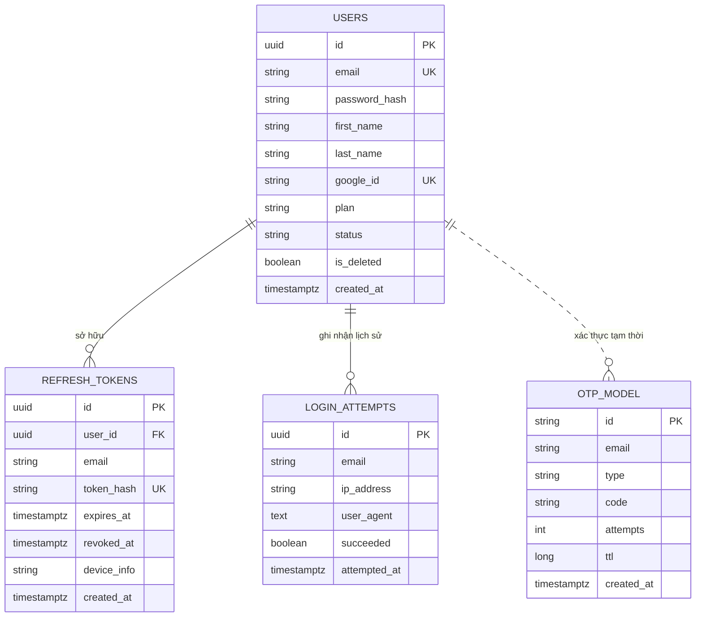

# THỰC THỂ & MÔ HÌNH DỮ LIỆU — PHÂN HỆ XÁC THỰC (AUTH)

> **File này trả lời:** Phân hệ xác thực lưu trữ những dữ liệu gì, trên CSDL PostgreSQL và Redis ra sao.  
> Endpoint API → [api.md](api.md) · Luồng xử lý → [pipeline.md](pipeline.md) · Quy tắc nghiệp vụ → [rule.md](rule.md)

---

## 📑 MỤC LỤC

- [1. Danh mục thực thể & Mô hình lưu trữ](#1-danh-muc-thuc-the)
- [2. Chi tiết bảng PostgreSQL](#2-chi-tiet-bang-postgresql)
  - [2.1 Bảng `refresh_tokens`](#21-bang-refresh_tokens)
  - [2.2 Bảng `login_attempts`](#22-bang-login_attempts)
- [3. Chi tiết mô hình Redis (In-Memory Cache)](#3-chi-tiet-mo-hinh-redis)
  - [3.1 Mô hình `OtpModel` (`otp:*`)](#31-mo-hinh-otpmodel)
  - [3.2 Khóa Rate Limiting Redis](#32-khoa-rate-limiting-redis)
- [4. Mô hình JWT Token (Stateless Claims)](#4-mo-hinh-jwt-token)
- [5. Sơ đồ thực thể & Cấu trúc lớp (Diagrams)](#5-so-do-thuc-the)

---

## 1. Danh mục thực thể & Mô hình lưu trữ <a id="1-danh-muc-thuc-the"></a>

Phân hệ xác thực kết hợp giữa lưu trữ bền vững (PostgreSQL) và lưu trữ tốc độ cao (Redis):

| Tên thực thể | Vị trí lưu trữ | Mục đích sử dụng | Vòng đời dữ liệu |
| :--- | :--- | :--- | :--- |
| **`RefreshToken`** | PostgreSQL (`refresh_tokens`) | Quản lý phiên đăng nhập dài hạn, hỗ trợ xoay vòng token (Token Rotation) và thu hồi | 30 ngày (lưu vĩnh viễn hash để phát hiện tái sử dụng) |
| **`LoginAttempt`** | PostgreSQL (`login_attempts`) | Ghi nhận lịch sử đăng nhập thành công/thất bại, IP, thiết bị, chống tấn công Brute-force | Lưu vết kiểm toán và phân tích bảo mật |
| **`OtpModel`** | Redis (`@RedisHash("otp")`) | Lưu trữ mã OTP 6 chữ số (xác thực email, quên mật khẩu) và đếm số lần nhập sai | TTL 15 phút, tự hủy sau khi dùng hoặc sai quá 5 lần |
| **`ForgotPasswordRateLimiter`** | Redis Key | Đếm số lần yêu cầu quên mật khẩu theo email để chống spam | TTL trượt theo cấu hình rate limit |

---

## 2. Chi tiết bảng PostgreSQL <a id="2-chi-tiet-bang-postgresql"></a>

### 2.1 Bảng `refresh_tokens` <a id="21-bang-refresh_tokens"></a>

Lưu trữ thông tin Refresh Token cấp cho người dùng. Token thô không bao giờ được lưu trực tiếp mà chỉ lưu mã băm SHA-256.

```sql
CREATE TABLE refresh_tokens (
    id          UUID PRIMARY KEY,
    user_id     UUID NOT NULL,
    email       VARCHAR(255) NOT NULL,
    token_hash  VARCHAR(64) NOT NULL UNIQUE,
    expires_at  TIMESTAMPTZ NOT NULL,
    revoked_at  TIMESTAMPTZ,
    device_info VARCHAR(255),
    created_at  TIMESTAMPTZ NOT NULL
);

CREATE INDEX idx_rt_user_id ON refresh_tokens(user_id);
CREATE INDEX idx_rt_hash_active ON refresh_tokens(token_hash) WHERE revoked_at IS NULL;
```

**Mô tả các cột:**
- `id`: Định danh duy nhất của bản ghi phiên token (`UUID.randomUUID()`).
- `user_id`: UUID người sở hữu token (tham chiếu sang `users.id`, lưu UUID trần để tối ưu hiệu năng).
- `email`: Email người dùng tại thời điểm phát hành token.
- `token_hash`: Chuỗi hex SHA-256 (64 ký tự) của token thô nhận từ client. Có ràng buộc `UNIQUE` (`uq_rt_hash`).
- `expires_at`: Thời điểm hết hạn (mặc định 30 ngày kể từ khi tạo).
- `revoked_at`: Thời điểm thu hồi token. Nếu `NULL` là token đang hoạt động; khác `NULL` là đã bị thu hồi/đã dùng.
- `device_info`: Thông tin thiết bị / User-Agent trích xuất từ HTTP Request.
- `created_at`: Thời điểm khởi tạo bản ghi token.

### 2.2 Bảng `login_attempts` <a id="22-bang-login_attempts"></a>

Lưu vết các lượt đăng nhập qua email/mật khẩu để phát hiện và ngăn chặn tấn công dò mật khẩu.

```sql
CREATE TABLE login_attempts (
    id           UUID PRIMARY KEY,
    email        VARCHAR(255) NOT NULL,
    ip_address   VARCHAR(45),
    user_agent   TEXT,
    succeeded    BOOLEAN NOT NULL,
    attempted_at TIMESTAMPTZ NOT NULL
);

CREATE INDEX idx_login_attempts_email_time ON login_attempts(email, attempted_at DESC);
```

**Mô tả các cột:**
- `id`: Khóa chính định danh lần đăng nhập.
- `email`: Địa chỉ email được sử dụng khi thử đăng nhập (chuẩn hóa chữ thường).
- `ip_address`: Địa chỉ IP của client gửi request.
- `user_agent`: Chuỗi User-Agent nhận dạng trình duyệt/thiết bị.
- `succeeded`: `true` nếu đăng nhập thành công, `false` nếu thất bại (sai email hoặc mật khẩu).
- `attempted_at`: Thời điểm thực hiện lần đăng nhập.

---

## 3. Chi tiết mô hình Redis (In-Memory Cache) <a id="3-chi-tiet-mo-hinh-redis"></a>

### 3.1 Mô hình `OtpModel` (`otp:*`) <a id="31-mo-hinh-otpmodel"></a>

Được định nghĩa qua Spring Data Redis với `@RedisHash("otp")`:

- **Khóa Redis:** `otp:{type}:{email}` (Ví dụ: `otp:register_otp:user@example.com`, `otp:password_reset_otp:user@example.com`).
- **Các trường dữ liệu:**
  - `id`: Định dạng `{type}:{email}` (viết thường).
  - `email`: Email nhận mã.
  - `type`: Loại mã OTP (`REGISTER_OTP` hoặc `PASSWORD_RESET_OTP`).
  - `code`: Mã OTP gồm 6 chữ số ngẫu nhiên.
  - `ttl`: Thời gian sống còn lại tính bằng phút (mặc định 15 phút).
  - `createdAt`: Thời điểm phát sinh mã OTP.
  - `attempts`: Số lần người dùng đã nhập sai mã. Nếu `attempts >= 5`, mã bị xóa ngay lập tức khỏi Redis để chống brute-force.

### 3.2 Khóa Rate Limiting Redis <a id="32-khoa-rate-limiting-redis"></a>

- **Gửi lại mã kích hoạt (`resend-verification`):** Kiểm tra `Duration.between(otp.getCreatedAt(), now).getSeconds() < 60`. Yêu cầu giãn cách tối thiểu 60 giây giữa các lần yêu cầu gửi lại.
- **Quên mật khẩu (`forgot-password`):** Quản lý qua `ForgotPasswordRateLimiter` trên Redis để hạn chế số lần gửi email yêu cầu đặt lại mật khẩu trong một khung thời gian nhất định.

---

## 4. Mô hình JWT Token (Stateless Claims) <a id="4-mo-hinh-jwt-token"></a>

Access Token được ký bằng thuật toán HMAC-SHA256 (`HS256`) và chứa các thông tin (Claims) cần thiết để toàn bộ hệ thống thực hiện phân quyền mà không cần truy vấn cơ sở dữ liệu:

```json
{
  "sub": "3fa85f64-5717-4562-b3fc-2c963f66afa6",
  "email": "user@example.com",
  "plan": "FREE",
  "roleLevel": 1,
  "roles": ["ROLE_USER"],
  "authorities": ["users:read", "transactions:create"],
  "iat": 1728450000,
  "exp": 1728450900
}
```

- `sub`: UUID của người dùng trong bảng `users`.
- `email`: Địa chỉ email đăng ký của người dùng.
- `plan`: Gói dịch vụ của người dùng (`FREE`, `PREMIUM`).
- `roleLevel`: Mức ưu tiên cao nhất của vai trò quản trị (dùng cho so sánh quyền hạn).
- `roles`: Danh sách tên vai trò (`ROLE_USER`, `ROLE_ADMIN`).
- `authorities`: Danh sách các quyền hạn chi tiết (Permissions) dùng cho `@PreAuthorize`.
- `iat` / `exp`: Thời điểm phát hành và thời điểm hết hạn (mặc định Access Token hết hạn sau 15 phút = 900 giây).

---

## 5. Sơ đồ thực thể & Cấu trúc lớp (Diagrams) <a id="5-so-do-thuc-the"></a>


