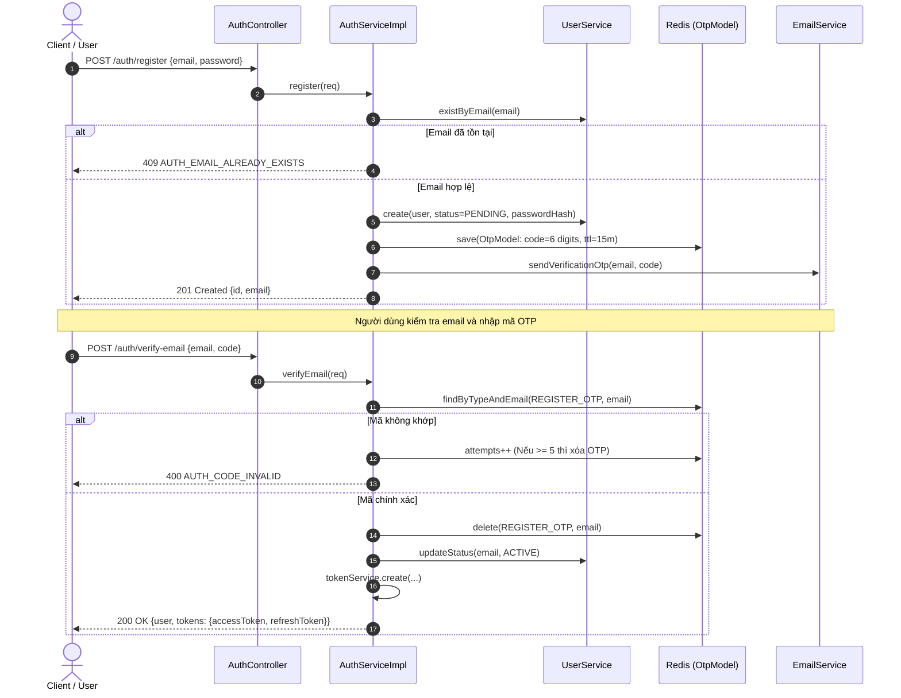
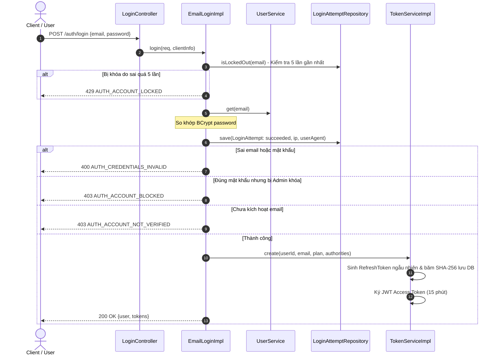
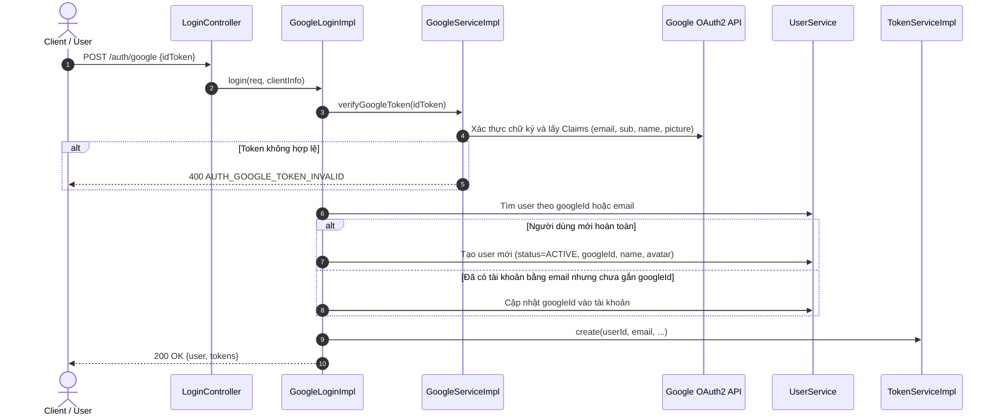
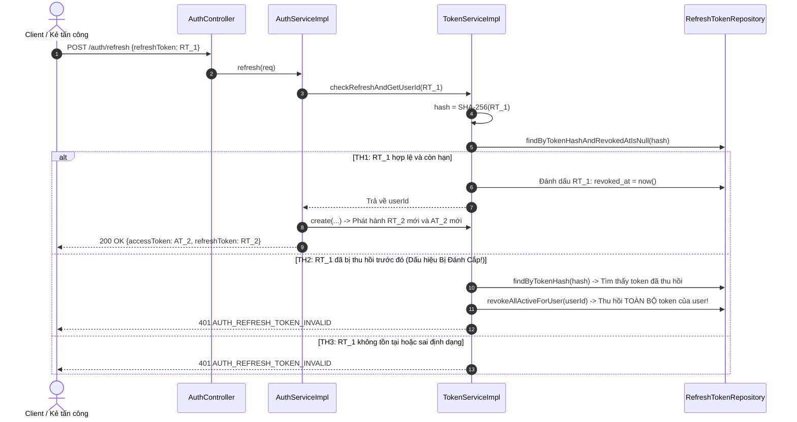

# LUỒNG XỬ LÝ & BẢO MẬT — PHÂN HỆ XÁC THỰC (AUTH)

> **File này trả lời:** Hệ thống xử lý các quy trình đăng ký, đăng nhập, xoay vòng token, xác thực OTP và bảo mật theo trình tự nào.  
> Cấu trúc bảng & Entity → [lop-thuc-the.md](lop-thuc-the.md) · Endpoint API → [api.md](api.md) · Luật bảo mật → [rule.md](rule.md)

---

## 📑 MỤC LỤC

- [1. Luồng Đăng ký & Kích hoạt Email qua OTP](#1-luong-dang-ky-otp)
- [2. Luồng Đăng nhập Email/Password & Chống Brute-force](#2-luong-dang-nhap)
- [3. Luồng Đăng nhập qua Google OAuth2](#3-luong-google)
- [4. Cơ chế Xoay vòng Refresh Token & Phát hiện Tái sử dụng (Token Rotation & Reuse Detection)](#4-co-che-token-rotation)
- [5. Luồng Quên & Đặt lại mật khẩu](#5-luong-quen-mat-khau)
- [6. Luồng Đăng xuất phiên làm việc](#6-luong-dang-xuat)

---

## 1. Luồng Đăng ký & Kích hoạt Email qua OTP 

**Quy trình chi tiết:**
1. **Đăng ký:**
   - Hệ thống chuẩn hóa email về chữ thường và kiểm tra trùng lặp trong CSDL.
   - Tạo bản ghi người dùng với mật khẩu mã hóa BCrypt và trạng thái `status = PENDING`.
   - Sinh chuỗi ngẫu nhiên 6 chữ số, lưu vào Redis (`otp:register_otp:{email}`) với TTL = 15 phút và gửi email thông báo.
2. **Xác thực:**
   - Tra cứu bản ghi OTP từ Redis.
   - Nếu mã không đúng: tăng `attempts`. Nếu `attempts >= 5`, xóa ngay bản ghi OTP khỏi Redis để ngăn chặn tấn công brute-force.
   - Nếu mã đúng: xóa OTP, chuyển trạng thái người dùng thành `ACTIVE`, đồng thời cấp phát cặp Access Token và Refresh Token ngay lập tức.
3. **Gửi lại mã (`resend-verification`):**
   - Kiểm tra giãn cách thời gian tối thiểu 60 giây (`cooldown`) so với thời điểm tạo mã OTP trước đó để tránh spam mail server.

---

## 2. Luồng Đăng nhập Email/Password & Chống Brute-force 

**Cơ chế chống Brute-force:**
- Mọi lần thử đăng nhập (kể cả thành công hay thất bại, email có tồn tại hay không) đều được lưu vào bảng `login_attempts` trong cùng transaction (có cờ `noRollbackFor = BusinessException.class` để bảo đảm dữ liệu lần thử luôn được lưu xuống DB).
- Nếu 5 lần đăng nhập gần nhất của cùng email đều thất bại (`succeeded = false`) trong khung thời gian bảo vệ, hệ thống lập tức từ chối và phản hồi `429 AUTH_ACCOUNT_LOCKED`.

---

## 3. Luồng Đăng nhập qua Google OAuth2 

- Người dùng đăng nhập Google được tự động kích hoạt trạng thái `ACTIVE` (không cần xác thực OTP email).
- Ban đầu tài khoản chưa có mật khẩu (`password_hash = NULL`). Khi có nhu cầu, người dùng có thể dùng chức năng tạo mật khẩu (`POST /users/me/password`) để bổ sung mật khẩu đăng nhập email truyền thống.

---

## 4. Cơ chế Xoay vòng Refresh Token & Phát hiện Tái sử dụng (Token Rotation & Reuse Detection) 

Đây là cơ chế bảo mật then chốt theo chuẩn **OAuth 2.0 Token Exchange & Rotation**:

**Nguyên lý bảo vệ:**
1. Mỗi Refresh Token chỉ được sử dụng **đúng 1 lần duy nhất** để lấy token mới.
2. Khi sử dụng thành công, token cũ lập tức được đánh dấu `revoked_at = now()`.
3. Nếu kẻ tấn công đánh cắp được token cũ và cố tình gửi lên lại, hệ thống phát hiện token đã nằm trong danh sách thu hồi (`revoked_at != NULL`), lập tức kích hoạt biện pháp phòng thủ diện rộng: **Hủy toàn bộ phiên làm việc của người dùng trên tất cả thiết bị** (`revokeAllActiveForUser`), buộc người dùng chính chủ phải đăng nhập lại và đổi mật khẩu.

---

## 5. Luồng Quên & Đặt lại mật khẩu 

1. **Yêu cầu cấp mã (`POST /auth/forgot-password`):**
   - Rate Limiter kiểm tra tần suất gọi theo email trên Redis.
   - Kiểm tra email có tồn tại trong hệ thống.
   - Sinh mã OTP 6 chữ số lưu vào Redis với type `PASSWORD_RESET_OTP` (TTL 15 phút) và gửi email hướng dẫn.
2. **Đặt lại mật khẩu (`POST /auth/reset-password`):**
   - Xác thực mã OTP trong Redis.
   - Kiểm tra mật khẩu mới không được trùng với mật khẩu hiện tại (tránh đổi như không đổi).
   - Mã hóa mật khẩu mới bằng BCrypt và lưu vào CSDL.
   - Xóa mã OTP khỏi Redis.
   - Thu hồi toàn bộ Refresh Token của tài khoản trên mọi thiết bị (`tokenService.revokeAllByEmail(...)`) để buộc các phiên đăng nhập cũ phải xác thực lại bằng mật khẩu mới.

---

## 6. Luồng Đăng xuất phiên làm việc 

- **Đăng xuất thiết bị hiện tại (`logoutAllDevices = false`):**
  - Hash chuỗi `refreshToken` gửi kèm trong request.
  - Tìm bản ghi trong `refresh_tokens` và gán `revoked_at = now()`.
- **Đăng xuất tất cả thiết bị (`logoutAllDevices = true`):**
  - Lấy `userId` từ Security Context của Access Token.
  - Cập nhật `revoked_at = now()` cho toàn bộ các bản ghi `refresh_tokens` đang hoạt động của người dùng đó.
