```mermaid
classDiagram
    class GroupController {
        -GroupService groupService
        +create(req: GroupCreateReq): ApiResponse~GroupDetailRes~
        +list(): ApiResponse~List~GroupSummaryRes~~
        +detail(id: UUID): ApiResponse~GroupDetailRes~
        +update(id: UUID, req: GroupUpdateReq): ApiResponse~GroupDetailRes~
        +delete(id: UUID): ApiResponse~Void~
        +join(req: GroupJoinReq): ApiResponse~Void~
        +pendingCount(id: UUID): ApiResponse~GroupPendingCountRes~
        +archive(id: UUID): ApiResponse~Void~
        +unarchive(id: UUID): ApiResponse~Void~
    }

    class MemberController {
        -MemberBehavierService memberBehavierService
        +listMembers(groupId: UUID, status: MemberStatus): ApiResponse~List~MemberRes~~
        +addMembers(groupId: UUID, req: MemberAddReq): ApiResponse~List~MemberRes~~
        +updateMemberRole(groupId: UUID, memberUserId: UUID): ApiResponse~Void~
        +approveMember(groupId: UUID, memberUserId: UUID): ApiResponse~Void~
        +approveMembers(groupId: UUID): ApiResponse~Void~
        +rejectMember(groupId: UUID, memberUserId: UUID): ApiResponse~Void~
        +rejectMembers(groupId: UUID): ApiResponse~Void~
        +removeMember(groupId: UUID, memberUserId: UUID): ApiResponse~Void~
        +leave(groupId: UUID): ApiResponse~Void~
    }

    class FundController {
        -FundService fundService
        +updateFund(groupId: UUID, req: FundKepperUpdateReq): ApiResponse~FundRes~
        +reconcileFund(groupId: UUID, req: FundReconcileReq): ApiResponse~GroupFundReconcileRes~
    }

    class GroupTransactionController {
        -GTransactionService gTransactionService
        -GTransactionReviewService transactionReviewService
        +create(groupId: UUID, req: GroupTransactionCreateReq): ApiResponse~GroupTransactionDetailRes~
        +list(groupId: UUID, filter: GroupTransactionFilterReq): ApiResponse~GroupTransactionListRes~
        +myList(groupId: UUID, filter: GroupTransactionFilterReq): ApiResponse~GroupTransactionListRes~
        +listPending(groupId: UUID, page: int, size: int): ApiResponse~GroupTransactionListRes~
        +detail(groupId: UUID, txnId: UUID): ApiResponse~GroupTransactionDetailRes~
        +update(groupId: UUID, txnId: UUID, req: GroupTransactionUpdateReq): ApiResponse~GroupTransactionDetailRes~
        +delete(groupId: UUID, txnId: UUID): ApiResponse~Void~
        +confirm(groupId: UUID, txnId: UUID): ApiResponse~GroupTransactionDetailRes~
        +reject(groupId: UUID, txnId: UUID): ApiResponse~GroupTransactionDetailRes~
        +bulkConfirm(groupId: UUID, req: GroupTransactionBulkReviewReq): ApiResponse~GroupTransactionBulkReviewRes~
        +bulkReject(groupId: UUID, req: GroupTransactionBulkReviewReq): ApiResponse~GroupTransactionBulkReviewRes~
    }

    class GroupReportController {
        -GReportService reportService
        +summary(groupId: UUID, month: String): ApiResponse~GroupSummaryReportRes~
        +balances(groupId: UUID): ApiResponse~GroupBalanceReportRes~
    }

    class GroupService {
        <<Interface>>
        +create(operatorId: UUID, req: GroupCreateReq): GroupDetailRes
        +list(operatorId: UUID): List~GroupSummaryRes~
        +detail(operatorId: UUID, groupId: UUID): GroupDetailRes
        +update(operatorId: UUID, groupId: UUID, req: GroupUpdateReq): GroupDetailRes
        +archive(operatorId: UUID, groupId: UUID): void
        +unarchive(operatorId: UUID, groupId: UUID): void
        +delete(operatorId: UUID, groupId: UUID): void
        +joinByCode(operatorId: UUID, req: GroupJoinReq): void
        +pendingCount(operatorId: UUID, groupId: UUID): GroupPendingCountRes
        +findNotDeletedById(groupId: UUID): GroupDetailRes
    }

    class MemberBehavierService {
        <<Interface>>
        +listMembers(operatorId: UUID, groupId: UUID, status: MemberStatus): List~MemberRes~
        +ownerAddMembers(operatorId: UUID, groupId: UUID, req: MemberAddReq): List~MemberRes~
        +leave(operatorId: UUID, groupId: UUID): void
        +approve(operatorId: UUID, groupId: UUID, memberId: UUID): void
        +approveAll(operatorId: UUID, groupId: UUID): int
        +reject(operatorId: UUID, groupId: UUID, memberId: UUID): void
        +rejectAll(operatorId: UUID, groupId: UUID): int
        +removeMember(operatorId: UUID, groupId: UUID, memberId: UUID): void
        +transferOwnership(operatorId: UUID, groupId: UUID, memberId: UUID): void
    }

    class MemberService {
        <<Interface>>
        +create(req: MemberCreateReq): Optional~MemberRes~
        +creates(req: List~MemberCreateReq~): List~MemberRes~
        +countActiveMembers(groupId: UUID): long
        +countPendingMembers(groupId: UUID): long
        +getMember(groupId: UUID, memberId: UUID, status: MemberStatus): MemberRes
        +getActivateMembers(groupId: UUID): List~MemberRes~
        +getMembersWithStatusIn(groupId: UUID, statuses: List~MemberStatus~): List~MemberRes~
        +findIdAllMember(groupId: UUID): List~UUID~
        +allMemberInGroup(groupId: UUID, memberIds: List~UUID~): boolean
        +assertNotInGroup(groupId: UUID, memberId: UUID): void
    }

    class FundService {
        <<Interface>>
        +create(groupId: UUID, operatorId: UUID, now: Instant): FundRes
        +updateFundKeepper(operatorId: UUID, groupId: UUID, req: FundKepperUpdateReq): FundRes
        +reconcileFund(operatorId: UUID, groupId: UUID, req: FundReconcileReq): GroupFundReconcileRes
        +adjustBalance(fundId: UUID, delta: Long): void
    }

    class GTransactionService {
        <<Interface>>
        +create(operatorId: UUID, groupId: UUID, req: GroupTransactionCreateReq): GroupTransactionDetailRes
        +list(operatorId: UUID, groupId: UUID, filter: GroupTransactionFilterReq): GroupTransactionListRes
        +myList(operatorId: UUID, groupId: UUID, filter: GroupTransactionFilterReq): GroupTransactionListRes
        +listPending(operatorId: UUID, groupId: UUID, page: Integer, size: Integer): GroupTransactionListRes
        +detail(operatorId: UUID, groupId: UUID, transactionId: UUID): GroupTransactionDetailRes
        +update(operatorId: UUID, groupId: UUID, transactionId: UUID, req: GroupTransactionUpdateReq): GroupTransactionDetailRes
        +delete(operatorId: UUID, groupId: UUID, transactionId: UUID): void
        +countPendingForGroup(groupId: UUID): long
    }

    class GTransactionReviewService {
        <<Interface>>
        +confirm(operatorId: UUID, groupId: UUID, transactionId: UUID): GroupTransactionDetailRes
        +reject(operatorId: UUID, groupId: UUID, transactionId: UUID): GroupTransactionDetailRes
        +bulkConfirm(operatorId: UUID, groupId: UUID, req: GroupTransactionBulkReviewReq): GroupTransactionBulkReviewRes
        +bulkReject(operatorId: UUID, groupId: UUID, req: GroupTransactionBulkReviewReq): GroupTransactionBulkReviewRes
    }

    class GReportService {
        <<Interface>>
        +getSummary(operatorId: UUID, groupId: UUID, month: String): GroupSummaryReportRes
        +getBalances(operatorId: UUID, groupId: UUID): GroupBalanceReportRes
    }

    GroupController --> GroupService
    MemberController --> MemberBehavierService
    FundController --> FundService
    GroupTransactionController --> GTransactionService
    GroupTransactionController --> GTransactionReviewService
    GroupReportController --> GReportService
```

# ĐẶC TẢ RESTFUL API ENDPOINTS — PHÂN HỆ NHÓM CHUNG QUỸ

## KIẾN TRÚC MÔ HÌNH HAI SỔ GHI TÁCH BIỆT (TWO SEPARATE LEDGERS)

> **Tài liệu chuẩn hóa kiến trúc:** Thiết kế RESTful API cho phân hệ Nhóm chung quỹ dựa trên mô hình thực thể hai sổ ghi
> độc lập (`Group`, `Member`, `Fund`, `GTransactionSpecification`, `TransactionParticipant`).  
> **Quy chuẩn kỹ thuật:** RESTful API, JSON Payload, Jakarta Validation, HTTP Status Code chuẩn RFC 7231, kiến trúc phân
> tầng Spring Boot Controller ➔ Service ➔ Repository.  
> **Tài liệu nền
tảng:** [Kịch bản Use Case](use-case.md) · [Lớp thực thể](lop-thuc-the.md) · [Quy tắc nghiệp vụ](rule.md) · [Luồng xử lý & cách tính](pipeline.md) ·
> `DATN/api/00-QUY-UOC-CHUNG.md`

---

## 📑 MỤC LỤC

- [1. Quy ước Giao tiếp API Chung](#1-quy-uoc)
- [2. Danh mục Điểm cuối API (Endpoints Summary)](#2-endpoints-summary)
- [3. Đặc tả Chi tiết các DTO & API Endpoints Trọng Tâm](#3-dac-ta-chi-tiet)
    - [3.1 Quản lý Nhóm & Thành viên](#31-nhom-va-thanh-vien)
        - [Tạo nhóm mới (`POST /v1/groups`)](#311-tao-nhom)
        - [Danh sách & Chi tiết nhóm (`GET /v1/groups`, `GET /v1/groups/{id}`)](#312-danh-sach-chi-tiet-nhom)
        - [Cập nhật thông tin nhóm (`PATCH /v1/groups/{id}`)](#313-cap-nhat-nhom)
        - [Lấy hoặc Làm mới mã mời (`POST /v1/groups/{id}/invite-code`)](#314-ma-moi)
        - [Tham gia nhóm bằng mã mời (`POST /v1/groups/join`)](#315-tham-gia-nhom)
        - [Danh sách thành viên nhóm (`GET /v1/groups/{id}/members`)](#315b-danh-sach-thanh-vien)
        - [Duyệt hoặc từ chối thành viên chờ](#316-duyet-thanh-vien)
        - [Chuyển quyền chủ nhóm (`POST /v1/groups/{id}/transfer-ownership`)](#317-chuyen-quyen-chu-nhom)
        - [Rời nhóm và mời thành viên rời nhóm](#318-roi-nhom)
        - [Lưu trữ và mở lại nhóm](#319-luu-tru-nhom)
        - [Xoá nhóm (`DELETE /v1/groups/{id}`)](#3110-xoa-nhom)
    - [3.2 Quỹ Nhóm (`Fund`) — mỗi nhóm một quỹ](#32-quan-ly-quy)
        - [Xem quỹ (`GET /v1/groups/{id}/fund`)](#321-xem-quy)
        - [Đổi tên, bàn giao quỹ (`PATCH /v1/groups/{id}/fund`)](#322-sua-quy)
    - [3.3 Giao dịch Nhóm (`GTransaction`)](#33-giao-dich-nhom)
        - [Tạo giao dịch nhóm (`POST /v1/groups/{id}/transactions`)](#331-tao-giao-dich)
        - [Lịch sử & Chi tiết giao dịch](#332-lich-su-chi-tiet-giao-dich)
        - [Giao dịch quỹ trả tiền cho thành viên (`REFUND`)](#333a-tra-lai-tien)
        - [Xác nhận hoặc từ chối giao dịch](#333b-xac-nhan-tu-choi)
        - [Sửa & Xóa giao dịch](#333-sua-xoa-giao-dich)
    - [3.4 Kiểm kê Quỹ (`Reconciliation`)](#34-kiem-ke-quy)
        - [Kiểm kê số dư thực tế (`POST /v1/groups/{id}/fund/reconcile`)](#341-kiem-ke-thuc-te)
    - [3.5 Tổng quan Tài chính & Bảng Phần Trong Quỹ](#35-tong-quan-tai-chinh)
        - [Tổng quan tài chính nhóm (`GET /v1/groups/{id}/summary`)](#351-tong-quan-summary)
        - [Bảng phần trong quỹ & Tình trạng nộp quỹ (`GET /v1/groups/{id}/balances`)](#352-bang-phan-balances)
- [4. Bảng Ma trận Mã Lỗi Phản Hồi API (Error Code Matrix)](#4-ma-tran-ma-loi)
- [5. Biểu đồ Lớp Phân Tầng Spring Boot (Architecture Class Diagram)](#5-class-diagram)

---

## 1. Quy ước Giao tiếp API Chung <a id="1-quy-uoc"></a>

- **Base URL:** `/v1/groups`
- **Quy ước đặt tên DTO:** Tuân thủ chuẩn `<Object><Action>Req` (cho Request) và `<Object><Action>Res` (cho Response).
- **Headers Bắt buộc:**
    - `Authorization: Bearer <jwt_access_token>` (Chứa `userId` của tài khoản đăng nhập)
    - `Content-Type: application/json`
    - `Idempotency-Key: <UUID>` (Khuyến nghị, không bắt buộc, với các request ghi tạo mới: tạo nhóm, ghi giao dịch, trả
      lại tiền, kiểm kê. Không bắt buộc vì khoản thành viên ghi trùng vẫn phải qua bước xác nhận)
- **Cấu trúc JSON Response Chuẩn (2xx):**

  ```json
  {
    "success": true,
    "data": {},
    "message": "Thao tác thành công"
  }
  ```
- **Cấu trúc JSON Error Chuẩn (4xx / 5xx):**

  ```json
  {
    "success": false,
    "error": {
      "code": "GROUP_NOT_FOUND",
      "message": "Không tìm thấy nhóm hoặc bạn không có quyền truy cập",
      "details": []
    }
  }
  ```

---

## 2. Danh mục Điểm cuối API (Endpoints Summary) <a id="2-endpoints-summary"></a>

| Nhóm chức năng (Controller)        |  Method  | Endpoint URL                                        | Mục đích & Phân quyền                                                                                                                                                                                            |
|:-----------------------------------|:--------:|:----------------------------------------------------|:-----------------------------------------------------------------------------------------------------------------------------------------------------------------------------------------------------------------|
| **1. Quản lý Nhóm (`GroupController`)** |  `POST`  | `/v1/groups`                                        | Tạo nhóm mới (khởi tạo cấu hình, quỹ duy nhất và tự động sinh mã mời `invite_code`)                                                                                                                              |
|                                    |  `GET`   | `/v1/groups`                                        | Danh sách các nhóm user đang là thành viên `ACTIVE`, kèm mã mời và số dư quỹ                                                                                                                                     |
|                                    |  `GET`   | `/v1/groups/{id}`                                   | Chi tiết nhóm (thông tin, mã mời, quỹ, danh sách thành viên)                                                                                                                                                     |
|                                    | `PATCH`  | `/v1/groups/{id}`                                   | Sửa thông tin nhóm (Tên, mô tả, mục tiêu, cờ tính thừa thiếu) — *Owner*                                                                                                                                          |
|                                    | `DELETE` | `/v1/groups/{id}`                                   | Xóa nhóm — *Owner*. Quỹ = 0, không còn khoản chờ; bật tính thừa thiếu thì phần mọi thành viên = 0                                                                                                                |
|                                    |  `POST`  | `/v1/groups/{id}/archive`                           | Lưu trữ nhóm (chỉ xem) — *Owner*. Không còn khoản chờ                                                                                                                                                            |
|                                    |  `POST`  | `/v1/groups/{id}/unarchive`                         | Mở lại nhóm đã lưu trữ — *Owner*                                                                                                                                                                                 |
|                                    |  `POST`  | `/v1/groups/join`                                   | Tham gia nhóm bằng mã mời (`invite_code`). Trạng thái `ACTIVE` (vào thẳng) hoặc `PENDING` (chờ duyệt) tùy cấu hình                                                                                               |
|                                    |  `GET`   | `/v1/groups/{id}/pending-count`                     | Đếm số giao dịch và thành viên đang chờ duyệt (hiển thị badge) — *Thành viên ACTIVE*                                                                                                                             |
| **2. Thành viên (`MemberController`)** |  `GET`   | `/v1/groups/{id}/members`                           | Danh sách thành viên hiện tại và lịch sử tham gia (lọc tùy chọn `status`)                                                                                                                                        |
|                                    |  `POST`  | `/v1/groups/{id}/members`                           | Chủ nhóm thêm trực tiếp danh sách thành viên (`MemberAddReq`) — *Owner*                                                                                                                                          |
|                                    |  `PUT`   | `/v1/groups/{id}/owner-role/{memberUserId}/`        | Chuyển giao quyền chủ nhóm cho một thành viên `ACTIVE` khác — *Owner*                                                                                                                                            |
|                                    |  `POST`  | `/v1/groups/{id}/members/{memberUserId}/approve`   | Duyệt thành viên `PENDING` đơn lẻ vào nhóm — *Owner*                                                                                                                                                             |
|                                    |  `POST`  | `/v1/groups/{id}/approves`                          | Duyệt toàn bộ thành viên `PENDING` vào nhóm — *Owner*                                                                                                                                                            |
|                                    |  `POST`  | `/v1/groups/{id}/members/{memberUserId}/reject`    | Từ chối yêu cầu tham gia của thành viên `PENDING` đơn lẻ — *Owner*                                                                                                                                               |
|                                    |  `POST`  | `/v1/groups/{id}/rejects`                           | Từ chối toàn bộ yêu cầu tham gia `PENDING` — *Owner*                                                                                                                                                             |
|                                    | `DELETE` | `/v1/groups/{id}/members/{memberUserId}`           | Mời thành viên rời nhóm — *Owner*. Bật tính thừa thiếu thì người bị mời phải tất toán về 0 trước                                                                                                                |
|                                    |  `POST`  | `/v1/groups/{id}/leave`                             | Thành viên tự rời nhóm. Chủ nhóm phải chuyển quyền trước; bật tính thừa thiếu thì phải tất toán về 0                                                                                                             |
| **3. Quỹ Nhóm (`FundController`)** |  `PUT`   | `/v1/groups/{id}/fund-kepper`                       | Bàn giao người giữ quỹ (`FundKepperUpdateReq`) — *Owner*                                                                                                                                                         |
|                                    |  `POST`  | `/v1/groups/{id}/fund/reconcile`                    | Kiểm kê tiền thực tế, sinh giao dịch điều chỉnh chênh lệch `ADJUSTMENT_UP`/`DOWN` — *Thủ quỹ / Owner*                                                                                                            |
| **4. Giao dịch (`GroupTransactionController`)** |  `POST`  | `/v1/groups/{id}/transactions`    | **Tạo giao dịch nhóm thống nhất**: `EXPENSE` (chi tiêu), `CONTRIBUTION` (nộp quỹ), `REFUND` (quỹ trả tiền cho thành viên). Thành viên ghi ở `PENDING`, Thủ quỹ / Owner duyệt `CONFIRMED` ngay |
|                                    |  `GET`   | `/v1/groups/{id}/transactions`                      | Lịch sử giao dịch nhóm (phân trang `page`/`size`, lọc `money_source`, `type`, `status`, `transactor_id`, `start_date`, `end_date`)                                                                               |
|                                    |  `GET`   | `/v1/groups/{id}/transactions/mine`                 | Lịch sử giao dịch do chính người dùng hiện tại ghi nhận (kèm cả `PENDING`)                                                                                                                                       |
|                                    |  `GET`   | `/v1/groups/{id}/transactions/pending`              | Danh sách giao dịch đang chờ duyệt (`PENDING`) dành riêng cho người duyệt — *Thủ quỹ / Owner*                                                                                                                    |
|                                    |  `GET`   | `/v1/groups/{id}/transactions/{tId}`                | Chi tiết giao dịch kèm danh sách người tham gia phân bổ chi phí                                                                                                                                                  |
|                                    |  `PUT`   | `/v1/groups/{id}/transactions/{tId}`                | Sửa giao dịch — *người ghi / Owner*. Áp dụng cập nhật số dư qua Strategy tương ứng                                                                                                                               |
|                                    | `DELETE` | `/v1/groups/{id}/transactions/{tId}`                | Xóa mềm giao dịch — **chỉ Owner**                                                                                                                                                                                |
|                                    |  `POST`  | `/v1/groups/{id}/transactions/{tId}/confirm`        | Xác nhận khoản `PENDING` — *Thủ quỹ / Owner*                                                                                                                                                                     |
|                                    |  `POST`  | `/v1/groups/{id}/transactions/{tId}/reject`         | Từ chối khoản `PENDING` — *Thủ quỹ / Owner*                                                                                                                                                                     |
|                                    |  `POST`  | `/v1/groups/{id}/transactions/bulk-confirm`         | Xác nhận nhiều khoản `PENDING` cùng lúc — *Thủ quỹ / Owner*                                                                                                                                                      |
|                                    |  `POST`  | `/v1/groups/{id}/transactions/bulk-reject`          | Từ chối nhiều khoản `PENDING` cùng lúc — *Thủ quỹ / Owner*                                                                                                                                                       |
| **5. Báo cáo (`GroupReportController`)** |  `GET`   | `/v1/groups/{id}/summary`                           | Báo cáo tổng quan số dư, tổng thu, tổng chi (tham số tùy chọn `month=YYYY-MM`, bỏ trống = toàn thời gian)                                                                                                        |
|                                    |  `GET`   | `/v1/groups/{id}/balances`                          | Bảng cân đối phần trong quỹ của từng thành viên (`BalanceCalculator`)                                                                                                                                            |

---

## 3. Đặc tả Chi tiết các DTO & API Endpoints Trọng Tâm <a id="3-dac-ta-chi-tiet"></a>

---

### 3.1 Quản lý Nhóm & Thành viên <a id="31-nhom-va-thanh-vien"></a>

#### Tạo nhóm mới (`POST /v1/groups`) <a id="311-tao-nhom"></a>

Khởi tạo nhóm mới, tự động gắn User gọi API làm `OWNER` và tạo **quỹ duy nhất** của nhóm, do người tạo giữ
([pipeline.md](pipeline.md) mục 6).

- **Request Body (`GroupCreateReq`):**

```json
{
  "name": "Du lịch Đà Nẵng",
  "description": "Quỹ ăn chơi hè 2026",
  "target": 15000000,
  "is_settlement_enabled": true,
  "is_join_without_confirm": true,
  "fund_name": "Quỹ chung tiền mặt"
}
```

- **Jakarta Validation:**
    - `name`: `@NotBlank`, `@Size(max = 100)`
    - `description`: `@Size(max = 255)`
    - `target`: Tùy chọn, `@Positive`, `@Max(999999999999L)`. Không nhập thì lưu `NULL` (tuyệt đối không đổi thành 0).
    - `is_settlement_enabled`: `@NotNull`
    - `is_join_without_confirm`: `@NotNull`
    - `fund_name`: `@NotBlank`, `@Size(max = 50)`
    - **Không có `initial_balance`:** quỹ luôn bắt đầu từ 0. Quỹ đã có sẵn tiền thì sau khi tạo nhóm, ghi cho mỗi người
      đã đưa tiền một khoản `CONTRIBUTION` ([pipeline.md](pipeline.md) mục 6)

- **Response (`HTTP 201 Created` - `GroupDetailRes`):**

```json
{
  "success": true,
  "data": {
    "id": "a1000000-0000-0000-0000-000000000001",
    "name": "Du lịch Đà Nẵng",
    "description": "Quỹ ăn chơi hè 2026",
    "status": "ACTIVE",
    "target": 15000000,
    "is_settlement_enabled": true,
    "is_join_without_confirm": true,
    "created_at": "2026-09-16T10:00:00Z",
    "my_role": "OWNER",
    "fund": {
      "id": "w1000000-0000-0000-0000-000000000001",
      "keepper_id": "u1000000-0000-0000-0000-000000000001",
      "current_balance": 0
    },
    "members": [
      {
        "id": "m1000000-0000-0000-0000-000000000001",
        "user_id": "u1000000-0000-0000-0000-000000000001",
        "full_name": "Nguyễn Văn A",
        "avatar_url": "https://example.com/avatar1.png",
        "role": "OWNER",
        "status": "ACTIVE",
        "joined_at": "2026-09-16T10:00:00Z"
      }
    ]
  },
  "message": "Tạo nhóm thành công"
}
```

---

#### Danh sách & Chi tiết nhóm (`GET /v1/groups`, `GET /v1/groups/{id}`) <a id="312-danh-sach-chi-tiet-nhom"></a>

- **`GET /v1/groups`:** các nhóm người dùng đang là thành viên `ACTIVE`, **gồm cả nhóm `ARCHIVED`** — app dựa vào
  `status` để hiện nhãn "Đã lưu trữ".
- **`GET /v1/groups` Response (`HTTP 200 OK` - `List<GroupSummaryRes>`):**

```json
{
  "success": true,
  "data": [
    {
      "id": "a1000000-0000-0000-0000-000000000001",
      "name": "Du lịch Đà Nẵng",
      "my_role": "OWNER",
      "status": "ACTIVE",
      "member_count": 3,
      "fund_balance": 2400000,
      "target": 15000000,
      "created_at": "2026-09-16T10:00:00Z"
    }
  ]
}
```

---

#### Cập nhật thông tin nhóm (`PATCH /v1/groups/{id}`) <a id="313-cap-nhat-nhom"></a>

- **Phân quyền:** Chỉ `OWNER` của nhóm.
- **Request Body (`GroupUpdateReq`):**

```json
{
  "name": "Du lịch Đà Nẵng 2026",
  "description": "Cập nhật lịch trình mới",
  "target": 20000000,
  "clear_target": false,
  "is_settlement_enabled": true,
  "is_join_without_confirm": true
}
```

- **Jakarta Validation:**
    - `name`: Tùy chọn, `@Size(max = 100)`
    - `description`: Tùy chọn, `@Size(max = 255)`
    - `target`: Tùy chọn, `@Positive`, `@Max(999999999999L)`
    - `clear_target`: Tùy chọn, boolean. Nếu `true`, gỡ bỏ mục tiêu quỹ (chuyển `target` về `NULL`).
    - `is_settlement_enabled`: Tùy chọn, boolean
    - `is_join_without_confirm`: Tùy chọn, boolean
- **Nghiệp vụ:**
    - Nếu `clear_target = true`: Đặt `target = NULL` (gỡ bỏ mục tiêu).
    - Nếu `clear_target != true` và có truyền `target`: Cập nhật mục tiêu mới.
    - Nếu cả hai không truyền: Giữ nguyên mục tiêu hiện tại.
- **Response (`HTTP 200 OK` - `GroupDetailRes`).**

---

#### Mã mời tham gia nhóm (`invite_code`) <a id="314-ma-moi"></a>

- **Cơ chế hoạt động:**
    - Mã mời gồm **8 ký tự** viết hoa ngẫu nhiên, chữ và số dễ đọc (bỏ `0`/`O`, `1`/`I`), được tự động sinh ngay khi tạo
      nhóm mới.
    - Mã mời được trả trực tiếp trong đối tượng phản hồi của API chi tiết nhóm (`GroupDetailRes`) và danh sách nhóm
      (`GroupSummaryRes`) qua thuộc tính `invite_code`.
    - Không cần endpoint riêng để lấy mã mời; chủ nhóm và thành viên có thể copy mã này để mời thành viên khác.

---

#### Tham gia nhóm bằng mã mời (`POST /v1/groups/join`) <a id="315-tham-gia-nhom"></a>

- **Request Body (`GroupJoinReq`):**

```json
{
  "invite_code": "DN7K2QXP"
}
```

- **Jakarta Validation:**
    - `invite_code`: `@NotBlank`, `@Size(min = 8, max = 8)`

- **Nghiệp vụ:**
    - Kiểm tra tính hợp lệ của mã mời: Đối chiếu `invite_code` trong bảng `groups` (trừ nhóm trạng thái `DELETED`). Nếu
      mã không tồn tại hoặc sai ký tự, hệ thống trả về lỗi `404 INVITE_CODE_INVALID` (*"Mã mời không chính xác"*).
    - Kiểm tra người dùng đã là thành viên (`ACTIVE` hoặc `PENDING`) chưa: nếu rồi trả về lỗi `409 ALREADY_IN_GROUP`.
    - Nhóm đang lưu trữ → `409 GROUP_ARCHIVED`.
    - Nếu nhóm có `is_join_without_confirm = true`: Tạo `group_members` với `status = ACTIVE`, `joined_at = now()`.
    - Nếu `is_join_without_confirm = false`: Tạo `group_members` với `status = PENDING`, `joined_at = NULL`. Thành viên
      chưa thấy nội dung nhóm cho đến khi được chủ nhóm duyệt.
    - Người từng `LEFT` / `REMOVED` quay lại: **tạo bản ghi mới**, không sửa bản ghi cũ ([rule.md](rule.md) quy tắc 4).

- **Response (`HTTP 200 OK` - `ApiResponse<Void>`):**

```json
{
  "success": true,
  "data": null,
  "message": "Thao tác thành công"
}
```

---

#### Đếm việc chờ duyệt (`GET /v1/groups/{id}/pending-count`) <a id="315a-dem-viec-cho-duyet"></a>

Dùng để hiển thị badge thông báo trên giao diện người dùng.

- **Phân quyền:** Thành viên `ACTIVE` của nhóm.
- **Nghiệp vụ:**
    - Giao dịch `PENDING` chỉ trả cho Trưởng nhóm / Thủ quỹ; thành viên thường nhận 0.
    - Thành viên `PENDING` chỉ trả cho Trưởng nhóm; thành viên thường nhận 0.
- **Response (`HTTP 200 OK` - `GroupPendingCountRes`):**

```json
{
  "success": true,
  "data": {
    "pending_transactions": 2,
    "pending_members": 1
  },
  "message": "Thao tác thành công"
}
```

---

#### Danh sách thành viên nhóm (`GET /v1/groups/{id}/members`) <a id="315b-danh-sach-thanh-vien"></a>

- **Phân quyền:** Thành viên `ACTIVE` của nhóm → nếu không: `403 FORBIDDEN_NOT_GROUP_MEMBER`.
- **Query Parameters:**
    - `status` (chuỗi, tùy chọn): Lọc theo trạng thái thành viên (`ACTIVE`, `PENDING`, `LEFT`, `REMOVED`).
    - Lọc `PENDING` chỉ dành cho Trưởng nhóm (`OWNER`); nếu không phải Owner mà lọc `PENDING`: `403 FORBIDDEN_OWNER_REQUIRED`.
    - Bỏ trống `status`: Trưởng nhóm thấy cả `ACTIVE` và `PENDING`, thành viên thường chỉ thấy `ACTIVE`.
- **Response (`HTTP 200 OK` - `List<GroupMemberRes>`):**

```json
{
  "success": true,
  "data": [
    {
      "id": "m1000000-0000-0000-0000-000000000001",
      "user_id": "u1000000-0000-0000-0000-000000000001",
      "full_name": "Nguyễn Văn A",
      "email": "a@example.com",
      "avatar_url": "https://example.com/avatar1.png",
      "role": "OWNER",
      "status": "ACTIVE",
      "joined_at": "2026-09-16T10:00:00Z",
      "left_at": null
    },
    {
      "id": "m1000000-0000-0000-0000-000000000002",
      "user_id": "u2000000-0000-0000-0000-000000000002",
      "full_name": "Trần Thị B",
      "email": "b@example.com",
      "avatar_url": "https://example.com/avatar2.png",
      "role": "MEMBER",
      "status": "ACTIVE",
      "joined_at": "2026-09-16T10:05:00Z",
      "left_at": null
    }
  ],
  "message": "Thao tác thành công"
}
```

---

#### Chủ nhóm thêm thành viên trực tiếp (`POST /v1/groups/{id}/members`) <a id="315c-them-thanh-vien"></a>

Chủ nhóm (`OWNER`) có thể thêm trực tiếp danh sách thành viên vào nhóm ở trạng thái `ACTIVE` mà không cần duyệt.

- **Phân quyền:** Chỉ `OWNER` của nhóm → nếu không: `403 FORBIDDEN_OWNER_REQUIRED`.
- **Request Body (`MemberAddReq`):**

```json
{
  "member_ids": [
    "u2000000-0000-0000-0000-000000000002",
    "u3000000-0000-0000-0000-000000000003"
  ]
}
```

- **Jakarta Validation:**
    - `member_ids`: `@NotNull`
- **Nghiệp vụ:**
    - Nhóm không đang lưu trữ (`409 GROUP_ARCHIVED`).
    - Các thành viên được thêm chuyển ngay sang trạng thái `ACTIVE` với `joined_at = now()`.
- **Response (`HTTP 200 OK` - `List<GroupMemberRes>`).**

---

#### Duyệt hoặc từ chối thành viên chờ <a id="316-duyet-thanh-vien"></a>

- **Duyệt đơn lẻ: `POST /v1/groups/{id}/members/{memberUserId}/approve`**
    - **Phân quyền:** Chỉ `OWNER` của nhóm.
    - **Nghiệp vụ:** Chỉ áp dụng cho bản ghi đang `PENDING`. Chuyển `status` sang `ACTIVE`, gán `joined_at = now()`.
- **Duyệt hàng loạt: `POST /v1/groups/{id}/approves`**
    - **Phân quyền:** Chỉ `OWNER` của nhóm.
    - **Nghiệp vụ:** Chuyển toàn bộ thành viên đang `PENDING` sang `ACTIVE`, gán `joined_at = now()`.
- **Từ chối đơn lẻ: `POST /v1/groups/{id}/members/{memberUserId}/reject`**
    - **Phân quyền:** Chỉ `OWNER` của nhóm.
    - **Nghiệp vụ:** Xoá bản ghi `PENDING` của thành viên khỏi nhóm.
- **Từ chối hàng loạt: `POST /v1/groups/{id}/rejects`**
    - **Phân quyền:** Chỉ `OWNER` của nhóm.
    - **Nghiệp vụ:** Xoá toàn bộ bản ghi `PENDING` của nhóm.
- **Response:** `HTTP 200 OK`, `data = null`.

---

#### Chuyển quyền chủ nhóm (`PUT /v1/groups/{id}/owner-role/{memberUserId}/`) <a id="317-chuyen-quyen-chu-nhom"></a>

Nhóm luôn có **đúng một** `OWNER` đang `ACTIVE` ([rule.md](rule.md) quy tắc 9).

- **Phân quyền:** Chỉ `OWNER` hiện tại → nếu không: `403 FORBIDDEN_OWNER_REQUIRED`.
- **Path Variable:** `memberUserId` (UUID người nhận quyền).
- **Nghiệp vụ** — trong **một** transaction CSDL:
    - `memberUserId` phải là thành viên `ACTIVE` của nhóm → nếu không: `400 NEW_OWNER_NOT_MEMBER`.
    - `memberUserId` khác người gọi → nếu trùng: `400 CANNOT_TRANSFER_TO_SELF`.
    - Chủ cũ: `role = MEMBER`. Người nhận: `role = OWNER`.
    - Chủ cũ đang giữ quỹ thì quỹ **không tự đổi người giữ** — chủ mới bàn giao lại nếu muốn.
- **Response:** `HTTP 200 OK`, `data = null`.

---

#### Rời nhóm và mời thành viên rời nhóm <a id="318-roi-nhom"></a>

- **`POST /v1/groups/{id}/leave`** — thành viên tự rời
    - Người gọi phải đang `ACTIVE`.
    - Người gọi là `OWNER` → **chặn** với `409 OWNER_MUST_TRANSFER_FIRST`. Chủ nhóm phải chuyển quyền trước.
    - Người gọi đang giữ quỹ (thủ quỹ) → **chặn** với `409 TREASURER_MUST_TRANSFER_FIRST`. Phải bàn giao quỹ trước.
- **`DELETE /v1/groups/{id}/members/{userId}`** — chủ nhóm mời rời (với người đang `ACTIVE`)
    - **Phân quyền:** Chỉ `OWNER`.
    - Không mời chính mình rời: `409 CANNOT_REMOVE_OWNER`.
    - Người đó đang giữ quỹ → **chặn** với `409 TREASURER_MUST_TRANSFER_FIRST`. Chủ nhóm bàn giao quỹ (`PATCH /fund`)
      trước rồi mới mời rời.

- **Kiểm tra chung khi bật tính thừa thiếu** ([rule.md](rule.md) quy tắc 27) — tắt thì bỏ qua:

| # | Kiểm tra                                  | Lỗi                                                                   |
|:-:|:------------------------------------------|:----------------------------------------------------------------------|
| 1 | Nhóm không còn khoản `PENDING`            | `409 HAS_PENDING_TRANSACTIONS`                                        |
| 2 | Phần của người rời (`net_balance`) bằng 0 | `409 MEMBER_SHARE_NOT_ZERO`, `details` ghi phần hiện tại của người đó |

Phần dương → thủ quỹ ghi loại `REFUND` qua `POST /transactions` trả đúng số đó. Phần âm → người đó góp thêm
(`POST /transactions`, loại `CONTRIBUTION`) rồi thủ quỹ xác nhận. Người còn
nợ mà không góp thì chủ nhóm cũng không mời ra được ([pipeline.md](pipeline.md) mục 10).

- **Nghiệp vụ chung** — trong **một** transaction CSDL ([pipeline.md](pipeline.md) mục 10):
    1. Bản ghi thành viên: `status = LEFT` (tự rời) hoặc `REMOVED` (bị mời rời), `left_at = now()`.
    2. Hệ thống tự **`REJECTED`** mọi khoản `PENDING` có `created_by` = người rời: `reviewed_by` = người kích hoạt
       (chính mình hoặc chủ nhóm), `reviewed_at = now()`.
    3. Không đụng tới giao dịch đã `CONFIRMED` hoặc `REJECTED` từ trước: khoản "cả nhóm" có thời điểm trước lúc rời vẫn
       tính người đó.
- **Response:** `HTTP 200 OK`, `data = null`.

---

#### Lưu trữ và mở lại nhóm <a id="319-luu-tru-nhom"></a>

- **`POST /v1/groups/{id}/archive`** — lưu trữ
    - **Phân quyền:** Chỉ `OWNER`.
    - Nhóm phải đang `ACTIVE`, và **không còn khoản `PENDING`** → nếu còn: `409 HAS_PENDING_TRANSACTIONS`.
    - `groups.status = ARCHIVED`.
- **`POST /v1/groups/{id}/unarchive`** — mở lại
    - **Phân quyền:** Chỉ `OWNER`. Nhóm phải đang `ARCHIVED`.
    - `groups.status = ACTIVE`.
- **Khi nhóm đang lưu trữ** ([rule.md](rule.md) quy tắc 26, mục 3.7):
    - Mọi endpoint `GET` vẫn dùng được.
    - Bị chặn với `409 GROUP_ARCHIVED`: ghi / sửa / xoá / xác nhận / từ chối giao dịch, trả lại tiền, kiểm kê, sửa nhóm,
      sửa quỹ, mã mời, vào nhóm, duyệt, mời rời, rời nhóm, chuyển quyền.
    - Vẫn làm được: `unarchive` và `DELETE /v1/groups/{id}`.
- **Response:** `HTTP 200 OK`, `data = null`.

---

#### Xoá nhóm (`DELETE /v1/groups/{id}`) <a id="3110-xoa-nhom"></a>

- **Phân quyền:** Chỉ `OWNER`.
- **Điều kiện** ([rule.md](rule.md) quy tắc 23):

| # | Điều kiện                                                                              | Lỗi                                    |
|:-:|:---------------------------------------------------------------------------------------|:---------------------------------------|
| 1 | Không còn khoản `PENDING`                                                              | `409 HAS_PENDING_TRANSACTIONS`         |
| 2 | Số dư quỹ bằng 0                                                                       | `409 CANNOT_DELETE_GROUP_WITH_BALANCE` |
| 3 | **Bật tính thừa thiếu** → phần của mọi thành viên (kể cả thành viên đã rời) đều bằng 0 | `409 CANNOT_DELETE_GROUP_WITH_BALANCE` |

Muốn đạt điều kiện 3: thủ quỹ ghi trả lại tiền (loại `REFUND` qua `POST /transactions`) cho người còn phần
dương, người còn phần âm góp thêm (người đã rời góp bù theo Cách A hoặc nhóm tự gánh theo Cách B —
xem [pipeline.md](pipeline.md) mục 10 & 14).

- **Nghiệp vụ:** `groups.status = DELETED` (xoá mềm), cùng một transaction CSDL.
- **Response:** `HTTP 200 OK`, `data = null`.

---

#### 3.2 Quỹ Nhóm (`Fund`) — mỗi nhóm một quỹ <a id="32-quan-ly-quy"></a>

Mỗi nhóm có **đúng một quỹ**, tạo cùng lúc với nhóm và giao cho một thành viên giữ (`keepper_id`) — gọi là thủ quỹ.
**Không có** endpoint tạo thêm quỹ, chuyển tiền giữa hai quỹ hay đóng quỹ; quỹ đi theo vòng đời của nhóm
([rule.md](rule.md) quy tắc 14). Quỹ **không có thuộc tính loại ví** (`type`), **không có trường `status`** và **được
phép âm**.

- **Thông tin quỹ:** Được trả trực tiếp trong đối tượng phản hồi của API chi tiết nhóm (`GroupDetailRes.fund`) và
  báo cáo tổng quan (`GroupSummaryReportRes.fund`), không có endpoint `GET /fund` riêng lẻ để tránh thừa thãi.
- **Kiểm kê quỹ:** Xem chi tiết tại [Mục 3.4](#34-kiem-ke-quy) (`POST /v1/groups/{id}/fund/reconcile`).

---

#### Bàn giao thủ quỹ (`PUT /v1/groups/{id}/fund-kepper`) <a id="322-sua-quy"></a>

- **Phân quyền:** Chỉ `OWNER` của nhóm → nếu không: `403 FORBIDDEN_OWNER_REQUIRED`.
- **Request Body (`FundKepperUpdateReq`):**

```json
{
  "keepper_id": "u3000000-0000-0000-0000-000000000003"
}
```

- **Jakarta Validation:**
    - `keepper_id`: `@NotNull`
- **Nghiệp vụ:**

| Trường       | Kiểm tra                             | Lỗi                     |
|:-------------|:-------------------------------------|:------------------------|
| `keepper_id` | Phải là thành viên `ACTIVE` của nhóm | `400 HOLDER_NOT_MEMBER` |

Quỹ đi theo vòng đời của nhóm, không có trường `status`.

- **Response (`HTTP 200 OK` - `FundRes`):**

```json
{
  "success": true,
  "data": {
    "id": "w1000000-0000-0000-0000-000000000001",
    "group_id": "a1000000-0000-0000-0000-000000000001",
    "keepper_id": "u3000000-0000-0000-0000-000000000003",
    "current_balance": 2400000,
    "created_at": "2026-09-16T10:00:00Z"
  },
  "message": "Thao tác thành công"
}
```

---

### 3.3 Giao dịch Nhóm (`GTransaction`) <a id="33-giao-dich-nhom"></a>

Giao dịch gắn với nhóm qua `group_id`. Mỗi nhóm có duy nhất một quỹ tiền, nên việc dòng tiền có đi qua quỹ nhóm hay
không phụ thuộc vào **`money_source`**: `FUND` (tiền quỹ) hoặc `PERSONAL` (tiền túi cá nhân) — [rule.md](rule.md) quy
tắc 24.

Toàn bộ các loại giao dịch được quản lý và tạo lập tập trung qua endpoint thống nhất:

- `POST /v1/groups/{id}/transactions` và cập nhật qua `PUT /v1/groups/{id}/transactions/{tId}` sử dụng **Strategy
  Pattern** tương ứng theo từng loại giao dịch (`GTransactionType`):
    - `EXPENSE` (Chi tiêu): Trả bằng tiền quỹ (`FUND`) hoặc tiền túi (`PERSONAL`), bắt buộc có `category_id`. Phân bổ
      chi phí qua `participants`.
    - `CONTRIBUTION` (Nộp quỹ): Tiền túi (`PERSONAL`) nộp vào quỹ (`FUND`), `category_id = null`, `participants = []`.
    - `REFUND` (Quỹ trả tiền cho thành viên): Quỹ (`FUND`) chi trả cho thành viên, để hoàn tiền túi họ đã chi hộ nhóm
      hoặc trả lại tiền họ đã góp. `transactor_id` là người nhận tiền, `category_id = null`, `participants = []`. Chỉ
      Owner hoặc Thủ quỹ được tạo, tự động duyệt `CONFIRMED`.
- `ADJUSTMENT_UP` / `ADJUSTMENT_DOWN`: Chỉ sinh tự động thông qua API kiểm kê quỹ thực tế
  `POST /v1/groups/{id}/fund/reconcile`.

**Trạng thái xác nhận** ([rule.md](rule.md) quy tắc 17–21):

| `status`    | Nghĩa                                       | Tính vào số dư quỹ, phần, báo cáo |
|:------------|:--------------------------------------------|:---------------------------------:|
| `PENDING`   | Chờ thủ quỹ / chủ nhóm xác nhận             |                ❌                 |
| `CONFIRMED` | Đã xác nhận, hoặc thủ quỹ / chủ nhóm tự ghi |                ✅                 |
| `REJECTED`  | Bị từ chối                                  |                ❌                 |

Hỗ trợ 2 loại giao dịch người dùng tạo trực tiếp:

1. `EXPENSE` (Chi tiêu):
    - `money_source = FUND`: chi bằng tiền quỹ (số dư quỹ giảm khi xác nhận).
    - `money_source = PERSONAL`: người trả bỏ tiền túi (số dư quỹ không đổi). Muốn lấy lại tiền thì thủ quỹ ghi`REFUND`.
    - Bắt buộc có `category_id` (chỉ dùng danh mục hệ thống).
    - **Người tham gia:** Vắng dòng = cả nhóm có mặt tại thời điểm giao dịch; Có dòng = chỉ chia cho những người được
      chọn.
2. `CONTRIBUTION` (Góp quỹ):
    - `money_source = PERSONAL` (tiền bản thân nộp vào quỹ; số dư quỹ tăng khi xác nhận).
    - `category_id = NULL`, không có người tham gia.
    - Chỉ ghi ở sổ nhóm. Ví cá nhân của người góp **không bị đụng tới** và **không có trường liên kết sang giao dịch cá
      nhân** ([rule.md](rule.md) quyết định 4). Ai muốn ví cá nhân khớp thì tự ghi một khoản bên sổ cá nhân.

---

#### Tạo giao dịch nhóm (`POST /v1/groups/{id}/transactions`) <a id="331-tao-giao-dich"></a>

- **Request Body Trường hợp 1: Chi tiêu trả bằng tiền túi, chia cho 2 người B và C (`GroupTransactionCreateReq`):**

```json
{
  "type": "EXPENSE",
  "amount": 600000,
  "occurred_at": "2026-09-16T12:30:00Z",
  "category_id": "c1000000-0000-0000-0000-000000000001",
  "money_source": "PERSONAL",
  "transactor_id": "u2000000-0000-0000-0000-000000000002",
  "note": "B và C đi xem phim (B quẹt thẻ cá nhân)",
  "participants": [
    {
      "user_id": "u2000000-0000-0000-0000-000000000002",
      "share_amount": null
    },
    {
      "user_id": "u3000000-0000-0000-0000-000000000003",
      "share_amount": null
    }
  ]
}
```

> **Lưu ý quy ước:**
>
> - `money_source = PERSONAL`: Tiền túi của B, số dư quỹ giữ nguyên.
> - `participants`: B và C được chọn, `share_amount = null` ➔ hệ thống tự chia đều mỗi người 300.000đ khi đọc.
> - Nếu chi cho **cả nhóm**: Để `participants: []` (rỗng) ➔ hệ thống tự hiểu chia đều cho tất cả thành viên có mặt lúc
    `2026-09-16T12:30:00Z`.

- **Request Body Trường hợp 2: B góp 1.000.000đ vào quỹ chung:**

```json
{
  "type": "CONTRIBUTION",
  "amount": 1000000,
  "occurred_at": "2026-09-16T08:00:00Z",
  "category_id": null,
  "money_source": "PERSONAL",
  "transactor_id": "u2000000-0000-0000-0000-000000000002",
  "note": "B đóng tiền quỹ đợt 1",
  "participants": []
}
```

- **Jakarta Validation:**
    - `type`: `@NotNull`, **chỉ `EXPENSE` hoặc `CONTRIBUTION`**
    - `money_source`: `@NotNull`, `FUND` hoặc `PERSONAL`
    - `amount`: `@NotNull`, `@Positive`, `@Max(999999999999L)`
    - `occurred_at`: `@NotNull`, thời điểm ISO 8601 giờ UTC, tới giây. App mặc định là lúc mở màn ghi; ghi bù thì người
      dùng chọn ngày và giờ
    - `transactor_id`: `@NotNull` (Người thực chi / người góp tiền)
    - `note`: `@Size(max = 255)`

- **Kiểm tra nghiệp vụ** (service, áp dụng cho cả `POST` và `PUT`):

| #  | Kiểm tra                                                                                                                                                                                                                                     | Lỗi                                                          |
|:--:|:---------------------------------------------------------------------------------------------------------------------------------------------------------------------------------------------------------------------------------------------|:-------------------------------------------------------------|
| 1  | `type` là `EXPENSE` hoặc `CONTRIBUTION`                                                                                                                                                                                                      | `400 TRANSACTION_TYPE_NOT_ALLOWED`                           |
| 2  | `transactor_id` (người trả / người góp) là thành viên **có mặt trong nhóm tại `occurred_at`**; riêng `CONTRIBUTION` cho phép `transactor_id` là thành viên đã rời (`LEFT` / `REMOVED`) nếu đang có phần âm trong quỹ (để góp bù theo Cách A) | `400 PAYER_NOT_MEMBER`                                       |
| 3  | Mỗi `participants[].user_id` là thành viên **có mặt trong nhóm tại `occurred_at`**, và không trùng nhau                                                                                                                                      | `400 PARTICIPANT_NOT_MEMBER`                                 |
| 4  | `share_amount` trong một khoản **trống hết hoặc có hết**                                                                                                                                                                                     | `400 PARTICIPANTS_SHARE_MIXED`                               |
| 5  | Nếu có hết `share_amount`: tổng = `amount`, mỗi phần > 0                                                                                                                                                                                     | `400 PARTICIPANTS_SUM_MISMATCH`                              |
| 6  | `CONTRIBUTION` không được có `participants`                                                                                                                                                                                                  | `400 PARTICIPANTS_NOT_ALLOWED`                               |
| 7  | Danh sách `participants` **đúng bằng** toàn bộ thành viên có mặt tại thời điểm đó, `share_amount` trống hết                                                                                                                                  | Không lỗi — service **lưu thành rỗng** (vắng dòng = cả nhóm) |
| 8  | `PUT` không đổi `type` của giao dịch                                                                                                                                                                                                         | `400 TRANSACTION_TYPE_NOT_ALLOWED`                           |
| 9  | `occurred_at` không ở tương lai (≤ thời điểm máy chủ nhận request)                                                                                                                                                                           | `400 DATE_IN_FUTURE`                                         |
| 10 | `money_source` khớp loại: `CONTRIBUTION` chỉ nhận `PERSONAL` ([rule.md](rule.md) quy tắc 24)                                                                                                                                                 | `400 MONEY_SOURCE_INVALID`                                   |
| 11 | `EXPENSE` bắt buộc có `category_id`                                                                                                                                                                                                          | `400 CATEGORY_REQUIRED_FOR_EXPENSE`                          |
| 12 | `category_id` tồn tại trong hệ thống                                                                                                                                                                                                         | `404 CATEGORY_NOT_FOUND`                                     |
| 13 | `category_id` là danh mục hệ thống, loại chi ([rule.md](rule.md) quy tắc 6)                                                                                                                                                                  | `400 SYSTEM_CATEGORY_REQUIRED`                               |
| 14 | Nhóm không đang lưu trữ                                                                                                                                                                                                                      | `409 GROUP_ARCHIVED`                                         |

- **Trạng thái khi tạo** ([pipeline.md](pipeline.md) mục 7.1): người ghi là thủ quỹ / chủ nhóm → `CONFIRMED` và cập nhật
  quỹ ngay (khoản `EXPENSE` bằng `PERSONAL` không đổi quỹ); người khác → `PENDING`, quỹ chưa đổi.

  "Có mặt tại `occurred_at`" dùng đúng truy vấn ở [pipeline.md](pipeline.md) mục 1. Không kiểm tra thì người ngoài nhóm
  có phần tiền, trong khi bảng phần trong quỹ chỉ liệt kê thành viên — tổng phần sẽ lệch số dư quỹ.

- **Response (`HTTP 201 Created` - `GroupTransactionDetailRes`):**

```json
{
  "success": true,
  "data": {
    "id": "gt100000-0000-0000-0000-000000000001",
    "group_id": "a1000000-0000-0000-0000-000000000001",
    "money_source": "PERSONAL",
    "transactor_id": "u2000000-0000-0000-0000-000000000002",
    "created_by": "u2000000-0000-0000-0000-000000000002",
    "category_id": "c1000000-0000-0000-0000-000000000001",
    "type": "EXPENSE",
    "status": "PENDING",
    "reviewed_by": null,
    "reviewed_at": null,
    "amount": 600000,
    "occurred_at": "2026-09-16T12:30:00Z",
    "note": "B và C đi xem phim (B quẹt thẻ cá nhân)",
    "created_at": "2026-09-16T12:00:00Z",
    "is_all_members": false,
    "participants": [
      {
        "user_id": "u2000000-0000-0000-0000-000000000002",
        "full_name": "Trần Thị B",
        "avatar_url": "https://example.com/avatar2.png",
        "share_amount": 300000
      },
      {
        "user_id": "u3000000-0000-0000-0000-000000000003",
        "full_name": "Lê Văn C",
        "avatar_url": "https://example.com/avatar3.png",
        "share_amount": 300000
      }
    ]
  },
  "message": "Ghi nhận giao dịch nhóm thành công"
}
```

---

#### Lịch sử & Chi tiết giao dịch <a id="332-lich-su-chi-tiet-giao-dich"></a>

- **Lịch sử giao dịch chung (`GET /v1/groups/{id}/transactions`)**:
    - **Phân quyền:** Thành viên `ACTIVE` của nhóm.
    - **Query Parameters** (100% `snake_case`):
        - `money_source` (chuỗi, tùy chọn): `FUND` hoặc `PERSONAL`
        - `type` (chuỗi, tùy chọn): `EXPENSE`, `CONTRIBUTION`, `REFUND`, `ADJUSTMENT_UP`, `ADJUSTMENT_DOWN`
        - `status` (chuỗi, tùy chọn): `PENDING`, `CONFIRMED`, `REJECTED`
        - `start_date` (chuỗi `YYYY-MM-DD`, tùy chọn): Lọc theo ngày giao dịch (tính theo múi giờ Việt Nam UTC+7)
        - `end_date` (chuỗi `YYYY-MM-DD`, tùy chọn): Lọc theo ngày giao dịch (tính theo múi giờ Việt Nam UTC+7)
        - `transactor_id` (UUID, tùy chọn): Lọc theo người thực hiện/đối ứng (người trả/góp/nhận/kiểm kê)
        - `page` (số nguyên >= 1, tùy chọn, mặc định `1`)
        - `size` (số nguyên > 0, tùy chọn, mặc định `20`)
    - Sắp xếp: `occurred_at` giảm dần (mới nhất lên đầu).
    - **Response (`HTTP 200 OK` - `GroupTransactionListRes`):**

```json
{
  "success": true,
  "data": {
    "items": [
      {
        "id": "gt100000-0000-0000-0000-000000000001",
        "group_id": "a1000000-0000-0000-0000-000000000001",
        "money_source": "PERSONAL",
        "transactor_id": "u2000000-0000-0000-0000-000000000002",
        "created_by": "u2000000-0000-0000-0000-000000000002",
        "category_id": "c1000000-0000-0000-0000-000000000001",
        "type": "EXPENSE",
        "status": "CONFIRMED",
        "reviewed_by": "u1000000-0000-0000-0000-000000000001",
        "reviewed_at": "2026-09-16T12:05:00Z",
        "amount": 600000,
        "occurred_at": "2026-09-16T12:30:00Z",
        "note": "B và C đi xem phim (B quẹt thẻ cá nhân)",
        "created_at": "2026-09-16T12:00:00Z",
        "is_all_members": false,
        "participants": [
          {
            "user_id": "u2000000-0000-0000-0000-000000000002",
            "full_name": "Trần Thị B",
            "avatar_url": "https://example.com/avatar2.png",
            "share_amount": 300000
          },
          {
            "user_id": "u3000000-0000-0000-0000-000000000003",
            "full_name": "Lê Văn C",
            "avatar_url": "https://example.com/avatar3.png",
            "share_amount": 300000
          }
        ]
      }
    ],
    "meta": {
      "page": 1,
      "page_size": 20,
      "total_items": 1,
      "total_pages": 1
    }
  },
  "message": "Thao tác thành công"
}
```

- **Lịch sử giao dịch của tôi (`GET /v1/groups/{id}/transactions/mine`)**:
    - **Phân quyền:** Thành viên `ACTIVE` của nhóm.
    - Lấy toàn bộ giao dịch do chính người dùng hiện tại ghi nhận (kể cả giao dịch đang `PENDING` chờ duyệt).
    - Query Parameters tương tự endpoint trên (ngoại trừ `transactor_id` được cố định theo người gọi).
    - **Response:** `HTTP 200 OK` - `GroupTransactionListRes`.

- **Danh sách giao dịch chờ duyệt (`GET /v1/groups/{id}/transactions/pending`)**:
    - **Phân quyền:** Chỉ Thủ quỹ (`keepper_id`) hoặc Trưởng nhóm (`OWNER`) → nếu không: `403 FORBIDDEN_TREASURER_REQUIRED`.
    - Lấy các khoản `PENDING` cần phê duyệt với phân trang `page`, `size`.
    - **Response:** `HTTP 200 OK` - `GroupTransactionListRes`.

- **Chi tiết giao dịch (`GET /v1/groups/{id}/transactions/{tId}`)**:
    - Trả về `GroupTransactionDetailRes` có tính sẵn danh sách người tham gia (kèm `user_id`, `full_name`, `avatar_url`, `share_amount`) và số tiền mỗi người chịu. Không tìm thấy khoản → `404 TRANSACTION_NOT_FOUND`.

---

##### Giao dịch quỹ trả tiền cho thành viên (`REFUND`) <a id="333a-tra-lai-tien"></a>

Một loại giao dịch cho mọi trường hợp tiền quỹ đi ra cho một thành viên ([pipeline.md](pipeline.md) mục 12): hoàn tiền
túi người đó đã trả hộ nhóm, hoặc trả lại tiền người đó đã góp (góp dư, rời nhóm, giải tán). Nguồn tiền luôn là `FUND`.

Giao dịch này được tạo qua điểm cuối thống nhất **`POST /v1/groups/{id}/transactions`** và chỉnh sửa qua **
`PUT /v1/groups/{id}/transactions/{tId}`**.

- **Phân quyền:** Chỉ thủ quỹ hoặc `OWNER` mới có quyền tạo `REFUND` → nếu không: `403 FORBIDDEN_TREASURER_REQUIRED`.
- **Request Body khi tạo (`GroupTransactionCreateReq`):**

```json
{
  "type": "REFUND",
  "money_source": "FUND",
  "amount": 600000,
  "transactor_id": "u2000000-0000-0000-0000-000000000002",
  "occurred_at": "2026-09-17T03:00:00Z",
  "category_id": null,
  "note": "Hoàn tiền B trả hộ vé xem phim",
  "participants": []
}
```

- **Kiểm tra nghiệp vụ (xử lý bởi `RefundTransactionStrategy`):**
    - `money_source` bắt buộc là `FUND`.
    - `transactor_id` (người nhận tiền) phải là thành viên trong nhóm.
    - Hạn mức: số tiền không vượt quá phần còn lại của người nhận trong quỹ (`net_balance`), dù bật hay tắt tính thừa
      thiếu (`validRefundLimit`) → nếu vượt: `400 CANNOT_REFUND_EXCEED_BALANCE`.
    - Khi **sửa** (`RefundUpdateStrategy`): chỉ kiểm lại hạn mức khi số tiền tăng hoặc đổi người nhận, tính trên số dư
      hiện tại bỏ chính khoản đang sửa.
    - Tự động gán trạng thái `status = CONFIRMED`, trừ trực tiếp vào số dư quỹ nhóm (`FundBalanceChangedEvent`).
- **Response:** `HTTP 201 Created` - `GroupTransactionDetailRes`.

---

#### Xác nhận hoặc từ chối giao dịch <a id="333b-xac-nhan-tu-choi"></a>

- **`POST /v1/groups/{id}/transactions/{tId}/confirm`** — xác nhận
- **`POST /v1/groups/{id}/transactions/{tId}/reject`** — từ chối
- **Phân quyền** ([rule.md](rule.md) quy tắc 18): **thủ quỹ** hoặc `OWNER`, với mọi khoản → nếu không:
  `403 FORBIDDEN_TREASURER_REQUIRED`.

- **Nghiệp vụ** — trong một transaction CSDL:
    1. Khoản phải đang `PENDING` → nếu không: `409 TRANSACTION_NOT_PENDING`.
    2. `confirm`: `status = CONFIRMED`, `reviewed_by = userId`, `reviewed_at = now()`. **Khoá dòng quỹ** rồi áp ảnh
       hưởng theo [pipeline.md](pipeline.md) mục 3 (khoản `EXPENSE` bằng `PERSONAL` không đổi quỹ).
    3. `reject`: `status = REJECTED`, `reviewed_by`, `reviewed_at`. Không đụng tới quỹ.
- **Response:** `HTTP 200 OK` — `GroupTransactionDetailRes` với `status` mới.

---

#### Xác nhận hoặc từ chối hàng loạt (`bulk-confirm`, `bulk-reject`) <a id="333c-bulk-review"></a>

- **`POST /v1/groups/{id}/transactions/bulk-confirm`** — xác nhận nhiều khoản
- **`POST /v1/groups/{id}/transactions/bulk-reject`** — từ chối nhiều khoản
- **Phân quyền:** **thủ quỹ** hoặc `OWNER` → nếu không: `403 FORBIDDEN_TREASURER_REQUIRED`.
- **Request Body (`GroupTransactionBulkReviewReq`):**

```json
{
  "transaction_ids": [
    "gt100000-0000-0000-0000-000000000001",
    "gt100000-0000-0000-0000-000000000002"
  ]
}
```

- **Jakarta Validation:** `transaction_ids`: `@NotEmpty`, mỗi phần tử `@NotNull`.
- **Nghiệp vụ** — trong **một** transaction CSDL:
    1. Mọi khoản trong danh sách phải đang `PENDING` và thuộc nhóm `{id}` → khoản không đạt:
       `409 TRANSACTION_NOT_PENDING` kèm `details` liệt kê id sai.
    2. `bulk-confirm`: với mỗi khoản, `status = CONFIRMED`, ghi `reviewed_by`, `reviewed_at`. **Khoá dòng quỹ một lần**,
       áp tổng ảnh hưởng của tất cả khoản lên quỹ.
    3. `bulk-reject`: với mỗi khoản, `status = REJECTED`, ghi `reviewed_by`, `reviewed_at`. Không đụng quỹ.
    4. Nhóm đang lưu trữ → `409 GROUP_ARCHIVED`.
- **Response (`HTTP 200 OK`):**

```json
{
  "success": true,
  "data": {
    "confirmed_count": 2,
    "transaction_ids": [
      "gt100000-0000-0000-0000-000000000001",
      "gt100000-0000-0000-0000-000000000002"
    ]
  },
  "message": "Đã xác nhận 2 giao dịch"
}
```

#### Sửa & Xóa giao dịch <a id="333-sua-xoa-giao-dich"></a>

- **`PUT /v1/groups/{id}/transactions/{tId}`**:
    - **Phân quyền:** người ghi khoản đó (`created_by`) hoặc `OWNER` → nếu không: `403 FORBIDDEN_TRANSACTION_EDIT`.
    - Hỗ trợ sửa các loại giao dịch `EXPENSE`, `CONTRIBUTION`, `REFUND` thông qua bộ chiến lược cập nhật
      (`GTransactionUpdateStrategy`). `ADJUSTMENT_*` không được sửa trực tiếp — nếu kiểm kê sai thì thực hiện phiên kiểm
      kê mới.
    - **Không đổi được `type`** của giao dịch. Muốn đổi loại, người dùng xóa và tạo khoản mới.
    - **Request Body (`GroupTransactionUpdateReq`):**

```json
{
  "amount": 700000,
  "occurred_at": "2026-09-16T12:30:00Z",
  "category_id": "c1000000-0000-0000-0000-000000000001",
  "money_source": "PERSONAL",
  "user_id": "u2000000-0000-0000-0000-000000000002",
  "note": "B và C đi xem phim (cập nhật tiền vé)",
  "participants": [
    {
      "user_id": "u2000000-0000-0000-0000-000000000002",
      "share_amount": null
    },
    {
      "user_id": "u3000000-0000-0000-0000-000000000003",
      "share_amount": null
    }
  ]
}
```

- **Jakarta Validation:**
    - `amount`: `@NotNull`, `@Positive`, `@Max(999999999999L)`
    - `occurred_at`: Tùy chọn, ISO 8601 UTC
    - `date`: Tùy chọn, `YYYY-MM-DD` (sử dụng khi không truyền `occurred_at`)
    - `money_source`: Tùy chọn, `FUND` hoặc `PERSONAL`
    - `category_id`: Bắt buộc với `EXPENSE`, `NULL` với `CONTRIBUTION`, `REFUND`
    - `user_id`: `@NotNull` (người chi trả / người nộp / người nhận)
    - `note`: `@Size(max = 255)`
    - `participants`: Với `EXPENSE`: rỗng = cả nhóm có mặt; có danh sách = chỉ chia người được chọn. Với các loại khác:
      bắt buộc rỗng `[]`
- **Kiểm tra nghiệp vụ:** Áp dụng đầy đủ bảng kiểm tra như khi tạo `POST` (thành viên có mặt tại thời điểm giao dịch,
  danh mục hợp lệ, kiểm tra hạn mức hoàn trả, nhóm không lưu trữ,...).
- **Nghiệp vụ** — trong một transaction CSDL:
    1. Khoản đang `CONFIRMED` → hoàn tác số dư quỹ cũ.
    2. Điều phối tới `GTransactionUpdateStrategy` tương ứng để cập nhật dữ liệu.
    3. Nếu người sửa là Owner / Thủ quỹ → giữ nguyên trạng thái `CONFIRMED` và áp dụng số tiền mới vào quỹ. Nếu người
       sửa là thành viên thường → chuyển về `PENDING` chờ duyệt lại.
    4. Gửi sự kiện `FundBalanceChangedEvent` nếu có chênh lệch delta số dư quỹ.
- **Response (`HTTP 200 OK` - `GroupTransactionDetailRes`).**

- **`DELETE /v1/groups/{id}/transactions/{tId}`**:
    - **Phân quyền:** **chỉ `OWNER`** → nếu không: `403 FORBIDDEN_OWNER_REQUIRED`.
    - Gán `deleted_at = now()` (Xóa mềm).
    - Khoản đang `CONFIRMED` → hoàn tác ảnh hưởng lên quỹ (nếu có). Áp dụng cho mọi loại, kể cả `REFUND` và
      `ADJUSTMENT_*`.

---

### 3.4 Kiểm kê Quỹ (`Reconciliation`) <a id="34-kiem-ke-quy"></a>

Dành cho thủ quỹ (`keepper_id`) hoặc chủ nhóm (`OWNER`) đếm tiền thực tế và điều chỉnh số dư app cho khớp thực tế
mà không làm sai lệch báo cáo chi tiêu.

#### Kiểm kê số dư thực tế (`POST /v1/groups/{id}/fund/reconcile`) <a id="341-kiem-ke-thuc-te"></a>

- **Request Body (`FundReconcileReq`):**

```json
{
  "actual_balance": 2300000,
  "occurred_at": "2026-09-16T14:00:00Z",
  "note": "Đếm lại tiền két sau chuyến đi",
  "excluded_user_ids": []
}
```

- **Xử lý nghiệp vụ — thực hiện trong một transaction CSDL:**
    1. **Kiểm tra:** Người gọi API phải là thủ quỹ (`keepper_id`) hoặc `OWNER`(`403 FORBIDDEN_TREASURER_REQUIRED`).
       `occurred_at` tuỳ chọn, bỏ trống thì lấy lúc nhận request; có gửi thì không được ở tương lai
       (`400 DATE_IN_FUTURE`). Nhóm không đang lưu trữ (`409 GROUP_ARCHIVED`).
    2. **Khóa bi quan dòng quỹ (`PESSIMISTIC_WRITE` / `FOR UPDATE`):**
        - Đóng băng quỹ tại thời điểm kiểm kê bằng truy vấn khóa:

          ```text
          SELECT * FROM group_funds
           WHERE group_id = :groupId
             FOR UPDATE;
          ```

        - Các thao tác xác nhận, trả lại tiền, sửa hoặc xoá khoản đã xác nhận phát sinh đồng thời sẽ phải chờ kiểm kê
          xong.
    3. **Tính độ lệch trên số dư vừa khóa:**
        - `difference = actual_balance - current_balance` (lấy `current_balance` mới nhất vừa đọc từ dòng khóa).
        - Nếu `difference == 0`: Không phát sinh gì, trả về kết quả khớp.
    4. **Tạo giao dịch điều chỉnh:**
        - Nếu `difference > 0`: Tạo `group_transactions` loại **`ADJUSTMENT_UP`** với `amount = difference`.
        - Nếu `difference < 0`: Tạo `group_transactions` loại **`ADJUSTMENT_DOWN`** với `amount = abs(difference)`.
        - Gán `money_source = FUND`, `user_id = keepper_id`, `created_by = userId` (người kiểm kê), **
          `status = CONFIRMED`**, `reviewed_by = userId`, `reviewed_at = now()`.
    5. **Cộng chênh lệch vào số dư quỹ (không ghi đè):**
        - Cập nhật số dư bằng câu UPDATE nguyên tử:

          ```text
          UPDATE group_funds
             SET current_balance = current_balance + :difference
           WHERE group_id = :groupId;
          ```

        - **Tuyệt đối không ghi đè** `current_balance = actual_balance`. Kết hợp khóa bi quan ở bước 2 và cộng chênh
          lệch ở bước này đảm bảo vừa khớp số dư đếm thực tế `actual_balance`, vừa không bị mất mát (Lost Update) các
          giao dịch chi tiêu/góp quỹ diễn ra đồng thời.
    6. **Người cùng chịu độ lệch:** Mặc định chia đều cả nhóm (`participants` để rỗng). Nếu có `excluded_user_ids`, ghi
       nhận các thành viên còn lại vào `group_transaction_participants`.
    7. **Báo cáo chi tiêu nhóm:** Hoàn toàn không bị tính các khoản `ADJUSTMENT_*` này vào tổng chi tiêu.

- **Response (`HTTP 200 OK` - `GroupFundReconcileRes`):**

```json
{
  "success": true,
  "data": {
    "fund_id": "w1000000-0000-0000-0000-000000000001",
    "previous_balance": 2400000,
    "actual_balance": 2300000,
    "difference": -100000,
    "adjustment_type": "ADJUSTMENT_DOWN",
    "transaction_id": "gt900000-0000-0000-0000-000000000009"
  },
  "message": "Kiểm kê quỹ thành công"
}
```

---

### 3.5 Tổng quan Tài chính & Bảng Phần Trong Quỹ <a id="35-tong-quan-tai-chinh"></a>

---

#### Tổng quan tài chính nhóm (`GET /v1/groups/{id}/summary`) <a id="351-tong-quan-summary"></a>

Hiển thị thẻ tổng quan ở màn hình chính của nhóm:

- **Phân quyền:** Thành viên `ACTIVE` của nhóm.
- **Query Parameters:**
    - `month` (chuỗi `YYYY-MM`, tùy chọn): Kỳ tháng thống kê chi tiêu và góp quỹ (theo múi giờ Việt Nam UTC+7). Nếu
      không truyền: hệ thống tính toán **toàn thời gian** và trường `period` trong response sẽ có giá trị `null`.
- **Response (`HTTP 200 OK` - `GroupFinanceSummaryRes`):**
    - `target`: Quỹ mục tiêu hiện tại của nhóm (NULL nếu không đặt mục tiêu).
    - `fund`: Quỹ duy nhất của nhóm và số dư thực tế hiện tại (`current_balance`).
    - `period`: Chu kỳ tháng thống kê áp dụng (`YYYY-MM`, hoặc `null` nếu lấy toàn thời gian).
    - `total_expense`: Tổng chi tiêu (`EXPENSE` đã xác nhận, chưa xoá) diễn ra trong kỳ thống kê.
    - `total_contribution`: Tổng số tiền thành viên góp vào quỹ (`CONTRIBUTION` đã xác nhận, chưa xoá) diễn ra trong
      kỳ thống kê.

```json
{
  "success": true,
  "data": {
    "group_id": "a1000000-0000-0000-0000-000000000001",
    "group_name": "Du lịch Đà Nẵng",
    "target": 15000000,
    "period": "2026-09",
    "fund": {
      "id": "w1000000-0000-0000-0000-000000000001",
      "keepper_id": "u1000000-0000-0000-0000-000000000001",
      "current_balance": 2300000
    },
    "total_expense": 600000,
    "total_contribution": 3000000
  }
}
```

---

#### Bảng phần trong quỹ & Tình trạng nộp quỹ (`GET /v1/groups/{id}/balances`) <a id="352-bang-phan-balances"></a>

Áp dụng công thức bất biến trung tâm để tính toán số tiền thực chất thuộc về ai:

$$\text{Phần của X} = \sum \text{Đã nộp vào quỹ} + \sum \text{Đã chi tiền túi} - \sum \text{Được quỹ trả lại} - \sum \text{Phần X chịu (chi tiêu, kiểm kê thiếu)} + \sum \text{Phần X hưởng (kiểm kê thừa)}$$

Chỉ tính các khoản **`CONFIRMED`, chưa xoá**. Chi tiết ở [pipeline.md](pipeline.md) mục 4.

**Response đổi theo cờ tính thừa thiếu** (`is_settlement_enabled`, [rule.md](rule.md) mục 3.1):

| Cờ                            | Mỗi thành viên có                                                                                        | Cấp nhóm có                                                     |
|:------------------------------|:---------------------------------------------------------------------------------------------------------|:----------------------------------------------------------------|
| **Bật**                       | `total_paid_out_of_pocket`, `total_refunded`, `total_share_amount`, `net_balance`, `needed_contribution` | `target`, `fund_balance`, `total_needed_contribution`           |
| **Tắt** — không ai cần trả ai | Cùng các trường như khi bật; ứng dụng chỉ hiển thị `net_balance` (số còn lại của mỗi người trong quỹ)    | `target`, `fund_balance`; `total_needed_contribution` là `null` |

Không còn trường `total_contributed` và `total_withdrawn`: mỗi người chỉ có một con số là `net_balance`, số họ còn trong
quỹ. `total_refunded` là tổng tiền quỹ đã trả lại cho người đó.

> **Quy tắc cốt lõi về dòng tiền:**
>
> - Nhóm vận hành theo **Mô hình Quỹ tập trung**. Mọi chênh lệch giải quyết **qua quỹ**: người thiếu góp thêm
    (`CONTRIBUTION`), người thừa được quỹ trả lại (`REFUND`); **tuyệt đối không** gợi ý các
    thành viên chuyển tiền trực tiếp cho nhau ngoài đời.
> - Nếu gợi ý chuyển tiền tay đôi ngoài đời: tiền không vào quỹ, thủ quỹ vẫn giữ nguyên số tiền thực tế, dẫn tới khi
    giải tán nhóm thủ quỹ sẽ bị hụt tiền và phải bù tiền túi.
> - Vì vậy API **không trả về `settlement_suggestions`** ("X chuyển cho Y"), mà trả về **"Số tiền cần nộp thêm vào
    quỹ" (`needed_contribution`)** cho từng người.

- **Quy tắc tính Số tiền cần nộp thêm (`needed_contribution`)** — chỉ có ý nghĩa khi bật tính thừa thiếu
  ([pipeline.md](pipeline.md) mục 5):
    1. **Mọi nhóm, có hay không có mục tiêu:** `target` chỉ để xem tiến độ gom quỹ, **không** chia đầu người.
       Phần âm → nộp đúng bằng `|net_balance|`; phần không âm → `0`.
    2. **`total_needed_contribution`** = tổng `needed_contribution` của mọi thành viên; `null` khi tắt tính thừa thiếu.

- **Quy tắc hiển thị và xử lý thành viên trong `balances`:**
    - **Thành viên `ACTIVE`:** Luôn xuất hiện trong mảng `balances`.
    - **Thành viên đã rời (`LEFT` / `REMOVED`):**
        - `net_balance == 0`: **Ẩn hoàn toàn** khỏi mảng `balances` để màn hình gọn gàng.
        - `net_balance != 0`: **Hiển thị** trong `balances` kèm `status: "LEFT"` (hoặc `"REMOVED"`).
        - `needed_contribution`: nếu `net_balance < 0` thì `needed_contribution = |net_balance|`; nếu `net_balance >= 0`
          thì `0`.
    - **Giải quyết khi người đã rời bị lệch sau đó:**
        - Nếu phần âm: (A) Người đó nộp bù qua `CONTRIBUTION` $\to$ `net_balance` về 0 $\to$ tự động ẩn; (B) Nhóm tự
          gánh bằng cách sửa khoản cũ bỏ tích người đó khỏi `participants` $\to$ `net_balance` về 0 $\to$ tự động ẩn.
        - Nếu phần dương: Quỹ trả cho người đó qua giao dịch `REFUND` (`POST /transactions`).

- **Response khi bật tính thừa thiếu (`HTTP 200 OK` - `GroupBalanceReportRes`):**

```json
{
  "success": true,
  "data": {
    "group_id": "a1000000-0000-0000-0000-000000000001",
    "target": 15000000,
    "fund_balance": 3000000,
    "total_needed_contribution": 0,
    "is_settlement_enabled": true,
    "balances": [
      {
        "user_id": "u1000000-0000-0000-0000-000000000001",
        "full_name": "Nguyễn Văn A (Thủ quỹ)",
        "status": "ACTIVE",
        "total_paid_out_of_pocket": 0,
        "total_refunded": 0,
        "total_share_amount": 0,
        "net_balance": 1000000,
        "needed_contribution": 0
      },
      {
        "user_id": "u2000000-0000-0000-0000-000000000002",
        "full_name": "Trần Thị B",
        "status": "ACTIVE",
        "total_paid_out_of_pocket": 600000,
        "total_refunded": 0,
        "total_share_amount": 300000,
        "net_balance": 1300000,
        "needed_contribution": 0
      },
      {
        "user_id": "u3000000-0000-0000-0000-000000000003",
        "full_name": "Lê Văn C",
        "status": "ACTIVE",
        "total_paid_out_of_pocket": 0,
        "total_refunded": 0,
        "total_share_amount": 300000,
        "net_balance": 700000,
        "needed_contribution": 0
      }
    ]
  }
}
```

- **Response khi tắt tính thừa thiếu** — mỗi người góp 1.000.000đ, nhóm đã tiêu 600.000đ tiền quỹ (chia đều 200.000đ
  mỗi người). Ví dụ rút gọn: các trường còn lại của từng thành viên (như khi bật) vẫn có trong response, ứng dụng chỉ
  hiển thị phần dưới đây, trong đó `net_balance` là số mỗi người còn trong quỹ:

```json
{
  "success": true,
  "data": {
    "group_id": "a1000000-0000-0000-0000-000000000001",
    "target": 15000000,
    "fund_balance": 2400000,
    "total_needed_contribution": null,
    "is_settlement_enabled": false,
    "balances": [
      {
        "user_id": "u1000000-0000-0000-0000-000000000001",
        "full_name": "Nguyễn Văn A",
        "net_balance": 800000
      },
      {
        "user_id": "u2000000-0000-0000-0000-000000000002",
        "full_name": "Trần Thị B",
        "net_balance": 800000
      },
      {
        "user_id": "u3000000-0000-0000-0000-000000000003",
        "full_name": "Lê Văn C",
        "net_balance": 800000
      }
    ]
  }
}
```

---

## 4. Bảng Ma trận Mã Lỗi Phản Hồi API (Error Code Matrix) <a id="4-ma-tran-ma-loi"></a>

| HTTP Status | Error Code                         | Ý nghĩa nghiệp vụ                                                                                                                                                                                     |
|:-----------:|:-----------------------------------|:------------------------------------------------------------------------------------------------------------------------------------------------------------------------------------------------------|
|    `400`    | `INVALID_AMOUNT`                   | Số tiền không hợp lệ (nhỏ hơn hoặc bằng 0 hoặc vượt trần)                                                                                                                                             |
|    `400`    | `CATEGORY_REQUIRED_FOR_EXPENSE`    | Giao dịch chi tiêu bắt buộc phải có danh mục                                                                                                                                                          |
|    `400`    | `SYSTEM_CATEGORY_REQUIRED`         | Giao dịch nhóm chỉ được chọn danh mục hệ thống                                                                                                                                                        |
|    `400`    | `PARTICIPANTS_SUM_MISMATCH`        | Tổng `share_amount` của người tham gia không khớp với `amount`                                                                                                                                        |
|    `400`    | `PARTICIPANTS_SHARE_MIXED`         | Trong một khoản có dòng `share_amount` trống lẫn dòng có số                                                                                                                                           |
|    `400`    | `PARTICIPANTS_NOT_ALLOWED`         | Khoản góp quỹ không được có người tham gia                                                                                                                                                            |
|    `400`    | `PARTICIPANT_NOT_MEMBER`           | Người tham gia không có mặt trong nhóm tại thời điểm giao dịch, hoặc bị trùng                                                                                                                         |
|    `400`    | `PAYER_NOT_MEMBER`                 | Người trả / người góp / người nhận tiền không có mặt trong nhóm tại thời điểm giao dịch                                                                                                               |
|    `400`    | `TRANSACTION_TYPE_NOT_ALLOWED`     | Tạo giao dịch với loại không được hỗ trợ bởi chiến lược tạo, hoặc đổi `type` khi sửa giao dịch                                                                                                        |
|    `400`    | `MONEY_SOURCE_INVALID`             | Nguồn tiền không khớp loại giao dịch                                                                                                                                                                  |
|    `400`    | `HOLDER_NOT_MEMBER`                | Người được giao giữ quỹ không phải thành viên `ACTIVE`                                                                                                                                                |
|    `400`    | `NEW_OWNER_NOT_MEMBER`             | Người nhận quyền chủ nhóm không phải thành viên `ACTIVE`                                                                                                                                              |
|    `400`    | `CANNOT_TRANSFER_TO_SELF`          | Chủ nhóm chuyển quyền cho chính mình                                                                                                                                                                  |
|    `400`    | `DATE_IN_FUTURE`                   | Thời điểm giao dịch hoặc kiểm kê ở tương lai                                                                                                                                                          |
|    `409`    | `CANNOT_DELETE_GROUP_WITH_BALANCE` | Xoá nhóm khi quỹ khác 0, hoặc (bật tính thừa thiếu) còn thành viên có phần khác 0                                                                                                                     |
|    `409`    | `TRANSACTION_NOT_PENDING`          | Xác nhận / từ chối một khoản không còn ở trạng thái `PENDING`                                                                                                                                         |
|    `409`    | `CONCURRENT_MODIFICATION`          | Hai yêu cầu cùng duyệt / sửa một giao dịch: yêu cầu đến sau bị từ chối, app tải lại rồi thử lại nếu cần                                                                                               |
|    `409`    | `HAS_PENDING_TRANSACTIONS`         | Lưu trữ nhóm, xoá nhóm, hoặc rời nhóm (bật tính thừa thiếu) khi còn khoản chờ xác nhận                                                                                                                |
|    `409`    | `MEMBER_SHARE_NOT_ZERO`            | Rời nhóm hoặc bị mời rời khi phần của người đó khác 0 (bật tính thừa thiếu)                                                                                                                           |
|    `409`    | `GROUP_ARCHIVED`                   | Thao tác ghi trên nhóm đang lưu trữ                                                                                                                                                                   |
|    `400`    | `CANNOT_REFUND_EXCEED_BALANCE`     | Quỹ trả (`REFUND`) nhiều hơn phần hiện có của người nhận, dù bật hay tắt tính thừa thiếu                                                                                                              |
|    `409`    | `OWNER_MUST_TRANSFER_FIRST`        | Chủ nhóm tự rời nhóm khi chưa chuyển quyền                                                                                                                                                            |
|    `409`    | `TREASURER_MUST_TRANSFER_FIRST`    | Thủ quỹ tự rời hoặc bị mời rời khi chưa bàn giao quỹ cho người khác                                                                                                                                   |
|    `409`    | `CANNOT_REMOVE_OWNER`              | Chủ nhóm mời chính mình rời nhóm                                                                                                                                                                      |
|    `401`    | `UNAUTHORIZED`                     | Token đăng nhập không hợp lệ hoặc đã hết hạn                                                                                                                                                          |
|    `403`    | `FORBIDDEN_NOT_GROUP_MEMBER`       | Nhóm có thật nhưng người dùng không phải thành viên `ACTIVE` (gồm cả người đang `PENDING` và người đã rời nhóm). **Cố ý trả 403, không trả 404** — ngoại lệ đã chốt, xem [rule.md](rule.md) quy tắc 8 |
|    `403`    | `FORBIDDEN_OWNER_REQUIRED`         | Thao tác chỉ dành cho Chủ nhóm (`OWNER`)                                                                                                                                                              |
|    `403`    | `FORBIDDEN_TREASURER_REQUIRED`     | Kiểm kê, ghi hoặc sửa khoản quỹ trả lại tiền (`REFUND`), xác nhận hoặc từ chối giao dịch — chỉ thủ quỹ hoặc Chủ nhóm                                                                                  |
|    `403`    | `FORBIDDEN_TRANSACTION_EDIT`       | Sửa giao dịch không phải do mình ghi, và không phải Chủ nhóm                                                                                                                                          |
|    `404`    | `GROUP_NOT_FOUND`                  | Nhóm không tồn tại hoặc người dùng không có quyền xem                                                                                                                                                 ||
|    `404`    | `CATEGORY_NOT_FOUND`               | Danh mục chi tiêu không tồn tại trong hệ thống                                                                                                                                                        |
|    `404`    | `TRANSACTION_NOT_FOUND`            | Giao dịch không tồn tại trong nhóm                                                                                                                                                                    |
|    `409`    | `ALREADY_IN_GROUP`                 | Người dùng đã là thành viên trong nhóm                                                                                                                                                                |

---

## 5. Biểu đồ Lớp Phân Tầng Spring Boot (Architecture Class Diagram) <a id="5-class-diagram"></a>


