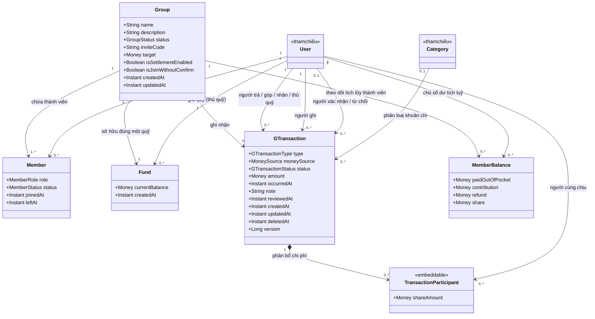
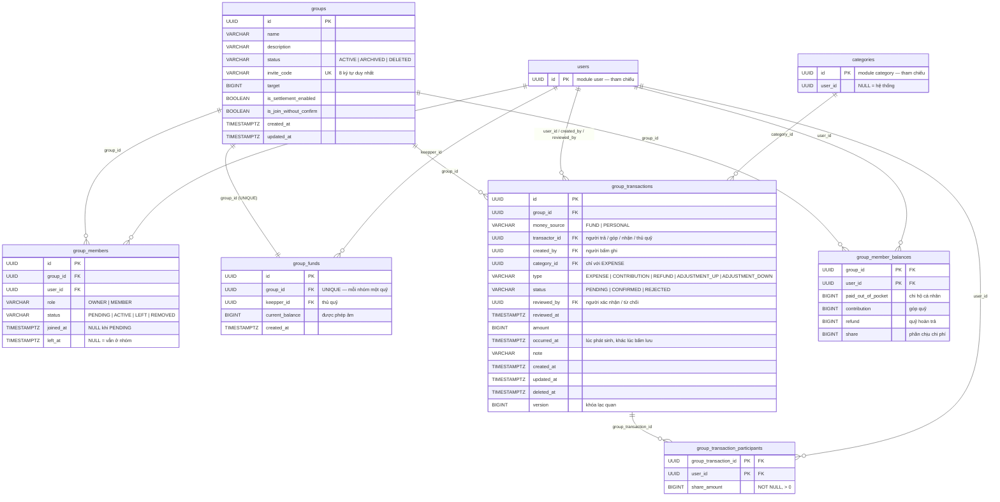

# THIẾT KẾ CÁC LỚP THỰC THỂ (ENTITY ARCHITECTURE)

> **File này chỉ mô tả dữ liệu:** lớp, thuộc tính, quan hệ, bảng, khoá, ràng buộc CSDL và entity JPA của phân hệ nhóm
> chung quỹ.
> Kịch bản Use Case → [use-case.md](use-case.md) · Luật nghiệp vụ → [rule.md](rule.md) · Luồng xử lý và cách
> tính → [pipeline.md](pipeline.md) · Endpoint → [api.md](api.md)

## 📑 MỤC LỤC

- [PHẦN 1: PHA PHÂN TÍCH LỚP THỰC THỂ (ANALYSIS PHASE)](#phan-1)
    - [1.1 Sơ đồ Lớp Thực thể Phân tích](#11-so-do-phan-tich)
    - [1.2 Danh mục 6 Thực thể & Thuộc tính Nghiệp vụ](#12-danh-muc-thuc-the)
    - [1.3 Mô tả các Mối quan hệ Nghiệp vụ](#13-moi-quan-he)
- [PHẦN 2: PHA THIẾT KẾ CHI TIẾT (DESIGN PHASE)](#phan-2)
    - [2.1 Sơ đồ Thực thể Quan hệ Thiết kế](#21-erd-thiet-ke)
    - [2.2 Chi tiết Thiết kế 6 Bảng & Lớp Thực thể JPA](#22-thiet-ke-5-bang)
        - [1. Thực thể `Group` (Bảng `groups`)](#221-group-entity)
        - [2. Thực thể `Member` (Bảng `group_members`)](#222-group-member-entity)
        - [3. Thực thể `Fund` (Bảng `group_funds`)](#223-group-fund-entity)
        - [4. Thực thể `GTransaction` (Bảng `group_transactions`)](#224-group-transaction-entity)
        - [5. Thực thể `TransactionParticipant` (Bảng `group_transaction_participants`)](#225-group-transaction-participant-entity)
        - [6. Thực thể `MemberBalance` (Bảng `group_member_balances`)](#226-member-balance-entity)
    - [2.3 Bảng Tham chiếu từ Module khác](#23-tham-chieu)
    - [2.4 Bảng Tổng hợp Khóa Ngoại](#24-tong-hop-khoa-ngoai)

---

# PHẦN 1: PHA PHÂN TÍCH LỚP THỰC THỂ (ANALYSIS PHASE) <a id="phan-1"></a>

Trong pha phân tích, mô hình thực thể tập trung hoàn toàn vào **bản chất nghiệp vụ** (Conceptual Domain Model):

- **Chỉ chứa các thuộc tính bản chất** của đối tượng.
- **Không chứa khóa ngoại (`_id`)**: quan hệ được biểu diễn bằng đường kết hợp kèm bản số (`1`, `0..1`, `0..*`, `1..*`).
- **Lớp của module khác** chỉ vẽ phần vỏ, gắn nhãn `<<tham chiếu>>`, không liệt kê thuộc tính.

---

### 1.1 Sơ đồ Lớp Thực thể Phân tích (Conceptual Class Diagram) <a id="11-so-do-phan-tich"></a>



---

### 1.2 Danh mục 6 Thực thể & Thuộc tính Nghiệp vụ <a id="12-danh-muc-thuc-the"></a>

|  STT  | Thực thể                                         | Thuộc tính bản chất                                                                                                                                                                                                                                                                                                                                                                                                                                                                                                                                                                                                                                                                                                                        | Ý nghĩa nghiệp vụ                                                                                                                                       |
|:-----:|:-------------------------------------------------|:-------------------------------------------------------------------------------------------------------------------------------------------------------------------------------------------------------------------------------------------------------------------------------------------------------------------------------------------------------------------------------------------------------------------------------------------------------------------------------------------------------------------------------------------------------------------------------------------------------------------------------------------------------------------------------------------------------------------------------------------|:--------------------------------------------------------------------------------------------------------------------------------------------------------|
| **1** | **`Group`** (Nhóm chung)                         | - `name`: Tên nhóm<br>- `description`: Mô tả<br>- `status`: `ACTIVE`, `ARCHIVED` (lưu trữ, chỉ xem), `DELETED`<br>- `inviteCode`: Mã mời vào nhóm (duy nhất, không giới hạn thời gian)<br>- `target`: Số tiền quỹ mục tiêu cần gom<br>- `isSettlementEnabled`: **Bật tính thừa thiếu** — bật thì hệ thống tính phần của từng người; tắt thì không ai cần trả ai<br>- `isJoinWithoutConfirm`: Bật thì nhập mã là vào thẳng; tắt thì chờ chủ nhóm duyệt<br>- `createdAt`, `updatedAt`                                                                                                                                                                                                                                                | Gốc điều phối thành viên, quỹ và giao dịch chung. Mọi nhóm vận hành cùng một cơ chế, không phân loại.                                                   |
| **2** | **`Member`** (Người trong nhóm)                  | - `role`: `OWNER`, `MEMBER`<br>- `status`: `PENDING`, `ACTIVE`, `LEFT`, `REMOVED`<br>- `joinedAt`: Lúc được duyệt vào<br>- `leftAt`: Lúc rời hoặc bị đuổi                                                                                                                                                                                                                                                                                                                                                                                                                                                                                                                                               ---------------------------------- | Tư cách của một người trong **một khoảng thời gian** ở một nhóm. Rời rồi quay lại là bản ghi mới, nhờ vậy biết được tại mỗi thời điểm nhóm có những ai. |
| **3** | **`Fund`** (Quỹ nhóm)                            | - `currentBalance`: Tiền quỹ còn lại, **được phép âm**<br>- `createdAt`                                                                                                                                                                                                                                                                                                                                                                                                                                                                                                                                                                                                                                                                    | Nơi giữ tiền chung. **Mỗi nhóm đúng một quỹ**, giao cho **một người giữ** (`keepper_id` - thủ quỹ). Quỹ đi theo vòng đời nhóm, không có trạng thái riêng. |
| **4** | **`GTransaction`** (Giao dịch nhóm)              | - `type`:<br>&nbsp;&nbsp;· `EXPENSE` — chi tiêu<br>&nbsp;&nbsp;· `CONTRIBUTION` — góp quỹ<br>&nbsp;&nbsp;· `REFUND` — quỹ trả tiền cho thành viên (hoàn tiền túi hoặc trả lại tiền đã góp)<br>&nbsp;&nbsp;· `ADJUSTMENT_UP` — kiểm kê, tiền thật **nhiều hơn** sổ<br>&nbsp;&nbsp;· `ADJUSTMENT_DOWN` — kiểm kê, tiền thật **ít hơn** sổ<br>- `moneySource`: `FUND` (tiền quỹ) hoặc `PERSONAL` (tiền bản thân)<br>- `status`: `PENDING` (chờ xác nhận), `CONFIRMED` (đã xác nhận), `REJECTED` (bị từ chối)<br>- `amount`: Luôn dương<br>- `occurredAt`: Thời điểm phát sinh (tới giây)<br>- `note`: Nội dung<br>- `reviewedAt`: Lúc được xác nhận hoặc từ chối<br>- `createdAt`, `updatedAt`, `deletedAt`<br>- `version`: Khóa lạc quan chống Lost Update   | Một lần tiền vào, ra, hoặc được điều chỉnh trong phạm vi nhóm.                                                                                          |
| **5** | **`TransactionParticipant`** (Người cùng chịu)   | - `shareAmount`: Số tiền người này chịu (hoặc hưởng, với `ADJUSTMENT_UP`), luôn `> 0` và bắt buộc có giá trị khi lưu. Tổng các `shareAmount` bằng đúng `amount` của giao dịch.                                                                                                                                                                                                                                                                                                                                                                                                                                                                                                                                                            | Value Object đại diện cho người cùng chịu phân bổ chi phí của giao dịch.                                                                                |
| **6** | **`MemberBalance`** (Số dư tích luỹ thành viên)  | - `paidOutOfPocket`: Tổng tiền chi hộ nhóm (`EXPENSE` nguồn `PERSONAL`)<br>- `contribution`: Tổng tiền nộp quỹ (`CONTRIBUTION`)<br>- `refund`: Tổng tiền quỹ hoàn trả (`REFUND`)<br>- `share`: Tổng phần phải chịu trong các khoản chi chung                                                                                                                                                                                                                                                                                                                                                                                                                                                                                          | Bảng tổng hợp số dư tích luỹ từng thành viên, chỉ tính giao dịch `CONFIRMED` chưa xoá. Cập nhật cộng dồn delta tự động nhằm tối ưu hiệu năng đọc báo cáo. |

**Thực thể tham chiếu** — thuộc module khác, phân hệ nhóm không định nghĩa lại:

| Thực thể   | Module         | Vai trò trong phân hệ nhóm                                                                             |
|:-----------|:---------------|:-------------------------------------------------------------------------------------------------------|
| `User`     | user (cố định) | Thành viên, thủ quỹ, người trả, người góp, người nhận tiền, người ghi, người xác nhận, người cùng chịu |
| `Category` | category       | Phân loại khoản chi nhóm. **Chỉ dùng danh mục hệ thống**                                               |

---

### 1.3 Mô tả các Mối quan hệ Nghiệp vụ (Relationships & Multiplicity) <a id="13-moi-quan-he"></a>

1. **`Group` (1) — chứa — (1..*) `Member`:**
   Nhóm luôn có ít nhất một thành viên là chủ nhóm.
2. **`User` (1) — có tư cách — (0..*) `Member`:**
   Một người có thể ở nhiều nhóm, và có thể có **nhiều khoảng thời gian** trong cùng một nhóm nếu rời rồi quay lại.
3. **`Group` (1) — sở hữu — (1) `Fund`:**
   Mỗi nhóm có đúng một quỹ, lập cùng lúc với nhóm. Quỹ không tồn tại ngoài nhóm.
4. **`User` (1) — giữ — (0..*) `Fund`:**
   Mỗi quỹ luôn có đúng một thủ quỹ là thành viên đang ở nhóm (`keepper_id`). Một người có thể giữ quỹ của nhiều nhóm khác nhau.
5. **`Group` (1) — ghi nhận — (0..*) `GTransaction`:**
   Toàn bộ lịch sử góp, chi, kiểm kê của nhóm.
6. *(Không có quan hệ trực tiếp `Fund` — `GTransaction`.)*
   Giao dịch gắn với nhóm; mỗi nhóm có một quỹ nên quỹ suy ra từ nhóm. Khoản đó có đi qua quỹ hay không nằm ở thuộc tính `moneySource`.
7. **`User` (1) — trả / góp / nhận / giữ quỹ — (0..\*) `GTransaction`:**
   Người bỏ tiền ra (`EXPENSE`), người góp (`CONTRIBUTION`), người nhận tiền (`REFUND`), hoặc thủ quỹ lúc kiểm kê (`ADJUSTMENT_*`).
8. **`User` (1) — ghi chép — (0..\*) `GTransaction`:**
   Người bấm lưu có thể khác người trả, ví dụ thủ quỹ ghi hộ.
9. **`User` (0..1) — xác nhận / từ chối — (0..\*) `GTransaction`:**
   Khoản đang chờ chưa có người xác nhận; khoản đã xác nhận hoặc bị từ chối ghi lại ai làm việc đó.
10. **`Category` (0..1) — phân loại — (0..\*) `GTransaction`:**
    Chỉ khoản chi (`EXPENSE`) mới có danh mục.
11. **`GTransaction` (1) — chia cho — (0..\*) `TransactionParticipant`:**
    Chứa danh sách người tham gia cùng chịu chi phí kèm `shareAmount` cụ thể của từng người.
12. **`User` (1) — cùng chịu — (0..\*) `TransactionParticipant`:**
    Một người có mặt trong nhiều khoản khác nhau.
13. **`Group` (1) — theo dõi tích luỹ — (0..*) `MemberBalance`:**
    Mỗi thành viên trong nhóm có đúng một bản ghi tổng hợp số dư tích luỹ.
14. **`User` (1) — sở hữu số dư — (0..*) `MemberBalance`:**
    Ghi nhận tình trạng đóng góp, hoàn tiền, chi hộ và phần chi phí đã gánh vác.

---

# PHẦN 2: PHA THIẾT KẾ CHI TIẾT (DESIGN PHASE) <a id="phan-2"></a>

Các mối quan hệ nghiệp vụ được cụ thể hóa thành **khóa chính (PK), khóa ngoại (FK), ràng buộc toàn vẹn CSDL và mã nguồn
JPA Entity**.

**Ranh giới module:** `@ManyToOne` chỉ dùng **trong cùng module group**. Trỏ sang `users` hay `categories` thì **chỉ giữ
`UUID`**.

```text
group  ──phụ thuộc──►  user (cố định)
group  ──phụ thuộc──►  category

group KHÔNG phụ thuộc module ví / giao dịch cá nhân, và không module nào phụ thuộc ngược lại group.
```

---

### 2.1 Sơ đồ Thực thể Quan hệ Thiết kế (Physical ERD với PK & FK) <a id="21-erd-thiet-ke"></a>



---

### 2.2 Chi tiết Thiết kế 6 Bảng & Lớp Thực thể JPA (`@Entity`) <a id="22-thiet-ke-5-bang"></a>

#### 1. Thực thể `Group` (Bảng `groups`) <a id="221-group-entity"></a>

- **Khóa chính (PK):** `id` (UUID).
- **Khóa duy nhất (UK):** `invite_code`.
- **Chủ nhóm** xác định bằng `group_members.role = OWNER`, **không** lưu thêm `owner_id` — hai nơi cùng ghi một chuyện
  sẽ có ngày lệch nhau.

```java
@Entity
@Table(name = "groups")
@Getter
@Setter
@Builder
@NoArgsConstructor
@AllArgsConstructor
public class Group extends AssignedIdEntity {

    @Id
    private UUID id;

    @Column(name = "name", nullable = false, length = 100)
    private String name;

    @Column(name = "description")
    private String description;

    @Column(name = "invite_code", nullable = false, length = 8)
    private String inviteCode;

    @Enumerated(EnumType.STRING)
    @Column(name = "status", nullable = false, length = 20)
    @Builder.Default
    private GroupStatus status = GroupStatus.ACTIVE; // ACTIVE, ARCHIVED, DELETED

    // Quỹ mục tiêu cần gom. NULL = không đặt mục tiêu.
    @Column(name = "target")
    private Long target;

    // TRUE  = tính phần của từng người và ai thừa ai thiếu.
    // FALSE = chỉ ghi chép. Người tham gia VẪN được ghi, để bật lại sau vẫn tính được khoản cũ.
    @Column(name = "is_settlement_enabled", nullable = false)
    @Builder.Default
    private Boolean isSettlementEnabled = true;

    // TRUE  = nhập mã là vào thẳng.
    // FALSE = thành viên mới nằm ở PENDING, chờ chủ nhóm duyệt.
    @Column(name = "is_join_without_confirm", nullable = false)
    @Builder.Default
    private Boolean isJoinWithoutConfirm = true;

    @Column(name = "created_at", nullable = false)
    private Instant createdAt;

    @Column(name = "updated_at", nullable = false)
    private Instant updatedAt;

    @OneToOne(mappedBy = "group")
    private Fund fund;
}
```

```sql
ALTER TABLE groups
    ADD CONSTRAINT ck_groups_status
        CHECK (status IN ('ACTIVE', 'ARCHIVED', 'DELETED'));
ALTER TABLE groups
    ADD CONSTRAINT ck_groups_target
        CHECK (target IS NULL OR (target > 0 AND target <= 999999999999));

-- Mã mời là duy nhất đối với các nhóm chưa bị xoá mềm
CREATE UNIQUE INDEX uq_groups_invite_code
    ON groups (invite_code)
    WHERE status != 'DELETED';
```

---

#### 2. Thực thể `Member` (Bảng `group_members`) <a id="222-group-member-entity"></a>

- **Khóa chính (PK):** `id` (UUID).
- **Khóa ngoại (FK):** `group_id` → `groups.id`; `user_id` → `users.id`.
- **Mỗi bản ghi là một khoảng thời gian ở trong nhóm** (từ `joined_at` tới `left_at`). Một người rời rồi quay lại sẽ có
  nhiều bản ghi — xem [rule.md](rule.md) mục 3.2.
- **Không** đặt UNIQUE trên cả cặp `(group_id, user_id)`. Chỉ cấm hai bản ghi **đang hiệu lực** cùng lúc:

```sql
CREATE UNIQUE INDEX uq_group_member_current
    ON group_members (group_id, user_id)
    WHERE status IN ('PENDING', 'ACTIVE');

ALTER TABLE group_members
    ADD CONSTRAINT ck_gm_role
        CHECK (role IN ('OWNER', 'MEMBER'));
ALTER TABLE group_members
    ADD CONSTRAINT ck_gm_status
        CHECK (status IN ('PENDING', 'ACTIVE', 'LEFT', 'REMOVED'));

-- Đã từng ở nhóm thì phải có joined_at; đã rời thì phải có left_at.
ALTER TABLE group_members
    ADD CONSTRAINT ck_gm_dates CHECK (
        (status = 'PENDING' AND joined_at IS NULL AND left_at IS NULL)
            OR (status = 'ACTIVE' AND joined_at IS NOT NULL AND left_at IS NULL)
            OR (status IN ('LEFT', 'REMOVED') AND joined_at IS NOT NULL AND left_at IS NOT NULL)
        );

-- Tối ưu lọc danh sách thành viên ACTIVE của nhóm
CREATE INDEX idx_gm_group_user_active
    ON group_members (group_id, user_id)
    WHERE status = 'ACTIVE';
```

```java
@Entity
@Table(name = "group_members")
@Getter
@Setter
@Builder
@NoArgsConstructor
@AllArgsConstructor
public class Member extends AssignedIdEntity {

    @Id
    private UUID id;

    @Column(name = "group_id", nullable = false)
    private UUID groupId;

    @Column(name = "user_id", nullable = false)
    private UUID userId; // module user: chỉ giữ id

    @Enumerated(EnumType.STRING)
    @Column(name = "role", nullable = false, length = 20)
    @Builder.Default
    private MemberRole role = MemberRole.MEMBER; // OWNER, MEMBER

    @Enumerated(EnumType.STRING)
    @Column(name = "status", nullable = false, length = 20)
    @Builder.Default
    private MemberStatus status = MemberStatus.ACTIVE;

    @Column(name = "joined_at")
    private Instant joinedAt; // NULL khi PENDING

    @Column(name = "left_at")
    private Instant leftAt;   // NULL = vẫn đang ở nhóm
}
```

`role` chỉ có `OWNER` và `MEMBER` — người giữ tiền được lưu ở `group_funds.keepper_id`, không phải một vai trò
thành viên. Truy vấn "những ai có mặt tại một thời điểm" ở [pipeline.md](pipeline.md) mục 1.

---

#### 3. Thực thể `Fund` (Bảng `group_funds`) <a id="223-group-fund-entity"></a>

- **Khóa chính (PK):** `id` (UUID).
- **Khóa ngoại (FK):** `group_id` → `groups.id` (bắt buộc, **duy nhất** — mỗi nhóm một quỹ); `keepper_id` →
  `users.id` (bắt buộc).
- **Không có cột `type`:** quỹ duy nhất gắn trực tiếp với nhóm và người giữ tiền (`keepper_id`).
- **`current_balance` được phép âm:** nhóm chi vượt quỹ là trường hợp hợp lệ.
- **Không có cột `initial_balance`:** quỹ luôn bắt đầu từ 0. Tiền có sẵn lúc lập nhóm được ghi thành khoản `CONTRIBUTION` của đúng người đã đưa, nên `current_balance` luôn bằng tổng ảnh hưởng của các khoản đã xác nhận.
- **Không có cột `status`:** Quỹ gắn liền với vòng đời của nhóm (đã loại bỏ theo migration `V12__remove_group_fund_status.sql`).
- Ràng buộc "người giữ quỹ phải là thành viên `ACTIVE`" do tầng Service chịu trách nhiệm xác thực, xem [rule.md](rule.md) mục 3.3.

```java
@Entity
@Table(name = "group_funds", uniqueConstraints = {
        @UniqueConstraint(name = "uq_group_funds_group", columnNames = "group_id")
})
@Getter
@Setter
@Builder
@NoArgsConstructor
@AllArgsConstructor
public class Fund extends AssignedIdEntity {

    @Id
    private UUID id;

    @Column(name = "group_id", nullable = false, unique = true)
    private UUID groupId;

    // liên kết phía sở hữu khóa ngoại cho Hibernate, chặn hoàn toàn setter
    @OneToOne(fetch = FetchType.LAZY)
    @JoinColumn(name = "group_id", referencedColumnName = "id", insertable = false, updatable = false)
    @Setter(AccessLevel.NONE)
    private Group group;

    // Phải là thành viên ACTIVE của chính nhóm này.
    @Column(name = "keepper_id", nullable = false)
    private UUID keepperId;

    // Được phép ÂM: nhóm chi vượt quỹ là chuyện có thật.
    @Column(name = "current_balance", nullable = false)
    @Builder.Default
    private Long currentBalance = 0L;

    @Column(name = "created_at", nullable = false)
    private Instant createdAt;
}
```

```sql
ALTER TABLE group_funds
    ADD CONSTRAINT uq_group_funds_group UNIQUE (group_id);
```

---

#### 4. Thực thể `GTransaction` (Bảng `group_transactions`) <a id="224-group-transaction-entity"></a>

- **Khóa chính (PK):** `id` (UUID).
- **Khóa ngoại (FK):** `group_id`, `transactor_id`, `created_by`, `reviewed_by`, `category_id`.
- **Không có `group_fund_id`:** mỗi nhóm một quỹ, nên quỹ suy ra từ `group_id`. Khoản có đi qua quỹ hay không nằm ở
  `money_source`.

**Hình dạng dữ liệu theo từng loại** (được chặn bằng `ck_gt_shape` bên dưới):

| `type`            | `money_source`         | `category_id` | `transactor_id` là  |
|:------------------|:-----------------------|:--------------|:--------------------|
| `EXPENSE`         | `FUND` hoặc `PERSONAL` | **Bắt buộc**  | Người trả           |
| `CONTRIBUTION`    | `PERSONAL`             | Rỗng          | Người góp           |
| `REFUND`          | `FUND`                 | Rỗng          | Người nhận tiền     |
| `ADJUSTMENT_UP`   | `FUND`                 | Rỗng          | Thủ quỹ lúc kiểm kê |
| `ADJUSTMENT_DOWN` | `FUND`                 | Rỗng          | Thủ quỹ lúc kiểm kê |

Ý nghĩa nghiệp vụ của từng loại, và loại nào vào báo cáo → [rule.md](rule.md) mục 3.4.

```java
@Entity
@Table(name = "group_transactions")
@Getter
@Setter
@Builder
@NoArgsConstructor
@AllArgsConstructor
public class GTransaction {

    @Id
    private UUID id;

    @Column(name = "group_id", nullable = false)
    private UUID groupId;

    // FUND = tiền quỹ; PERSONAL = tiền bản thân. Khớp với type theo ck_gt_shape.
    @Enumerated(EnumType.STRING)
    @Column(name = "money_source", nullable = false, length = 20)
    private MoneySource moneySource;

    // Người thực hiện / đối ứng: Người trả (EXPENSE), người góp (CONTRIBUTION), người nhận (REFUND), thủ quỹ lúc kiểm kê (ADJUSTMENT_*).
    @Column(name = "transactor_id", nullable = false)
    private UUID transactorId;

    // Người bấm lưu — có thể khác transactorId (ví dụ thủ quỹ ghi hộ, chủ nhóm kiểm kê quỹ của thủ quỹ).
    @Column(name = "created_by", nullable = false)
    private UUID createdBy;

    // Chỉ có với EXPENSE. Chỉ được là danh mục hệ thống (categories.user_id IS NULL).
    @Column(name = "category_id")
    private UUID categoryId;

    @Enumerated(EnumType.STRING)
    @Column(name = "type", nullable = false, length = 20)
    private GTransactionType type;

    // PENDING = chờ xác nhận; CONFIRMED = đã xác nhận; REJECTED = bị từ chối.
    @Enumerated(EnumType.STRING)
    @Column(name = "status", nullable = false, length = 20)
    @Builder.Default
    private GTransactionStatus status = GTransactionStatus.PENDING;

    // Người xác nhận hoặc từ chối. NULL khi còn PENDING.
    @Column(name = "reviewed_by")
    private UUID reviewedBy;

    @Column(name = "reviewed_at")
    private Instant reviewedAt;

    @Column(name = "amount", nullable = false)
    private Long amount; // luôn dương

    // Lúc tiền thật sự vào / ra, tới giây; khác created_at (lúc bấm lưu) khi ghi bù.
    @Column(name = "occurred_at", nullable = false)
    private Instant occurredAt;

    @Column(name = "note")
    private String note;

    @Column(name = "created_at", nullable = false)
    private Instant createdAt;

    @Column(name = "updated_at", nullable = false)
    private Instant updatedAt;

    @Column(name = "deleted_at")
    private Instant deletedAt;

    // Khóa lạc quan chống Lost Update khi hai request cùng duyệt / sửa đồng thời
    @Version
    @Column(name = "version", nullable = false)
    private Long version;

    // Rỗng = cả nhóm cùng chịu. Quản lý qua @ElementCollection (Value Object)
    @ElementCollection
    @CollectionTable(
            name = "group_transaction_participants",
            joinColumns = @JoinColumn(name = "group_transaction_id")
    )
    @Builder.Default
    private List<TransactionParticipant> participants = new ArrayList<>();
}
```

```java
public enum GTransactionStatus {
    PENDING,     // chờ xác nhận
    CONFIRMED,   // đã xác nhận
    REJECTED     // bị từ chối
}

public enum MoneySource {
    FUND,        // tiền quỹ
    PERSONAL     // tiền bản thân
}

public enum GTransactionType {
    EXPENSE,          // nhóm tiêu tiền
    CONTRIBUTION,     // thành viên góp tiền vào quỹ
    REFUND,           // quỹ trả tiền cho thành viên (hoàn tiền túi hoặc trả lại tiền đã góp)
    ADJUSTMENT_UP,    // kiểm kê: tiền thật nhiều hơn sổ
    ADJUSTMENT_DOWN   // kiểm kê: tiền thật ít hơn sổ
}
```

```sql
ALTER TABLE group_transactions
    ADD CONSTRAINT ck_gt_amount
        CHECK (amount > 0 AND amount <= 999999999999);

ALTER TABLE group_transactions
    ADD CONSTRAINT ck_gt_type
        CHECK (type IN ('EXPENSE', 'CONTRIBUTION', 'REFUND', 'ADJUSTMENT_UP', 'ADJUSTMENT_DOWN'));

ALTER TABLE group_transactions
    ADD CONSTRAINT ck_gt_money_source
        CHECK (money_source IN ('FUND', 'PERSONAL'));

ALTER TABLE group_transactions
    ADD CONSTRAINT ck_gt_status
        CHECK (status IN ('PENDING', 'CONFIRMED', 'REJECTED'));

-- Đang chờ thì chưa có người xác nhận; đã xác nhận / bị từ chối thì phải có.
ALTER TABLE group_transactions
    ADD CONSTRAINT ck_gt_review CHECK (
        (status = 'PENDING' AND reviewed_by IS NULL AND reviewed_at IS NULL)
            OR (status IN ('CONFIRMED', 'REJECTED') AND reviewed_by IS NOT NULL AND reviewed_at IS NOT NULL)
        );

-- Kiểm kê và quỹ trả tiền cho thành viên do thủ quỹ / chủ nhóm tạo, luôn đã xác nhận.
ALTER TABLE group_transactions
    ADD CONSTRAINT ck_gt_treasurer_confirmed CHECK (
        type NOT IN ('REFUND', 'ADJUSTMENT_UP', 'ADJUSTMENT_DOWN') OR status = 'CONFIRMED'
        );

-- Chi tiêu: bắt buộc có danh mục, tiền quỹ hoặc tiền bản thân.
-- Góp quỹ: tiền bản thân, không danh mục.
-- Quỹ trả tiền và kiểm kê: tiền quỹ, không danh mục.
ALTER TABLE group_transactions
    ADD CONSTRAINT ck_gt_shape CHECK (
        (type = 'EXPENSE'
            AND category_id IS NOT NULL)
            OR (type = 'CONTRIBUTION'
            AND money_source = 'PERSONAL'
            AND category_id IS NULL)
            OR (type IN ('REFUND', 'ADJUSTMENT_UP', 'ADJUSTMENT_DOWN')
            AND money_source = 'FUND'
            AND category_id IS NULL)
        );

-- Partial index: Tối ưu truy vấn lịch sử giao dịch và lọc trạng thái (bỏ qua các bản ghi xoá mềm)
CREATE INDEX idx_gt_group_occurred
    ON group_transactions (group_id, occurred_at DESC)
    WHERE deleted_at IS NULL;

CREATE INDEX idx_gt_group_status
    ON group_transactions (group_id, status)
    WHERE deleted_at IS NULL;

CREATE INDEX idx_gt_transactor
    ON group_transactions (transactor_id)
    WHERE deleted_at IS NULL;
```

---

#### 5. Value Object `TransactionParticipant` (Bảng `group_transaction_participants`) <a id="225-group-transaction-participant-entity"></a>

- **Khóa chính (PK):** tổ hợp `(group_transaction_id, user_id)`.
- **Thiết kế kiến trúc DDD:** Được đánh dấu là `@Embeddable` và thuộc quyền quản lý của Aggregate Root `GTransaction` qua `@ElementCollection`. Không có ID độc lập và không chứa quan hệ ngược về cha (unidirectional).
- **Vắng bản ghi = cả nhóm cùng chịu.** Bảng chỉ có dòng khi khoản đó không chia cho tất cả.
- **`share_amount` luôn bắt buộc (NOT NULL > 0):** Khi tạo/sửa giao dịch, hệ thống tính toán và gán giá trị cụ thể cho từng người (chia đều hoặc tùy chỉnh), bảo đảm tổng `share_amount` bằng đúng `amount` của giao dịch (theo Migration `V16`).
- Các trường hợp cụ thể → [rule.md](rule.md) mục 3.5.

```java
@Embeddable
@Getter
@Setter
@Builder
@NoArgsConstructor
@AllArgsConstructor
public class TransactionParticipant {

    @Column(name = "user_id", nullable = false)
    private UUID userId;

    // Bắt buộc > 0 (NOT NULL từ V16).
    // MỌI dòng của khoản đó đều phải có, và tổng shareAmount = amount.
    @Column(name = "share_amount", nullable = false)
    private Long shareAmount;
}
```

```sql
ALTER TABLE group_transaction_participants
    ADD CONSTRAINT fk_gtp_txn FOREIGN KEY (group_transaction_id)
        REFERENCES group_transactions (id) ON DELETE CASCADE;

-- Đặt ràng buộc NOT NULL và CHECK (1 .. 999.999.999.999) theo migration V16
ALTER TABLE group_transaction_participants
    ALTER COLUMN share_amount SET NOT NULL;

ALTER TABLE group_transaction_participants
    ADD CONSTRAINT ck_gtp_share_amount
        CHECK (share_amount > 0 AND share_amount <= 999999999999);
```

---

#### 6. Thực thể `MemberBalance` (Bảng `group_member_balances`) <a id="226-member-balance-entity"></a>

- **Khóa chính (PK):** tổ hợp `(group_id, user_id)` qua `@IdClass(MemberBalance.MemberBalanceId.class)`.
- **Khóa ngoại (FK):** `group_id` → `groups.id` (CASCADE); `user_id` → `users.id` (CASCADE).
- **Mục đích thiết kế (Migration `V18`):** Bảng tổng hợp số dư tích luỹ của từng thành viên trong nhóm, chỉ tính các giao dịch `CONFIRMED` chưa xoá. Số liệu chỉ được cộng dồn delta qua query nguyên tử `MemberBalanceRepository.addDelta(...)` trong database, không gán field rồi flush Hibernate để tránh Race Condition / Lost Update.
- Báo cáo số dư (`/balances`) và kiểm tra hạn mức hoàn tiền đọc thẳng bảng này với độ phức tạp $O(N)$ số thành viên thay vì phải quét toàn bộ bảng giao dịch.

```java
@Entity
@Table(name = "group_member_balances")
@IdClass(MemberBalance.MemberBalanceId.class)
@Getter
@Setter
@Builder
@NoArgsConstructor
@AllArgsConstructor
public class MemberBalance {

    @Id
    @Column(name = "group_id", nullable = false)
    private UUID groupId;

    @Id
    @Column(name = "user_id", nullable = false)
    private UUID userId;

    // Tổng tiền túi người này đã chi hộ nhóm (EXPENSE nguồn PERSONAL)
    @Column(name = "paid_out_of_pocket", nullable = false)
    private long paidOutOfPocket;

    // Tổng tiền người này đã nộp quỹ (CONTRIBUTION)
    @Column(name = "contribution", nullable = false)
    private long contribution;

    // Tổng tiền quỹ đã trả lại cho người này (REFUND)
    @Column(name = "refund", nullable = false)
    private long refund;

    // Tổng phần người này phải chịu trong các khoản chia tiền; ADJUSTMENT_UP làm giảm phần này
    @Column(name = "share", nullable = false)
    private long share;

    @Getter
    @Setter
    @NoArgsConstructor
    @AllArgsConstructor
    @EqualsAndHashCode
    public static class MemberBalanceId implements Serializable {
        private UUID groupId;
        private UUID userId;
    }
}
```

```sql
CREATE TABLE group_member_balances (
    group_id           UUID   NOT NULL,
    user_id            UUID   NOT NULL,
    paid_out_of_pocket BIGINT NOT NULL DEFAULT 0,
    contribution       BIGINT NOT NULL DEFAULT 0,
    refund             BIGINT NOT NULL DEFAULT 0,
    share              BIGINT NOT NULL DEFAULT 0,

    PRIMARY KEY (group_id, user_id),
    CONSTRAINT fk_gmb_group FOREIGN KEY (group_id) REFERENCES groups (id) ON DELETE CASCADE,
    CONSTRAINT fk_gmb_user  FOREIGN KEY (user_id)  REFERENCES users  (id) ON DELETE CASCADE
);
```

---

### 2.3 Bảng Tham chiếu từ Module khác <a id="23-tham-chieu"></a>

Phân hệ nhóm **không định nghĩa, không sửa** các bảng dưới đây. Chỉ trỏ khoá ngoại tới. Luật dùng hai bảng này nằm ở [rule.md](rule.md) mục 3.6.

| Bảng         | Module         | Nhóm dùng cột nào | Ghi chú                                                                                                                           |
|:-------------|:---------------|:------------------|:----------------------------------------------------------------------------------------------------------------------------------|
| `users`      | user (cố định) | `id`              | Khoá ngoại của thành viên, thủ quỹ, người trả, người ghi, người xác nhận, người tham gia                                          |
| `categories` | category       | `id`, `user_id`   | `user_id` dùng để biết danh mục có phải của hệ thống không. Cấu trúc cây danh mục thuộc module danh mục, không thuộc tài liệu này |

**Không tham chiếu:** `wallets`, `transactions` (sổ cá nhân). Phân hệ nhóm không có khoá ngoại nào sang hai bảng này — xem [rule.md](rule.md) quyết định 4.

---

### 2.4 Bảng Tổng hợp Khóa Ngoại (Foreign Key Mapping Matrix) <a id="24-tong-hop-khoa-ngoai"></a>

| Bảng con                         | Cột FK                 | Bảng cha             | Khi xoá cha | Ý nghĩa                          |
|:---------------------------------|:-----------------------|:---------------------|:------------|:---------------------------------|
| `group_members`                  | `group_id`             | `groups`             | RESTRICT    | Nhóm chỉ xoá mềm                 |
| `group_members`                  | `user_id`              | `users`              | RESTRICT    | Định danh thành viên             |
| `group_funds`                    | `group_id` (UNIQUE)    | `groups`             | RESTRICT    | Mỗi nhóm đúng một quỹ            |
| `group_funds`                    | `keepper_id`           | `users`              | RESTRICT    | Thủ quỹ đang cầm tiền            |
| `group_transactions`             | `group_id`             | `groups`             | RESTRICT    | Thuộc nhóm nào                   |
| `group_transactions`             | `transactor_id`        | `users`              | RESTRICT    | Người trả / góp / nhận / thủ quỹ |
| `group_transactions`             | `created_by`           | `users`              | RESTRICT    | Người bấm ghi                    |
| `group_transactions`             | `reviewed_by`          | `users`              | RESTRICT    | Người xác nhận / từ chối         |
| `group_transactions`             | `category_id`          | `categories`         | RESTRICT    | Chỉ danh mục hệ thống            |
| `group_transaction_participants` | `group_transaction_id` | `group_transactions` | **CASCADE** | Đi theo khoản giao dịch          |
| `group_transaction_participants` | `user_id`              | `users`              | RESTRICT    | Người cùng chịu                  |
| `group_member_balances`          | `group_id`             | `groups`             | **CASCADE** | Số dư tích luỹ của nhóm          |
| `group_member_balances`          | `user_id`              | `users`              | **CASCADE** | Số dư tích luỹ của thành viên    |

Mọi khoá ngoại sang `users` trong các bảng nghiệp vụ chính là **RESTRICT**: tài khoản trong hệ thống này chỉ xoá mềm, nên lịch sử "ai đã trả, ai đã góp" không bao giờ mất. Riêng bảng `group_member_balances` sử dụng **CASCADE** để dọn dẹp số liệu tổng hợp khi cần thiết.ác bảng dưới đây. Chỉ trỏ khoá ngoại tới. Luật dùng hai bảng này nằm
ở [rule.md](rule.md) mục 3.6.

| Bảng         | Module         | Nhóm dùng cột nào | Ghi chú                                                                                                                           |
|:-------------|:---------------|:------------------|:----------------------------------------------------------------------------------------------------------------------------------|
| `users`      | user (cố định) | `id`              | Khoá ngoại của thành viên, thủ quỹ, người trả, người ghi, người xác nhận, người tham gia                                          |
| `categories` | category       | `id`, `user_id`   | `user_id` dùng để biết danh mục có phải của hệ thống không. Cấu trúc cây danh mục thuộc module danh mục, không thuộc tài liệu này |

**Không tham chiếu:** `wallets`, `transactions` (sổ cá nhân). Phân hệ nhóm không có khoá ngoại nào sang hai bảng này —
xem [rule.md](rule.md) quyết định 4.

---

### 2.4 Bảng Tổng hợp Khóa Ngoại (Foreign Key Mapping Matrix) <a id="24-tong-hop-khoa-ngoai"></a>

| Bảng con                         | Cột FK                 | Bảng cha             | Khi xoá cha | Ý nghĩa                          |
|:---------------------------------|:-----------------------|:---------------------|:------------|:---------------------------------|
| `group_members`                  | `group_id`             | `groups`             | RESTRICT    | Nhóm chỉ xoá mềm                 |
| `group_members`                  | `user_id`              | `users`              | RESTRICT    | Định danh thành viên             |
| `group_funds`                    | `group_id` (UNIQUE)    | `groups`             | RESTRICT    | Mỗi nhóm đúng một quỹ            |
| `group_funds`                    | `keepper_id`           | `users`              | RESTRICT    | Thủ quỹ đang cầm tiền            |
| `group_transactions`             | `group_id`             | `groups`             | RESTRICT    | Thuộc nhóm nào                   |
| `group_transactions`             | `transactor_id`        | `users`              | RESTRICT    | Người trả / góp / nhận / thủ quỹ |
| `group_transactions`             | `created_by`           | `users`              | RESTRICT    | Người bấm ghi                    |
| `group_transactions`             | `reviewed_by`          | `users`              | RESTRICT    | Người xác nhận / từ chối         |
| `group_transactions`             | `category_id`          | `categories`         | RESTRICT    | Chỉ danh mục hệ thống            |
| `group_transaction_participants` | `group_transaction_id` | `group_transactions` | **CASCADE** | Đi theo khoản giao dịch          |
| `group_transaction_participants` | `user_id`              | `users`              | RESTRICT    | Người cùng chịu                  |

Mọi khoá ngoại sang `users` là **RESTRICT**: tài khoản trong hệ thống này chỉ xoá mềm, nên lịch sử "ai đã trả, ai đã
góp" không bao giờ mất.

---
