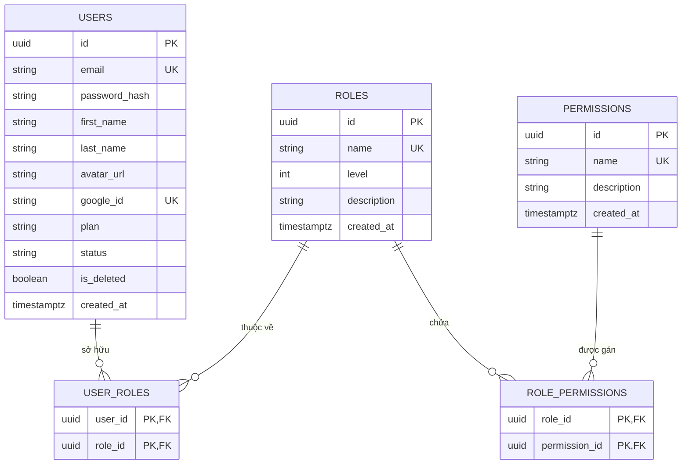

# THỰC THỂ & CƠ SỞ DỮ LIỆU — PHÂN HỆ NGƯỜI DÙNG & PHÂN QUYỀN (USER & RBAC)

> **File này trả lời:** Cấu trúc bảng CSDL, quan hệ giữa các thực thể người dùng, vai trò, quyền hạn trong hệ thống RBAC.  
> Endpoint API → [api.md](api.md) · Luồng nghiệp vụ → [pipeline.md](pipeline.md) · Quy tắc RBAC → [rule.md](rule.md)

---

## 📑 MỤC LỤC

- [1. Danh mục Thực thể](#1-danh-muc-thuc-the)
- [2. Chi tiết các bảng CSDL PostgreSQL](#2-chi-tiet-bang-csdl)
  - [2.1 Bảng `users`](#21-bang-users)
  - [2.2 Bảng `roles`](#22-bang-roles)
  - [2.3 Bảng `permissions`](#23-bang-permissions)
  - [2.4 Bảng `user_roles` (Bảng liên kết)](#24-bang-user_roles)
  - [2.5 Bảng `role_permissions` (Bảng liên kết)](#25-bang-role_permissions)
- [3. Danh mục Kiểu liệt kê (Enums)](#3-danh-muc-enums)
- [4. Bộ nhớ đệm Redis (Cache & Blacklist)](#4-bo-nho-dem-redis)
- [5. Sơ đồ ERD & Cấu trúc quan hệ](#5-so-do-erd)

---

## 1. Danh mục Thực thể <a id="1-danh-muc-thuc-the"></a>

Phân hệ người dùng áp dụng mô hình phân quyền dựa trên vai trò tiêu chuẩn (Role-Based Access Control - RBAC) kết hợp cấp bậc ưu tiên (`level`):

| Tên thực thể | Tên bảng CSDL | Mục đích & Trách nhiệm |
| :--- | :--- | :--- |
| **`User`** | `users` | Lưu trữ thông tin tài khoản người dùng, hồ sơ, gói cước và trạng thái tài khoản |
| **`Role`** | `roles` | Đại diện cho vai trò trong hệ thống (`ROLE_USER`, `ROLE_ADMIN`) kèm cấp bậc ưu tiên `level` |
| **`Permission`** | `permissions` | Đại diện cho quyền hạn chi tiết (Permission) dùng để phân quyền ở cấp độ API (`@PreAuthorize`) |
| **`UserRole`** | `user_roles` | Quan hệ nhiều-nhiều (N-N) gán các vai trò cho người dùng |
| **`RolePermission`** | `role_permissions` | Quan hệ nhiều-nhiều (N-N) gán các quyền hạn chi tiết cho từng vai trò |

---

## 2. Chi tiết các bảng CSDL PostgreSQL <a id="2-chi-tiet-bang-csdl"></a>

### 2.1 Bảng `users` <a id="21-bang-users"></a>

Bảng cốt lõi định danh người dùng toàn hệ thống.

```sql
CREATE TABLE users (
    id            UUID PRIMARY KEY,
    email         VARCHAR(255) NOT NULL UNIQUE,
    password_hash VARCHAR(255),
    first_name    VARCHAR(100),
    last_name     VARCHAR(100),
    avatar_url    TEXT,
    google_id     VARCHAR(255) UNIQUE,
    plan          VARCHAR(20) NOT NULL DEFAULT 'FREE',
    status        VARCHAR(20) NOT NULL DEFAULT 'ACTIVE',
    is_deleted    BOOLEAN NOT NULL DEFAULT FALSE,
    created_at    TIMESTAMPTZ NOT NULL DEFAULT CURRENT_TIMESTAMP,
    CONSTRAINT ck_users_email_lowercase CHECK (email = LOWER(email))
);

CREATE INDEX idx_users_email ON users(email);
CREATE INDEX idx_users_google_id ON users(google_id) WHERE google_id IS NOT NULL;
```

**Mô tả các cột:**
- `id`: Khóa chính định danh (`UUID.randomUUID()`).
- `email`: Địa chỉ email duy nhất, bắt buộc viết thường (`CHECK (email = LOWER(email))`).
- `password_hash`: Chuỗi băm mật khẩu BCrypt. Có thể là `NULL` nếu tài khoản đăng nhập Google thuần chưa tạo mật khẩu.
- `first_name`, `last_name`: Tên và họ của người dùng.
- `avatar_url`: Đường dẫn ảnh đại diện.
- `google_id`: Định danh `sub` từ Google OAuth2 (nếu có liên kết).
- `plan`: Gói cước (`FREE`, `PREMIUM`).
- `status`: Trạng thái tài khoản (`ACTIVE`, `PENDING`, `BLOCKED`).
- `is_deleted`: Cờ xóa mềm (`true` = người dùng đã tự xóa tài khoản).
- `created_at`: Thời điểm khởi tạo tài khoản.

### 2.2 Bảng `roles` <a id="22-bang-roles"></a>

Quản lý danh mục các vai trò.

```sql
CREATE TABLE roles (
    id          UUID PRIMARY KEY,
    name        VARCHAR(50) NOT NULL UNIQUE,
    level       INT NOT NULL,
    description VARCHAR(255),
    created_at  TIMESTAMPTZ NOT NULL DEFAULT CURRENT_TIMESTAMP
);
```

**Mô tả các cột:**
- `id`: Khóa chính định danh vai trò.
- `name`: Tên vai trò duy nhất (`ROLE_USER`, `ROLE_ADMIN`).
- `level`: Cấp bậc quyền hạn. **Quy tắc cấp bậc:** Số càng nhỏ thì quyền hạn càng cao (`level` thấp hơn = quyền lực lớn hơn). Quản trị viên chỉ được quản lý tài khoản/vai trò có `level` lớn hơn mình.
- `description`: Mô tả chi tiết vai trò.

### 2.3 Bảng `permissions` <a id="23-bang-permissions"></a>

Quản lý danh mục quyền thao tác cụ thể trong hệ thống.

```sql
CREATE TABLE permissions (
    id          UUID PRIMARY KEY,
    name        VARCHAR(50) NOT NULL UNIQUE,
    description VARCHAR(255),
    created_at  TIMESTAMPTZ NOT NULL DEFAULT CURRENT_TIMESTAMP
);
```

- `name`: Tên quyền hạn duy nhất theo quy ước `resource:action` (Ví dụ: `users:read`, `users:update`, `users:delete`, `user_roles:update`, `user_roles:delete`, `roles:read`, `role_permissions:read`, `role_permissions:update`).

### 2.4 Bảng `user_roles` (Bảng liên kết) <a id="24-bang-user_roles"></a>

```sql
CREATE TABLE user_roles (
    user_id UUID NOT NULL REFERENCES users(id) ON DELETE CASCADE,
    role_id UUID NOT NULL REFERENCES roles(id) ON DELETE CASCADE,
    PRIMARY KEY (user_id, role_id)
);
```

- Khóa chính tổng hợp `(user_id, role_id)`.
- Một người dùng có thể sở hữu nhiều vai trò. Vai trò mặc định `ROLE_USER` được tự động cấp phát khi tạo tài khoản và không thể xóa bỏ.

### 2.5 Bảng `role_permissions` (Bảng liên kết) <a id="25-bang-role_permissions"></a>

```sql
CREATE TABLE role_permissions (
    role_id       UUID NOT NULL REFERENCES roles(id) ON DELETE CASCADE,
    permission_id UUID NOT NULL REFERENCES permissions(id) ON DELETE CASCADE,
    PRIMARY KEY (role_id, permission_id)
);
```

- Khóa chính tổng hợp `(role_id, permission_id)`.
- Định nghĩa tập hợp các quyền cụ thể gán cho từng vai trò.

---

## 3. Danh mục Kiểu liệt kê (Enums) <a id="3-danh-muc-enums"></a>

| Enum | Giá trị | Ý nghĩa nghiệp vụ |
| :--- | :--- | :--- |
| **`UserStatus`** | `ACTIVE` | Tài khoản hoạt động bình thường |
| | `PENDING` | Tài khoản mới đăng ký, đang chờ xác thực OTP qua email |
| | `BLOCKED` | Tài khoản bị quản trị viên khóa do vi phạm |
| **`UserPlan`** | `FREE` | Gói cơ bản miễn phí |
| | `PREMIUM` | Gói trả phí nâng cao (nhiều tính năng AI và hạn mức) |
| **`RoleName`** | `ROLE_USER` | Vai trò người dùng thông thường mặc định (level = 100) |
| | `ROLE_ADMIN` | Vai trò quản trị viên hệ thống (level = 1) |
| **`PermissionName`** | `USERS_READ` (`users:read`) | Quyền xem danh sách và chi tiết người dùng |
| | `USERS_UPDATE` (`users:update`) | Quyền khóa / mở khóa tài khoản người dùng |
| | `USERS_DELETE` (`users:delete`) | Quyền xóa người dùng khỏi hệ thống |
| | `USER_ROLE_UPDATE` (`user_roles:update`) | Quyền gán vai trò mới cho người dùng |
| | `USER_ROLE_DELETE` (`user_roles:delete`) | Quyền thu hồi vai trò của người dùng |
| | `ROLES_READ` (`roles:read`) | Quyền xem danh sách các vai trò hệ thống |
| | `ROLE_PERMISSION_READ` (`role_permissions:read`) | Quyền xem danh sách quyền hạn của một vai trò |
| | `ROLE_PERMISSION_UPDATE` (`role_permissions:update`) | Quyền gán thêm quyền hạn cho vai trò |

---

## 4. Bộ nhớ đệm Redis (Cache & Blacklist) <a id="4-bo-nho-dem-redis"></a>

Để tăng tốc độ phân quyền và bảo đảm an ninh:
1. **`UserAuthCacheHelper`:** Lưu trữ thông tin phân quyền của user (`roles`, `authorities`, `topRoleLevel`) trong Redis để kiểm tra nhanh. Khi có thay đổi gán/gỡ role hoặc khóa tài khoản, cache bị hủy (`evictUserAuth`) ngay lập tức.
2. **`RolePermissionCacheHelper`:** Lưu trữ danh sách quyền của từng Role. Hủy cache (`evictPermissionsByRole`) khi gán thêm quyền cho role.
3. **`BlacklistedUserRepository`:** Khi tài khoản bị Admin khóa (`PATCH /admin/user/lock`), `userId` được đẩy vào danh sách đen trên Redis kèm lý do khóa (TTL 3600 giây). Mọi request mang token còn hạn của user này lập tức bị chặn tại Security Filter.

---

## 5. Sơ đồ ERD & Cấu trúc quan hệ <a id="5-so-do-erd"></a>


