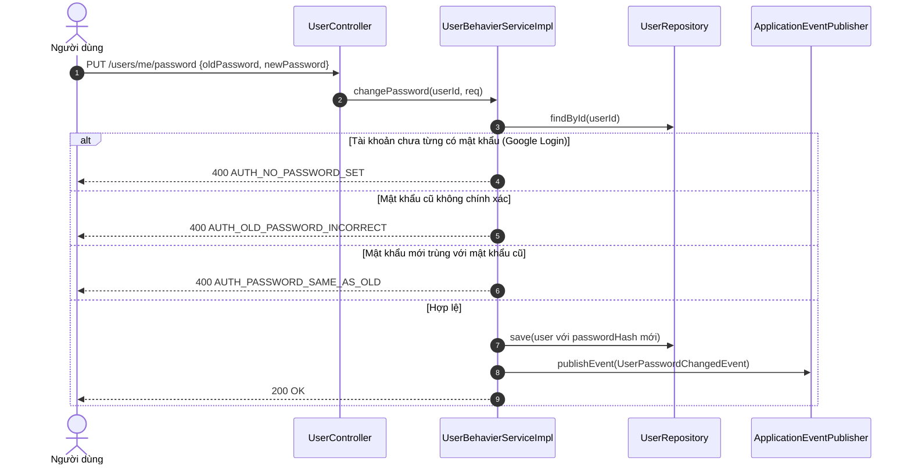
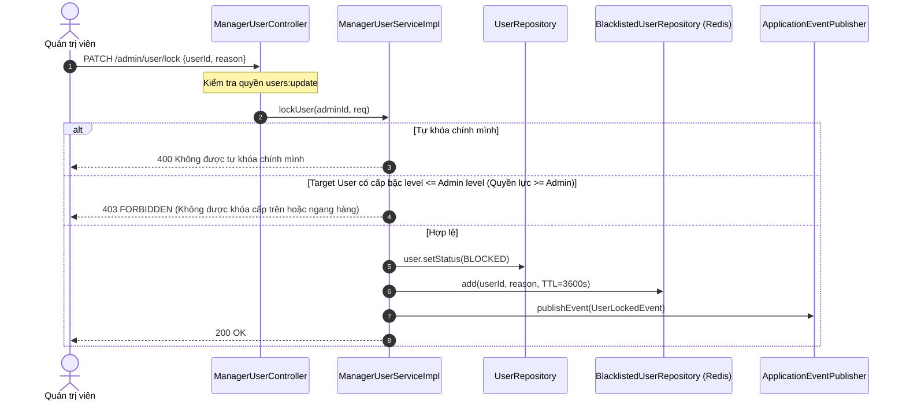

# LUỒNG XỬ LÝ & QUẢN TRỊ RBAC — PHÂN HỆ NGƯỜI DÙNG (USER & RBAC)

> **File này trả lời:** Trình tự xử lý các luồng nghiệp vụ hồ sơ cá nhân, đổi mật khẩu, cấp mật khẩu cho tài khoản Google, khóa tài khoản và phân quyền động RBAC.  
> Cấu trúc bảng & Entity → [lop-thuc-the.md](lop-thuc-the.md) · Endpoint API → [api.md](api.md) · Quy tắc RBAC → [rule.md](rule.md)

---

## 📑 MỤC LỤC

- [1. Luồng Cập nhật hồ sơ & Đổi mật khẩu](#1-luong-ho-so-mat-khau)
- [2. Luồng Cấp mật khẩu tự động cho tài khoản Google](#2-luong-cap-mat-khau-google)
- [3. Luồng Người dùng tự xóa tài khoản](#3-luong-tu-xoa-tai-khoan)
- [4. Luồng Khóa tài khoản & Cơ chế Blacklist Redis](#4-luong-khoa-tai-khoan)
- [5. Luồng Gán & Thu hồi vai trò người dùng](#5-luong-quan-tri-vai-tro)
- [6. Luồng Quản trị quyền hạn cho vai trò](#6-luong-quan-tri-quyen-han)

---

## 1. Luồng Cập nhật hồ sơ & Đổi mật khẩu 

**Các bước xử lý:**
1. Trích xuất `userId` từ Security Context của phiên đăng nhập hiện tại.
2. Kiểm tra tài khoản có mật khẩu chưa (`password != null`).
3. So khớp mật khẩu cũ qua `passwordEncoder.matches(oldPassword, user.getPassword())`.
4. Kiểm tra mật khẩu mới không được trùng mật khẩu cũ (`matches(newPassword, user.getPassword())`).
5. Mã hóa mật khẩu mới bằng BCrypt và lưu vào CSDL.
6. Phát hành sự kiện `UserPasswordChangedEvent` để lắng nghe và thu hồi các Refresh Token cũ.

---

## 2. Luồng Cấp mật khẩu tự động cho tài khoản Google 

Dành riêng cho người dùng đăng ký qua Google OAuth2 muốn bổ sung mật khẩu để đăng nhập bằng email:

1. Người dùng gọi `POST /users/me/password` (được bảo vệ bằng `@Idempotent` chống bấm đúp).
2. Kiểm tra điều kiện: `user.getPassword() == null`. Nếu đã có mật khẩu thì từ chối với lỗi `AUTH_PASSWORD_ALREADY_SET`.
3. Hệ thống sinh mật khẩu ngẫu nhiên an toàn độ dài cao qua `PasswordGenerator`.
4. Mã hóa BCrypt và lưu vào trường `password_hash` của người dùng.
5. Gửi email chứa mật khẩu vừa tạo tới địa chỉ email của người dùng qua `EmailService.sendGeneratedPassword`.

---

## 3. Luồng Người dùng tự xóa tài khoản 

1. Người dùng gọi `DELETE /users/me` kèm mật khẩu xác nhận (nếu tài khoản có mật khẩu).
2. Kiểm tra mật khẩu xác nhận: nếu sai mật khẩu thì chặn ngay (`AUTH_PASSWORD_INCORRECT`).
3. Đặt cờ `is_deleted = true`, lưu lại bản ghi.
4. Phát hành sự kiện `UserDeletedEvent(userId)` để thực hiện dọn dẹp các tài nguyên cá nhân và thu hồi phiên đăng nhập.

---

## 4. Luồng Khóa tài khoản & Cơ chế Blacklist Redis 

**Nguyên lý an ninh:**
- **Quy tắc cấp bậc (`level`):** Cấp bậc quản trị được định nghĩa bằng số nguyên, số nhỏ có quyền hạn cao hơn (`level = 1` là siêu quản trị). Quản trị viên không bao giờ được phép tác động lên tài khoản có `level <= level` của chính mình.
- **Vô hiệu hóa phiên tức thì:** Mặc dù JWT Access Token là stateless, khi tài khoản bị khóa, `userId` được đưa vào Redis Blacklist. Bộ lọc `JwtAuthenticationFilter` kiểm tra Redis Blacklist trong mỗi request và từ chối ngay lập tức nếu người dùng đang nằm trong danh sách đen.
- **Thu hồi Refresh Tokens:** Sự kiện `UserLockedEvent` kích hoạt thu hồi toàn bộ Refresh Tokens trong CSDL để người dùng không thể làm mới token.

---

## 5. Luồng Gán & Thu hồi vai trò người dùng 

### Gán vai trò (`POST /admin/user/role`):
1. Kiểm tra quyền thao tác `user_roles:update`.
2. Kiểm tra cấp bậc: Không được gán vai trò có `level <= level` của người thực hiện.
3. Kiểm tra trùng lặp: Nếu người dùng đã sở hữu vai trò này (`existsByUserIdAndRoleId`), ném lỗi `USER_ROLE_ALREADY_ASSIGNED`.
4. Tạo và lưu bản ghi `UserRole(userId, roleId)`.
5. Hủy cache phân quyền của người dùng trên Redis (`userAuthCacheHelper.evictUserAuth(userId)`).

### Thu hồi vai trò (`DELETE /admin/user/role`):
1. Kiểm tra quyền thao tác `user_roles:delete`.
2. Kiểm tra cấp bậc: Không được gỡ vai trò có `level <= level` của người thực hiện.
3. **Bảo vệ vai trò mặc định:** Nếu `role.getName() == RoleName.ROLE_USER`, lập tức từ chối với lỗi `USER_DEFAULT_ROLE_NOT_REMOVABLE`.
4. Xóa bản ghi trong `user_roles`.
5. Hủy cache phân quyền của người dùng trên Redis (`userAuthCacheHelper.evictUserAuth(userId)`).

---

## 6. Luồng Quản trị quyền hạn cho vai trò 

Áp dụng khi cấu hình phân quyền động (`POST /admin/role/permission`):

1. Kiểm tra quyền hạn `role_permissions:update`.
2. Kiểm tra cấp bậc: Quản trị viên không được can thiệp vào cấu hình của vai trò có `level <= level` của chính mình.
3. **Nguyên tắc thừa kế quyền lực:** Quản trị viên chỉ được phép gán cho vai trò khác **những quyền mà bản thân mình đang sở hữu**. Nếu cố gán quyền mình không có, hệ thống lập tức từ chối (`403 FORBIDDEN`).
4. Kiểm tra quyền chưa tồn tại trong vai trò (`USER_ROLE_PERMISSION_ALREADY_ASSIGNED`).
5. Lưu bản ghi `RolePermission(roleId, permissionId)`.
6. Hủy cache danh sách quyền hạn của vai trò trên Redis (`rolePermissionCacheHelper.evictPermissionsByRole(roleName)`).
