```mermaid
classDiagram
    class GroupController {
        -GroupService groupService
        +create(dto: GroupCreateReq): ApiResponse~GroupDetailRes~
        +list(): ApiResponse~List~GroupSummaryRes~~
        +detail(id: UUID): ApiResponse~GroupDetailRes~
        +listMembers(id: UUID, status: String): ApiResponse~List~GroupMemberRes~~
        +getOrRegenerateInviteCode(id: UUID, regenerate: boolean): ApiResponse~GroupInviteCodeRes~
        +join(dto: GroupJoinReq): ApiResponse~GroupJoinRes~
        +approveMember(id: UUID, userId: UUID): ApiResponse~Void~
        +removeMember(id: UUID, userId: UUID): ApiResponse~Void~
        +transferOwnership(id: UUID, dto: GroupTransferOwnershipReq): ApiResponse~Void~
        +leave(id: UUID): ApiResponse~Void~
        +archive(id: UUID): ApiResponse~Void~
        +unarchive(id: UUID): ApiResponse~Void~
        +delete(id: UUID): ApiResponse~Void~
    }

    class GroupWalletController {
        -GroupWalletService walletService
        +get(groupId: UUID): ApiResponse~GroupWalletRes~
        +update(groupId: UUID, dto: GroupWalletUpdateReq): ApiResponse~GroupWalletRes~
        +reconcile(groupId: UUID, dto: GroupWalletReconcileReq): ApiResponse~GroupWalletReconcileRes~
    }

    class GroupTransactionController {
        -GroupTransactionService txnService
        +create(groupId: UUID, dto: GroupTransactionCreateReq): ApiResponse~GroupTransactionDetailRes~
        +refund(groupId: UUID, dto: GroupPayoutReq): ApiResponse~GroupTransactionDetailRes~
        +updateRefund(groupId: UUID, txnId: UUID, dto: GroupPayoutReq): ApiResponse~GroupTransactionDetailRes~
        +withdraw(groupId: UUID, dto: GroupPayoutReq): ApiResponse~GroupTransactionDetailRes~
        +updateWithdrawal(groupId: UUID, txnId: UUID, dto: GroupPayoutReq): ApiResponse~GroupTransactionDetailRes~
        +list(groupId: UUID, filters: GroupTransactionFilterReq): ApiResponse~GroupTransactionPageRes~
        +detail(groupId: UUID, txnId: UUID): ApiResponse~GroupTransactionDetailRes~
        +update(groupId: UUID, txnId: UUID, dto: GroupTransactionUpdateReq): ApiResponse~GroupTransactionDetailRes~
        +confirm(groupId: UUID, txnId: UUID): ApiResponse~GroupTransactionDetailRes~
        +reject(groupId: UUID, txnId: UUID): ApiResponse~GroupTransactionDetailRes~
        +bulkConfirm(groupId: UUID, dto: GroupTransactionBulkReviewReq): ApiResponse~Void~
        +bulkReject(groupId: UUID, dto: GroupTransactionBulkReviewReq): ApiResponse~Void~
        +delete(groupId: UUID, txnId: UUID): ApiResponse~Void~
    }

    class GroupReportController {
        -GroupReportService reportService
        +summary(groupId: UUID, month: String): ApiResponse~GroupFinanceSummaryRes~
        +balances(groupId: UUID): ApiResponse~GroupBalanceReportRes~
    }

    class GroupService {
        <<Interface>>
        +create(userId: UUID, req: GroupCreateReq): GroupDetailRes
        +list(userId: UUID): List~GroupSummaryRes~
        +detail(userId: UUID, groupId: UUID): GroupDetailRes
        +listMembers(userId: UUID, groupId: UUID, status: MemberStatus): List~GroupMemberRes~
        +getInviteCode(userId: UUID, groupId: UUID): GroupInviteCodeRes
        +regenerateInviteCode(userId: UUID, groupId: UUID): GroupInviteCodeRes
        +join(userId: UUID, req: GroupJoinReq): GroupJoinRes
        +approveMember(userId: UUID, groupId: UUID, memberUserId: UUID): void
        +removeMember(userId: UUID, groupId: UUID, memberUserId: UUID): void
        +transferOwnership(userId: UUID, groupId: UUID, req: GroupTransferOwnershipReq): void
        +leave(userId: UUID, groupId: UUID): void
        +archive(userId: UUID, groupId: UUID): void
        +unarchive(userId: UUID, groupId: UUID): void
        +delete(userId: UUID, groupId: UUID): void
    }

    class GroupWalletService {
        <<Interface>>
        +createForGroup(groupId: UUID, holderId: UUID, name: String): GroupWalletRes
        +get(userId: UUID, groupId: UUID): GroupWalletRes
        +update(userId: UUID, groupId: UUID, req: GroupWalletUpdateReq): GroupWalletRes
        +reassignHolder(groupId: UUID, fromUserId: UUID, toUserId: UUID): void
        +adjustBalance(groupId: UUID, delta: Long): void
        +reconcile(userId: UUID, groupId: UUID, req: GroupWalletReconcileReq): GroupWalletReconcileRes
    }

    class GroupTransactionService {
        <<Interface>>
        +create(userId: UUID, groupId: UUID, req: GroupTransactionCreateReq): GroupTransactionDetailRes
        +payout(userId: UUID, groupId: UUID, type: GroupTransactionType, req: GroupPayoutReq): GroupTransactionDetailRes
        +updatePayout(userId: UUID, groupId: UUID, txnId: UUID, type: GroupTransactionType, req: GroupPayoutReq): GroupTransactionDetailRes
        +list(userId: UUID, groupId: UUID, filters: GroupTransactionFilterReq): GroupTransactionPageRes
        +detail(userId: UUID, groupId: UUID, txnId: UUID): GroupTransactionDetailRes
        +update(userId: UUID, groupId: UUID, txnId: UUID, req: GroupTransactionUpdateReq): GroupTransactionDetailRes
        +confirm(userId: UUID, groupId: UUID, txnId: UUID): GroupTransactionDetailRes
        +reject(userId: UUID, groupId: UUID, txnId: UUID): GroupTransactionDetailRes
        +bulkConfirm(userId: UUID, groupId: UUID, txnIds: List~UUID~): void
        +bulkReject(userId: UUID, groupId: UUID, txnIds: List~UUID~): void
        +delete(userId: UUID, groupId: UUID, txnId: UUID): void
    }

    class GroupReportService {
        <<Interface>>
        +getSummary(userId: UUID, groupId: UUID, month: String): GroupFinanceSummaryRes
        +getBalances(userId: UUID, groupId: UUID): GroupBalanceReportRes
    }

    GroupController --> GroupService
    GroupWalletController --> GroupWalletService
    GroupTransactionController --> GroupTransactionService
    GroupReportController --> GroupReportService
```

# ĐẶC TẢ RESTFUL API ENDPOINTS — PHÂN HỆ NHÓM CHUNG QUỸ

## KIẾN TRÚC MÔ HÌNH HAI SỔ GHI TÁCH BIỆT (TWO SEPARATE LEDGERS)

> **Tài liệu chuẩn hóa kiến trúc:** Thiết kế RESTful API cho phân hệ Nhóm chung quỹ dựa trên mô hình thực thể hai sổ ghi
> độc lập (`Group`, `GroupMember`, `GroupWallet`, `GroupTransaction`, `GroupTransactionParticipant`).  
> **Quy chuẩn kỹ thuật:** RESTful API, JSON Payload, Jakarta Validation, HTTP Status Code chuẩn RFC 7231, kiến trúc phân
> tầng Spring Boot Controller ➔ Service ➔ Repository.  
> **Tài liệu nền
tảng:** [Kịch bản Use Case](use-case.md) · [Lớp thực thể](lop-thuc-the.md) · [Quy tắc nghiệp vụ](rule.md) · [Luồng xử lý & cách tính](pipeline.md) · `DATN/api/00-QUY-UOC-CHUNG.md`

---

## 📑 MỤC LỤC

- [1. Quy ước Giao tiếp API Chung](#1-quy-uoc)
- [2. Danh mục Điểm cuối API (Endpoints Summary)](#2-endpoints-summary)
- [3. Đặc tả Chi tiết các DTO & API Endpoints Trọng Tâm](#3-dac-ta-chi-tiet)
  - [3.1 Quản lý Nhóm & Thành viên](#31-nhom-va-thanh-vien)
    - [Tạo nhóm mới (`POST /v1/groups`)](#311-tao-nhom)
    - [Danh sách & Chi tiết nhóm (`GET /v1/groups`, `GET /v1/groups/{id}`)](#312-danh-sach-chi-tiet-nhom)
    - [Cập nhật thông tin nhóm (`PATCH /v1/groups/{id}`)](#313-cap-nhat-nhom)
    - [Lấy hoặc Làm mới mã mời (`POST /v1/groups/{id}/invite-code`)](#314-ma-moi)
    - [Tham gia nhóm bằng mã mời (`POST /v1/groups/join`)](#315-tham-gia-nhom)
    - [Danh sách thành viên nhóm (`GET /v1/groups/{id}/members`)](#315b-danh-sach-thanh-vien)
    - [Duyệt hoặc từ chối thành viên chờ](#316-duyet-thanh-vien)
    - [Chuyển quyền chủ nhóm (`POST /v1/groups/{id}/transfer-ownership`)](#317-chuyen-quyen-chu-nhom)
    - [Rời nhóm và mời thành viên rời nhóm](#318-roi-nhom)
    - [Lưu trữ và mở lại nhóm](#319-luu-tru-nhom)
    - [Xoá nhóm (`DELETE /v1/groups/{id}`)](#3110-xoa-nhom)
  - [3.2 Quỹ Nhóm (`GroupWallet`) — mỗi nhóm một quỹ](#32-quan-ly-quy)
    - [Xem quỹ (`GET /v1/groups/{id}/fund`)](#321-xem-quy)
    - [Đổi tên, bàn giao quỹ (`PATCH /v1/groups/{id}/fund`)](#322-sua-quy)
  - [3.3 Giao dịch Nhóm (`GroupTransaction`)](#33-giao-dich-nhom)
    - [Tạo giao dịch nhóm (`POST /v1/groups/{id}/transactions`)](#331-tao-giao-dich)
    - [Lịch sử & Chi tiết giao dịch](#332-lich-su-chi-tiet-giao-dich)
    - [Trả lại tiền và rút tiền góp (`/refunds`, `/withdrawals`)](#333a-tra-lai-tien)
    - [Xác nhận hoặc từ chối giao dịch](#333b-xac-nhan-tu-choi)
    - [Sửa & Xóa giao dịch](#333-sua-xoa-giao-dich)
  - [3.4 Kiểm kê Quỹ (`Reconciliation`)](#34-kiem-ke-quy)
    - [Kiểm kê số dư thực tế (`POST /v1/groups/{id}/fund/reconcile`)](#341-kiem-ke-thuc-te)
  - [3.5 Tổng quan Tài chính & Bảng Phần Trong Quỹ](#35-tong-quan-tai-chinh)
    - [Tổng quan tài chính nhóm (`GET /v1/groups/{id}/summary`)](#351-tong-quan-summary)
    - [Bảng phần trong quỹ & Tình trạng nộp quỹ (`GET /v1/groups/{id}/balances`)](#352-bang-phan-balances)
- [4. Bảng Ma trận Mã Lỗi Phản Hồi API (Error Code Matrix)](#4-ma-tran-ma-loi)
- [5. Biểu đồ Lớp Phân Tầng Spring Boot (Architecture Class Diagram)](#5-class-diagram)

---

## 1. Quy ước Giao tiếp API Chung <a id="1-quy-uoc"></a>

- **Base URL:** `/v1/groups`
- **Quy ước đặt tên DTO:** Tuân thủ chuẩn `<Object><Action>Req` (cho Request) và `<Object><Action>Res` (cho Response).
- **Headers Bắt buộc:**
  - `Authorization: Bearer <jwt_access_token>` (Chứa `userId` của tài khoản đăng nhập)
  - `Content-Type: application/json`
  - `Idempotency-Key: <UUID>` (Khuyến nghị, không bắt buộc, với các request ghi tạo mới: tạo nhóm, ghi giao dịch, trả
      lại tiền, rút tiền góp, kiểm kê. Không bắt buộc vì khoản thành viên ghi trùng vẫn phải qua bước xác nhận)
- **Cấu trúc JSON Response Chuẩn (2xx):**

  ```json
  {
    "success": true,
    "data": {},
    "message": "Thao tác thành công"
  }
  ```
- **Cấu trúc JSON Error Chuẩn (4xx / 5xx):**

  ```json
  {
    "success": false,
    "error": {
      "code": "GROUP_NOT_FOUND",
      "message": "Không tìm thấy nhóm hoặc bạn không có quyền truy cập",
      "details": []
    }
  }
  ```

---

## 2. Danh mục Điểm cuối API (Endpoints Summary) <a id="2-endpoints-summary"></a>

| Nhóm chức năng                  |  Method  | Endpoint URL                                 | Mục đích & Phân quyền                                                                                                                                                                                                                         |
|:--------------------------------|:--------:|:---------------------------------------------|:----------------------------------------------------------------------------------------------------------------------------------------------------------------------------------------------------------------------------------------------|
| **1. Nhóm & Thành viên**        |  `POST`  | `/v1/groups`                                 | Tạo nhóm mới (khởi tạo cấu hình và **quỹ duy nhất** của nhóm)                                                                                                                                                                                 |
|                                 |  `GET`   | `/v1/groups`                                 | Danh sách các nhóm user đang là thành viên `ACTIVE`, gồm cả nhóm đã lưu trữ                                                                                                                                                                   |
|                                 |  `GET`   | `/v1/groups/{id}`                            | Chi tiết nhóm (thông tin, quỹ, danh sách thành viên)                                                                                                                                                                                          |
|                                 | `PATCH`  | `/v1/groups/{id}`                            | Sửa thông tin nhóm (Tên, mô tả, mục tiêu, cờ tính thừa thiếu) — *Owner*                                                                                                                                                                       |
|                                 | `DELETE` | `/v1/groups/{id}`                            | Xóa nhóm — *Owner*. Quỹ = 0, không còn khoản chờ; bật tính thừa thiếu thì phần mọi thành viên = 0                                                                                                                                             |
|                                 |  `POST`  | `/v1/groups/{id}/archive`                    | Lưu trữ nhóm (chỉ xem) — *Owner*. Không còn khoản chờ                                                                                                                                                                                         |
|                                 |  `POST`  | `/v1/groups/{id}/unarchive`                  | Mở lại nhóm đã lưu trữ — *Owner*                                                                                                                                                                                                              |
|                                 |  `POST`  | `/v1/groups/{id}/invite-code`                | Lấy/Tạo lại mã mời tham gia nhóm — *Owner*                                                                                                                                                                                                    |
|                                 |  `POST`  | `/v1/groups/join`                            | Tham gia nhóm bằng mã mời. **Chỉ trả trạng thái** (`ACTIVE` hoặc `PENDING`), không trả nội dung nhóm                                                                                                                                          |
|                                 |  `GET`   | `/v1/groups/{id}/members`                    | Danh sách thành viên hiện tại và lịch sử tham gia                                                                                                                                                                                             |
|                                 |  `POST`  | `/v1/groups/{id}/members/{userId}/approve`   | Duyệt thành viên `PENDING` vào nhóm — *Owner*                                                                                                                                                                                                 |
|                                 | `DELETE` | `/v1/groups/{id}/members/{userId}`           | Mời thành viên rời nhóm, hoặc từ chối người đang `PENDING` — *Owner*. Bật tính thừa thiếu thì người bị mời rời phải tất toán về 0 trước. Người đó đang giữ quỹ thì quỹ chuyển về chủ nhóm                                                     |
|                                 |  `POST`  | `/v1/groups/{id}/leave`                      | Thành viên tự rời nhóm. Chủ nhóm phải chuyển quyền trước. Bật tính thừa thiếu thì phải tất toán về 0 trước. Người đó đang giữ quỹ thì quỹ chuyển về chủ nhóm                                                                                  |
|                                 |  `POST`  | `/v1/groups/{id}/transfer-ownership`         | Chuyển quyền chủ nhóm cho một thành viên `ACTIVE` khác — *Owner*. **Thay cho `PATCH .../role` đã bỏ**                                                                                                                                         |
| **2. Quỹ Nhóm (`GroupWallet`)** |  `GET`   | `/v1/groups/{id}/fund`                       | Xem quỹ duy nhất của nhóm: thủ quỹ, số dư                                                                                                                                                                                                     |
|                                 | `PATCH`  | `/v1/groups/{id}/fund`                       | Đổi tên quỹ, bàn giao thủ quỹ — *Owner*. Không có tạo thêm hay đóng quỹ                                                                                                                                                                       |
| **3. Giao dịch Nhóm**           |  `POST`  | `/v1/groups/{id}/transactions`               | **Mọi thành viên** ghi được chi tiêu (`EXPENSE`, trả bằng tiền quỹ hoặc tiền bản thân) hoặc nộp tiền (`CONTRIBUTION`). Người ghi không phải thủ quỹ / Owner thì khoản ở `PENDING`. `REFUND`, `WITHDRAWAL` và `ADJUSTMENT_*` có endpoint riêng |
|                                 |  `POST`  | `/v1/groups/{id}/transactions/{tId}/confirm` | Xác nhận khoản `PENDING` — *Thủ quỹ / Owner*                                                                                                                                                                                                  |
|                                 |  `POST`  | `/v1/groups/{id}/transactions/{tId}/reject`  | Từ chối khoản `PENDING` — cùng quyền với xác nhận                                                                                                                                                                                             |
|                                 |  `POST`  | `/v1/groups/{id}/transactions/bulk-confirm`  | Xác nhận **nhiều** khoản `PENDING` cùng lúc — *Thủ quỹ / Owner*                                                                                                                                                                               |
|                                 |  `POST`  | `/v1/groups/{id}/transactions/bulk-reject`   | Từ chối **nhiều** khoản `PENDING` cùng lúc — cùng quyền với xác nhận                                                                                                                                                                          |
|                                 |  `GET`   | `/v1/groups/{id}/transactions`               | Lịch sử giao dịch nhóm (phân trang, lọc nguồn tiền/loại/trạng thái/khoảng ngày)                                                                                                                                                               |
|                                 |  `GET`   | `/v1/groups/{id}/transactions/{tId}`         | Chi tiết giao dịch kèm danh sách người tham gia chia tiền                                                                                                                                                                                     |
|                                 |  `PUT`   | `/v1/groups/{id}/transactions/{tId}`         | Sửa giao dịch — *người ghi / Owner*. Khoản đã xác nhận bị sửa bởi người không phải thủ quỹ / Owner thì quay về `PENDING`                                                                                                                      |
|                                 | `DELETE` | `/v1/groups/{id}/transactions/{tId}`         | Xóa mềm giao dịch — **chỉ Owner**                                                                                                                                                                                                             |
|                                 |  `POST`  | `/v1/groups/{id}/refunds`                    | Quỹ trả lại tiền cho một thành viên (`REFUND`) — *Thủ quỹ / Owner*, xác nhận luôn                                                                                                                                                             |
|                                 |  `PUT`   | `/v1/groups/{id}/refunds/{tId}`              | Sửa khoản trả lại — *Thủ quỹ / Owner*, sửa xong vẫn đã xác nhận                                                                                                                                                                               |
|                                 |  `POST`  | `/v1/groups/{id}/withdrawals`                | Thành viên rút lại tiền đã góp (`WITHDRAWAL`) — *Thủ quỹ / Owner* ghi, xác nhận luôn                                                                                                                                                          |
|                                 |  `PUT`   | `/v1/groups/{id}/withdrawals/{tId}`          | Sửa khoản rút tiền góp — *Thủ quỹ / Owner*                                                                                                                                                                                                    |
| **4. Kiểm kê Quỹ**              |  `POST`  | `/v1/groups/{id}/fund/reconcile`             | Kiểm kê tiền thật, sinh `ADJUSTMENT_UP`/`DOWN` — *Thủ quỹ / Owner*                                                                                                                                                                            |
| **5. Tổng quan & Báo cáo**      |  `GET`   | `/v1/groups/{id}/summary`                    | Thống kê số dư quỹ, tổng chi tiêu trong kỳ                                                                                                                                                                                                    |
|                                 |  `GET`   | `/v1/groups/{id}/balances`                   | **Bảng tiền từng người**. Bật tính thừa thiếu: đã góp, trả tiền túi, được trả lại, phần chịu, phần trong quỹ, cần nộp thêm. Tắt: chỉ mục tiêu, số dư quỹ, số mỗi người đã góp                                                                 |

---

## 3. Đặc tả Chi tiết các DTO & API Endpoints Trọng Tâm <a id="3-dac-ta-chi-tiet"></a>

---

### 3.1 Quản lý Nhóm & Thành viên <a id="31-nhom-va-thanh-vien"></a>

#### Tạo nhóm mới (`POST /v1/groups`) <a id="311-tao-nhom"></a>

Khởi tạo nhóm mới, tự động gắn User gọi API làm `OWNER` và tạo **quỹ duy nhất** của nhóm, do người tạo giữ
([pipeline.md](pipeline.md) mục 6).

- **Request Body (`GroupCreateReq`):**

```json
{
  "name": "Du lịch Đà Nẵng",
  "description": "Quỹ ăn chơi hè 2026",
  "target": 15000000,
  "is_settlement_enabled": true,
  "is_join_without_confirm": true,
  "fund_name": "Quỹ chung tiền mặt"
}
```

- **Jakarta Validation:**
  - `name`: `@NotBlank`, `@Size(max = 100)`
  - `description`: `@Size(max = 255)`
  - `target`: Tùy chọn, `@Positive`, `@Max(999999999999L)`. Không nhập thì lưu `NULL` (tuyệt đối không đổi thành 0).
  - `is_settlement_enabled`: `@NotNull`
  - `is_join_without_confirm`: `@NotNull`
  - `fund_name`: `@NotBlank`, `@Size(max = 50)`
  - **Không có `initial_balance`:** quỹ luôn bắt đầu từ 0. Quỹ đã có sẵn tiền thì sau khi tạo nhóm, ghi cho mỗi người
      đã đưa tiền một khoản `CONTRIBUTION` ([pipeline.md](pipeline.md) mục 6)

- **Response (`HTTP 201 Created` - `GroupDetailRes`):**

```json
{
  "success": true,
  "data": {
    "id": "a1000000-0000-0000-0000-000000000001",
    "name": "Du lịch Đà Nẵng",
    "description": "Quỹ ăn chơi hè 2026",
    "status": "ACTIVE",
    "target": 15000000,
    "is_settlement_enabled": true,
    "is_join_without_confirm": true,
    "created_at": "2026-09-16T10:00:00Z",
    "my_role": "OWNER",
    "fund": {
      "id": "w1000000-0000-0000-0000-000000000001",
      "held_by_user_id": "u1000000-0000-0000-0000-000000000001",
      "current_balance": 0,
      "status": "ACTIVE"
    },
    "members": [
      {
        "id": "m1000000-0000-0000-0000-000000000001",
        "user_id": "u1000000-0000-0000-0000-000000000001",
        "full_name": "Nguyễn Văn A",
        "avatar_url": "https://example.com/avatar1.png",
        "role": "OWNER",
        "status": "ACTIVE",
        "joined_at": "2026-09-16T10:00:00Z"
      }
    ]
  },
  "message": "Tạo nhóm thành công"
}
```

---

#### Danh sách & Chi tiết nhóm (`GET /v1/groups`, `GET /v1/groups/{id}`) <a id="312-danh-sach-chi-tiet-nhom"></a>

- **`GET /v1/groups`:** các nhóm người dùng đang là thành viên `ACTIVE`, **gồm cả nhóm `ARCHIVED`** — app dựa vào
  `status` để hiện nhãn "Đã lưu trữ".
- **`GET /v1/groups` Response (`HTTP 200 OK` - `List<GroupSummaryRes>`):**

```json
{
  "success": true,
  "data": [
    {
      "id": "a1000000-0000-0000-0000-000000000001",
      "name": "Du lịch Đà Nẵng",
      "my_role": "OWNER",
      "status": "ACTIVE",
      "member_count": 3,
      "fund_balance": 2400000,
      "target": 15000000,
      "created_at": "2026-09-16T10:00:00Z"
    }
  ]
}
```

---

#### Cập nhật thông tin nhóm (`PATCH /v1/groups/{id}`) <a id="313-cap-nhat-nhom"></a>

- **Phân quyền:** Chỉ `OWNER` của nhóm.
- **Request Body (`GroupUpdateReq`):**

```json
{
  "name": "Du lịch Đà Nẵng 2026",
  "description": "Cập nhật lịch trình mới",
  "target": 20000000,
  "clear_target": false,
  "is_settlement_enabled": true,
  "is_join_without_confirm": true
}
```

- **Jakarta Validation:**
  - `name`: Tùy chọn, `@Size(max = 100)`
  - `description`: Tùy chọn, `@Size(max = 255)`
  - `target`: Tùy chọn, `@Positive`, `@Max(999999999999L)`
  - `clear_target`: Tùy chọn, boolean. Nếu `true`, gỡ bỏ mục tiêu quỹ (chuyển `target` về `NULL`).
  - `is_settlement_enabled`: Tùy chọn, boolean
  - `is_join_without_confirm`: Tùy chọn, boolean
- **Nghiệp vụ:**
  - Nếu `clear_target = true`: Đặt `target = NULL` (gỡ bỏ mục tiêu).
  - Nếu `clear_target != true` và có truyền `target`: Cập nhật mục tiêu mới.
  - Nếu cả hai không truyền: Giữ nguyên mục tiêu hiện tại.
- **Response (`HTTP 200 OK` - `GroupDetailRes`).**

---

#### Lấy hoặc Làm mới mã mời (`POST /v1/groups/{id}/invite-code`) <a id="314-ma-moi"></a>

- **Phân quyền:** Chỉ `OWNER` của nhóm.
- **Query Parameters:**
  - `regenerate` (boolean, tùy chọn, mặc định `false`):
    - `false`: Lấy mã mời hiện tại của nhóm.
    - `true`: Chủ động hủy mã cũ và sinh ngay mã mời mới (kịch bản GD-KB-29).
- **Response (`HTTP 200 OK` - `GroupInviteCodeRes`):**

```json
{
  "success": true,
  "data": {
    "invite_code": "DN7K2QXP"
  },
  "message": "Thao tác thành công"
}
```

- **Nghiệp vụ:**
  - Mã mời gồm **8 ký tự** viết hoa ngẫu nhiên, chữ và số dễ đọc (bỏ `0`/`O`, `1`/`I`).
  - Mã mời không có thời hạn hết hạn (có mã là tham gia được) cho đến khi chủ nhóm chủ động làm mới.

---

#### Tham gia nhóm bằng mã mời (`POST /v1/groups/join`) <a id="315-tham-gia-nhom"></a>

- **Request Body (`GroupJoinReq`):**

```json
{
  "invite_code": "DN7K2QXP"
}
```

- **Nghiệp vụ:**
  - Kiểm tra tính hợp lệ của mã mời: Đối chiếu `invite_code` trong bảng `groups` (trừ nhóm trạng thái `DELETED`).
      Nếu mã không tồn tại hoặc sai ký tự, hệ thống trả về lỗi `404 INVITE_CODE_INVALID` (*"Mã
      mời không chính xác"*). Có mã là được xin vào nhóm.
  - Kiểm tra người dùng đã là thành viên (`ACTIVE` hoặc `PENDING`) chưa: nếu rồi trả về lỗi `409 ALREADY_IN_GROUP`.
  - Nhóm đang lưu trữ → `409 GROUP_ARCHIVED`.
  - Nếu nhóm có `is_join_without_confirm = true`: Tạo `group_members` với `status = ACTIVE`, `joined_at = now()`.
  - Nếu `is_join_without_confirm = false`: Tạo `group_members` với `status = PENDING`, `joined_at = NULL`. Thành viên
      chưa thấy nội dung nhóm cho đến khi được chủ nhóm duyệt.
  - Người từng `LEFT` / `REMOVED` quay lại: **tạo bản ghi mới**, không sửa bản ghi cũ ([rule.md](rule.md) quy tắc 4).

- **Response (`HTTP 200 OK` - `GroupJoinRes`):** **chỉ trả trạng thái**, không trả quỹ, giao dịch hay danh sách thành
  viên.

  Lý do: người `PENDING` không được thấy nội dung nhóm ([rule.md](rule.md) quy tắc 7). Không được gọi lại
  `GET /v1/groups/{id}` để dựng response — endpoint đó đòi `ACTIVE`, sẽ ném lỗi và **rollback luôn bản ghi `PENDING` vừa
  tạo**.

```json
{
  "success": true,
  "data": {
    "group_id": "a1000000-0000-0000-0000-000000000001",
    "group_name": "Du lịch Đà Nẵng",
    "status": "PENDING"
  },
  "message": "Đã gửi yêu cầu, chờ chủ nhóm duyệt"
}
```

| `status` trả về | Ứng dụng làm gì                                                                                                           |
  |:----------------|:--------------------------------------------------------------------------------------------------------------------------|
| `ACTIVE`        | Gọi `GET /v1/groups/{id}` để mở màn nhóm                                                                                  |
| `PENDING`       | Hiện *"Đang chờ chủ nhóm duyệt"*. Tên nhóm được phép hiện, vì người dùng đã thấy nó ở màn xác nhận trước khi bấm tham gia |

---

#### Danh sách thành viên nhóm (`GET /v1/groups/{id}/members`) <a id="315b-danh-sach-thanh-vien"></a>

- **Phân quyền:** Chỉ thành viên `ACTIVE` của nhóm → nếu không: `403 FORBIDDEN_NOT_GROUP_MEMBER`.
- **Query Parameters:**
  - `status` (chuỗi, tùy chọn): Lọc theo trạng thái thành viên (`ACTIVE`, `PENDING`, `LEFT`, `REMOVED`). Nếu để trống:
      lấy toàn bộ thành viên hiện tại và lịch sử tham gia nhóm.
- **Response (`HTTP 200 OK` - `List<GroupMemberRes>`):**

```json
{
  "success": true,
  "data": [
    {
      "id": "m1000000-0000-0000-0000-000000000001",
      "user_id": "u1000000-0000-0000-0000-000000000001",
      "full_name": "Nguyễn Văn A",
      "email": "a@example.com",
      "avatar_url": "https://example.com/avatar1.png",
      "role": "OWNER",
      "status": "ACTIVE",
      "joined_at": "2026-09-16T10:00:00Z",
      "left_at": null
    },
    {
      "id": "m1000000-0000-0000-0000-000000000002",
      "user_id": "u2000000-0000-0000-0000-000000000002",
      "full_name": "Trần Thị B",
      "email": "b@example.com",
      "avatar_url": "https://example.com/avatar2.png",
      "role": "MEMBER",
      "status": "ACTIVE",
      "joined_at": "2026-09-16T10:05:00Z",
      "left_at": null
    },
    {
      "id": "m1000000-0000-0000-0000-000000000003",
      "user_id": "u3000000-0000-0000-0000-000000000003",
      "full_name": "Lê Văn C",
      "email": "c@example.com",
      "avatar_url": "https://example.com/avatar3.png",
      "role": "MEMBER",
      "status": "LEFT",
      "joined_at": "2026-09-16T10:10:00Z",
      "left_at": "2026-09-16T20:00:00Z"
    }
  ],
  "message": "Thao tác thành công"
}
```

---

#### Duyệt hoặc từ chối thành viên chờ <a id="316-duyet-thanh-vien"></a>

- **`POST /v1/groups/{id}/members/{userId}/approve`** — duyệt
  - **Phân quyền:** Chỉ `OWNER` của nhóm.
  - **Nghiệp vụ:** Chỉ áp dụng cho bản ghi đang `PENDING`. Chuyển `status` sang `ACTIVE`, gán `joined_at = now()`.
- **`DELETE /v1/groups/{id}/members/{userId}`** với người đang `PENDING` — từ chối
  - **Nghiệp vụ:** **Xoá hẳn** bản ghi `PENDING`. Người này chưa từng ở trong nhóm nên không có lịch sử cần giữ, và
      ràng buộc `ck_gm_dates` không cho một bản ghi `REMOVED` thiếu `joined_at`.

---

#### Chuyển quyền chủ nhóm (`POST /v1/groups/{id}/transfer-ownership`) <a id="317-chuyen-quyen-chu-nhom"></a>

Nhóm luôn có **đúng một** `OWNER` đang `ACTIVE` ([rule.md](rule.md) quy tắc 9). Vì vậy **không có** endpoint gán vai trò
tuỳ ý — endpoint `PATCH /v1/groups/{id}/members/{userId}/role` trước đây đã bị bỏ, vì nó cho phép tạo nhóm không có chủ
hoặc có nhiều chủ.

- **Phân quyền:** Chỉ `OWNER` hiện tại.
- **Request Body (`GroupTransferOwnershipReq`):**

```json
{
  "new_owner_user_id": "u2000000-0000-0000-0000-000000000002"
}
```

- **Jakarta Validation:** `new_owner_user_id`: `@NotNull`
- **Nghiệp vụ** — trong **một** transaction CSDL:
    1. `new_owner_user_id` phải là thành viên `ACTIVE` của nhóm → nếu không: `400 NEW_OWNER_NOT_MEMBER`.
    2. `new_owner_user_id` khác người gọi → nếu trùng: `400 CANNOT_TRANSFER_TO_SELF`.
    3. Chủ cũ: `role = MEMBER`. Người nhận: `role = OWNER`.
    4. Chủ cũ đang giữ quỹ thì quỹ **không tự đổi người giữ** — chủ mới bàn giao lại nếu muốn.
- **Response:** `HTTP 200 OK`, `data = null`.

---

#### Rời nhóm và mời thành viên rời nhóm <a id="318-roi-nhom"></a>

- **`POST /v1/groups/{id}/leave`** — thành viên tự rời
  - Người gọi phải đang `ACTIVE`.
  - Người gọi là `OWNER` → **chặn** với `409 OWNER_MUST_TRANSFER_FIRST`. Chủ nhóm phải chuyển quyền trước.
  - Người gọi đang giữ quỹ (thủ quỹ) → **chặn** với `409 TREASURER_MUST_TRANSFER_FIRST`. Phải bàn giao quỹ trước.
- **`DELETE /v1/groups/{id}/members/{userId}`** — chủ nhóm mời rời (với người đang `ACTIVE`)
  - **Phân quyền:** Chỉ `OWNER`.
  - Không mời chính mình rời: `409 CANNOT_REMOVE_OWNER`.
  - Người đó đang giữ quỹ → **chặn** với `409 TREASURER_MUST_TRANSFER_FIRST`. Chủ nhóm bàn giao quỹ (`PATCH /fund`)
      trước rồi mới mời rời.

- **Kiểm tra chung khi bật tính thừa thiếu** ([rule.md](rule.md) quy tắc 27) — tắt thì bỏ qua:

| # | Kiểm tra                                  | Lỗi                                                                   |
|:-:|:------------------------------------------|:----------------------------------------------------------------------|
| 1 | Nhóm không còn khoản `PENDING`            | `409 HAS_PENDING_TRANSACTIONS`                                        |
| 2 | Phần của người rời (`net_balance`) bằng 0 | `409 MEMBER_SHARE_NOT_ZERO`, `details` ghi phần hiện tại của người đó |

Phần dương → thủ quỹ ghi rút tiền góp (`POST /withdrawals`); phần vượt số đã góp (tiền túi chưa hoàn) ghi
`POST /refunds`. Phần âm → người đó góp thêm (`POST /transactions`, loại `CONTRIBUTION`) rồi thủ quỹ xác nhận. Người còn
nợ mà không góp thì chủ nhóm cũng không mời ra được ([pipeline.md](pipeline.md) mục 10).

- **Nghiệp vụ chung** — trong **một** transaction CSDL ([pipeline.md](pipeline.md) mục 10):
    1. Bản ghi thành viên: `status = LEFT` (tự rời) hoặc `REMOVED` (bị mời rời), `left_at = now()`.
    2. Hệ thống tự **`REJECTED`** mọi khoản `PENDING` có `created_by` = người rời: `reviewed_by` = người kích hoạt
       (chính mình hoặc chủ nhóm), `reviewed_at = now()`.
    3. Không đụng tới giao dịch đã `CONFIRMED` hoặc `REJECTED` từ trước: khoản "cả nhóm" có thời điểm trước lúc rời vẫn
       tính người đó.
- **Response:** `HTTP 200 OK`, `data = null`.

---

#### Lưu trữ và mở lại nhóm <a id="319-luu-tru-nhom"></a>

- **`POST /v1/groups/{id}/archive`** — lưu trữ
  - **Phân quyền:** Chỉ `OWNER`.
  - Nhóm phải đang `ACTIVE`, và **không còn khoản `PENDING`** → nếu còn: `409 HAS_PENDING_TRANSACTIONS`.
  - `groups.status = ARCHIVED`.
- **`POST /v1/groups/{id}/unarchive`** — mở lại
  - **Phân quyền:** Chỉ `OWNER`. Nhóm phải đang `ARCHIVED`.
  - `groups.status = ACTIVE`.
- **Khi nhóm đang lưu trữ** ([rule.md](rule.md) quy tắc 26, mục 3.7):
  - Mọi endpoint `GET` vẫn dùng được.
  - Bị chặn với `409 GROUP_ARCHIVED`: ghi / sửa / xoá / xác nhận / từ chối giao dịch, trả lại tiền, kiểm kê, sửa nhóm,
      sửa quỹ, mã mời, vào nhóm, duyệt, mời rời, rời nhóm, chuyển quyền.
  - Vẫn làm được: `unarchive` và `DELETE /v1/groups/{id}`.
- **Response:** `HTTP 200 OK`, `data = null`.

---

#### Xoá nhóm (`DELETE /v1/groups/{id}`) <a id="3110-xoa-nhom"></a>

- **Phân quyền:** Chỉ `OWNER`.
- **Điều kiện** ([rule.md](rule.md) quy tắc 23):

| # | Điều kiện                                                                              | Lỗi                                    |
|:-:|:---------------------------------------------------------------------------------------|:---------------------------------------|
| 1 | Không còn khoản `PENDING`                                                              | `409 HAS_PENDING_TRANSACTIONS`         |
| 2 | Số dư quỹ bằng 0                                                                       | `409 CANNOT_DELETE_GROUP_WITH_BALANCE` |
| 3 | **Bật tính thừa thiếu** → phần của mọi thành viên (kể cả thành viên đã rời) đều bằng 0 | `409 CANNOT_DELETE_GROUP_WITH_BALANCE` |

Muốn đạt điều kiện 3: thủ quỹ ghi rút tiền góp / trả lại tiền (`POST /withdrawals`, `POST /refunds`) cho người còn phần
dương, người còn phần âm góp thêm (người đã rời góp bù theo Cách A hoặc nhóm tự gánh theo Cách B —
xem [pipeline.md](pipeline.md) mục 10 & 14).

- **Nghiệp vụ:** `groups.status = DELETED`, quỹ `status = CLOSED` (xoá mềm), cùng một transaction CSDL.
- **Response:** `HTTP 200 OK`, `data = null`.

---

### 3.2 Quỹ Nhóm (`GroupWallet`) — mỗi nhóm một quỹ <a id="32-quan-ly-quy"></a>

Mỗi nhóm có **đúng một quỹ**, tạo cùng lúc với nhóm và giao cho một thành viên giữ (`held_by_user_id`) — gọi là thủ quỹ.
**Không có** endpoint tạo thêm quỹ, chuyển tiền giữa hai quỹ hay đóng quỹ; quỹ chỉ chuyển `CLOSED` khi nhóm bị xoá
([rule.md](rule.md) quy tắc 14). Quỹ **không có thuộc tính loại ví** (`type`) và **được phép âm**.

#### Xem quỹ (`GET /v1/groups/{id}/fund`) <a id="321-xem-quy"></a>

- **Phân quyền:** Thành viên `ACTIVE` của nhóm.
- **Response (`HTTP 200 OK` - `GroupWalletRes`):**

```json
{
  "success": true,
  "data": {
    "id": "w1000000-0000-0000-0000-000000000001",
    "group_id": "a1000000-0000-0000-0000-000000000001",
    "held_by_user_id": "u1000000-0000-0000-0000-000000000001",
    "current_balance": 2400000,
    "status": "ACTIVE",
    "created_at": "2026-09-16T10:00:00Z"
  }
}
```

---

#### Bàn giao thủ quỹ (`PATCH /v1/groups/{id}/fund`) <a id="322-sua-quy"></a>

- **Phân quyền:** Chỉ `OWNER`.
- **Request Body (`GroupWalletUpdateReq`):**

```json
{
  "held_by_user_id": "u3000000-0000-0000-0000-000000000003"
}
```

- **Nghiệp vụ:**

| Trường            | Kiểm tra                             | Lỗi                     |
|:------------------|:-------------------------------------|:------------------------|
| `held_by_user_id` | Phải là thành viên `ACTIVE` của nhóm | `400 HOLDER_NOT_MEMBER` |

Không có trường `status`: quỹ không đóng riêng được.

- **Response (`HTTP 200 OK` - `GroupWalletRes`).**

---

### 3.3 Giao dịch Nhóm (`GroupTransaction`) <a id="33-giao-dich-nhom"></a>

Giao dịch gắn với nhóm qua `group_id`. Mỗi nhóm chỉ có một quỹ, nên khoản đó có đi qua quỹ hay không nằm ở **
`money_source`**: `FUND` (tiền quỹ) hoặc `PERSONAL` (tiền bản thân) — [rule.md](rule.md) quy tắc 24.

`POST /transactions` và `PUT` **chỉ nhận** 2 loại giao dịch dưới đây. Gửi loại khác →`400 TRANSACTION_TYPE_NOT_ALLOWED`:

- `REFUND` và `WITHDRAWAL` chỉ tạo và sửa qua `/v1/groups/{id}/refunds` và `/v1/groups/{id}/withdrawals`, nơi kiểm tra
  quyền thủ quỹ / chủ nhóm.
- `ADJUSTMENT_UP` / `ADJUSTMENT_DOWN` chỉ sinh qua `POST /v1/groups/{id}/fund/reconcile`.

**Trạng thái xác nhận** ([rule.md](rule.md) quy tắc 17–21):

| `status`    | Nghĩa                                       | Tính vào số dư quỹ, phần, báo cáo |
|:------------|:--------------------------------------------|:---------------------------------:|
| `PENDING`   | Chờ thủ quỹ / chủ nhóm xác nhận             |                ❌                 |
| `CONFIRMED` | Đã xác nhận, hoặc thủ quỹ / chủ nhóm tự ghi |                ✅                 |
| `REJECTED`  | Bị từ chối                                  |                ❌                 |

Hỗ trợ 2 loại giao dịch người dùng tạo trực tiếp:

1. `EXPENSE` (Chi tiêu):
    - `money_source = FUND`: chi bằng tiền quỹ (số dư quỹ giảm khi xác nhận).
    - `money_source = PERSONAL`: người trả bỏ tiền túi (số dư quỹ không đổi). Muốn lấy lại tiền thì thủ quỹ ghi`REFUND`.
    - Bắt buộc có `category_id` (chỉ dùng danh mục hệ thống).
    - **Người tham gia:** Vắng dòng = cả nhóm có mặt tại thời điểm giao dịch; Có dòng = chỉ chia cho những người được
      chọn.
2. `CONTRIBUTION` (Góp quỹ):
    - `money_source = PERSONAL` (tiền bản thân nộp vào quỹ; số dư quỹ tăng khi xác nhận).
    - `category_id = NULL`, không có người tham gia.
    - Chỉ ghi ở sổ nhóm. Ví cá nhân của người góp **không bị đụng tới** và **không có trường liên kết sang giao dịch cá
      nhân** ([rule.md](rule.md) quyết định 4). Ai muốn ví cá nhân khớp thì tự ghi một khoản bên sổ cá nhân.

---

#### Tạo giao dịch nhóm (`POST /v1/groups/{id}/transactions`) <a id="331-tao-giao-dich"></a>

- **Request Body Trường hợp 1: Chi tiêu trả bằng tiền túi, chia cho 2 người B và C (`GroupTransactionCreateReq`):**

```json
{
  "type": "EXPENSE",
  "amount": 600000,
  "occurred_at": "2026-09-16T12:30:00Z",
  "category_id": "c1000000-0000-0000-0000-000000000001",
  "money_source": "PERSONAL",
  "user_id": "u2000000-0000-0000-0000-000000000002",
  "note": "B và C đi xem phim (B quẹt thẻ cá nhân)",
  "participants": [
    {
      "user_id": "u2000000-0000-0000-0000-000000000002",
      "share_amount": null
    },
    {
      "user_id": "u3000000-0000-0000-0000-000000000003",
      "share_amount": null
    }
  ]
}
```

> **Lưu ý quy ước:**
>
> - `money_source = PERSONAL`: Tiền túi của B, số dư quỹ giữ nguyên.
> - `participants`: B và C được chọn, `share_amount = null` ➔ hệ thống tự chia đều mỗi người 300.000đ khi đọc.
> - Nếu chi cho **cả nhóm**: Để `participants: []` (rỗng) ➔ hệ thống tự hiểu chia đều cho tất cả thành viên có mặt lúc
    `2026-09-16T12:30:00Z`.

- **Request Body Trường hợp 2: B góp 1.000.000đ vào quỹ chung:**

```json
{
  "type": "CONTRIBUTION",
  "amount": 1000000,
  "occurred_at": "2026-09-16T08:00:00Z",
  "category_id": null,
  "money_source": "PERSONAL",
  "user_id": "u2000000-0000-0000-0000-000000000002",
  "note": "B đóng tiền quỹ đợt 1",
  "participants": []
}
```

- **Jakarta Validation:**
  - `type`: `@NotNull`, **chỉ `EXPENSE` hoặc `CONTRIBUTION`**
  - `money_source`: `@NotNull`, `FUND` hoặc `PERSONAL`
  - `amount`: `@NotNull`, `@Positive`, `@Max(999999999999L)`
  - `occurred_at`: `@NotNull`, thời điểm ISO 8601 giờ UTC, tới giây. App mặc định là lúc mở màn ghi; ghi bù thì người
      dùng chọn ngày và giờ
  - `user_id`: `@NotNull` (Người thực chi / người góp tiền)
  - `note`: `@Size(max = 255)`

- **Kiểm tra nghiệp vụ** (service, áp dụng cho cả `POST` và `PUT`):

| #  | Kiểm tra                                                                                                                                                                                                                         | Lỗi                                                          |
|:--:|:---------------------------------------------------------------------------------------------------------------------------------------------------------------------------------------------------------------------------------|:-------------------------------------------------------------|
| 1  | `type` là `EXPENSE` hoặc `CONTRIBUTION`                                                                                                                                                                                          | `400 TRANSACTION_TYPE_NOT_ALLOWED`                           |
| 2  | `user_id` (người trả / người góp) là thành viên **có mặt trong nhóm tại `occurred_at`**; riêng `CONTRIBUTION` cho phép `user_id` là thành viên đã rời (`LEFT` / `REMOVED`) nếu đang có phần âm trong quỹ (để góp bù theo Cách A) | `400 PAYER_NOT_MEMBER`                                       |
| 3  | Mỗi `participants[].user_id` là thành viên **có mặt trong nhóm tại `occurred_at`**, và không trùng nhau                                                                                                                          | `400 PARTICIPANT_NOT_MEMBER`                                 |
| 4  | `share_amount` trong một khoản **trống hết hoặc có hết**                                                                                                                                                                         | `400 PARTICIPANTS_SHARE_MIXED`                               |
| 5  | Nếu có hết `share_amount`: tổng = `amount`, mỗi phần > 0                                                                                                                                                                         | `400 PARTICIPANTS_SUM_MISMATCH`                              |
| 6  | `CONTRIBUTION` không được có `participants`                                                                                                                                                                                      | `400 PARTICIPANTS_NOT_ALLOWED`                               |
| 7  | Danh sách `participants` **đúng bằng** toàn bộ thành viên có mặt tại thời điểm đó, `share_amount` trống hết                                                                                                                      | Không lỗi — service **lưu thành rỗng** (vắng dòng = cả nhóm) |
| 8  | `PUT` không đổi `type` của giao dịch                                                                                                                                                                                             | `400 TRANSACTION_TYPE_NOT_ALLOWED`                           |
| 9  | `occurred_at` không ở tương lai (≤ thời điểm máy chủ nhận request)                                                                                                                                                               | `400 DATE_IN_FUTURE`                                         |
| 10 | `money_source` khớp loại: `CONTRIBUTION` chỉ nhận `PERSONAL` ([rule.md](rule.md) quy tắc 24)                                                                                                                                     | `400 MONEY_SOURCE_INVALID`                                   |
| 11 | `EXPENSE` bắt buộc có `category_id`                                                                                                                                                                                              | `400 CATEGORY_REQUIRED_FOR_EXPENSE`                          |
| 12 | `category_id` tồn tại trong hệ thống                                                                                                                                                                                             | `404 CATEGORY_NOT_FOUND`                                     |
| 13 | `category_id` là danh mục hệ thống, loại chi ([rule.md](rule.md) quy tắc 6)                                                                                                                                                      | `400 SYSTEM_CATEGORY_REQUIRED`                               |
| 14 | Nhóm không đang lưu trữ                                                                                                                                                                                                          | `409 GROUP_ARCHIVED`                                         |

- **Trạng thái khi tạo** ([pipeline.md](pipeline.md) mục 7.1): người ghi là thủ quỹ / chủ nhóm → `CONFIRMED` và cập nhật
  quỹ ngay (khoản `EXPENSE` bằng `PERSONAL` không đổi quỹ); người khác → `PENDING`, quỹ chưa đổi.

  "Có mặt tại `occurred_at`" dùng đúng truy vấn ở [pipeline.md](pipeline.md) mục 1. Không kiểm tra thì người ngoài nhóm
  có phần tiền, trong khi bảng phần trong quỹ chỉ liệt kê thành viên — tổng phần sẽ lệch số dư quỹ.

- **Response (`HTTP 201 Created` - `GroupTransactionDetailRes`):**

```json
{
  "success": true,
  "data": {
    "id": "gt100000-0000-0000-0000-000000000001",
    "group_id": "a1000000-0000-0000-0000-000000000001",
    "money_source": "PERSONAL",
    "user_id": "u2000000-0000-0000-0000-000000000002",
    "created_by": "u2000000-0000-0000-0000-000000000002",
    "category_id": "c1000000-0000-0000-0000-000000000001",
    "type": "EXPENSE",
    "status": "PENDING",
    "reviewed_by": null,
    "reviewed_at": null,
    "amount": 600000,
    "occurred_at": "2026-09-16T12:30:00Z",
    "note": "B và C đi xem phim (B quẹt thẻ cá nhân)",
    "created_at": "2026-09-16T12:00:00Z",
    "is_all_members": false,
    "participants": [
      {
        "user_id": "u2000000-0000-0000-0000-000000000002",
        "full_name": "Trần Thị B",
        "avatar_url": "https://example.com/avatar2.png",
        "share_amount": 300000
      },
      {
        "user_id": "u3000000-0000-0000-0000-000000000003",
        "full_name": "Lê Văn C",
        "avatar_url": "https://example.com/avatar3.png",
        "share_amount": 300000
      }
    ]
  },
  "message": "Ghi nhận giao dịch nhóm thành công"
}
```

---

#### Lịch sử & Chi tiết giao dịch <a id="332-lich-su-chi-tiet-giao-dich"></a>

- **`GET /v1/groups/{id}/transactions`**:
  - **Phân quyền:** Thành viên `ACTIVE` của nhóm.
  - **Query Parameters** (100% `snake_case`):
    - `money_source` (chuỗi, tùy chọn): `FUND` hoặc `PERSONAL`
    - `type` (chuỗi, tùy chọn): `EXPENSE`, `CONTRIBUTION`, `REFUND`, `WITHDRAWAL`, `ADJUSTMENT_UP`,`ADJUSTMENT_DOWN`
    - `status` (chuỗi, tùy chọn): `PENDING`, `CONFIRMED`, `REJECTED`
    - `start_date` (chuỗi `YYYY-MM-DD`, tùy chọn): Lọc theo ngày giao dịch (tính theo múi giờ Việt Nam UTC+7)
    - `end_date` (chuỗi `YYYY-MM-DD`, tùy chọn): Lọc theo ngày giao dịch (tính theo múi giờ Việt Nam UTC+7)
    - `user_id` (UUID, tùy chọn): Lọc theo người thực hiện/thủ quỹ
    - `page` (số nguyên >= 0, tùy chọn, mặc định `0`)
    - `size` (số nguyên > 0, tùy chọn, mặc định `20`)
  - Sắp xếp: `occurred_at` giảm dần (mới nhất lên đầu).
  - **Response (`HTTP 200 OK` - `GroupTransactionPageRes`):**

```json
{
  "success": true,
  "data": {
    "items": [
      {
        "id": "gt100000-0000-0000-0000-000000000001",
        "group_id": "a1000000-0000-0000-0000-000000000001",
        "money_source": "PERSONAL",
        "user_id": "u2000000-0000-0000-0000-000000000002",
        "user_full_name": "Trần Thị B",
        "created_by": "u2000000-0000-0000-0000-000000000002",
        "category_id": "c1000000-0000-0000-0000-000000000001",
        "type": "EXPENSE",
        "status": "CONFIRMED",
        "amount": 600000,
        "occurred_at": "2026-09-16T12:30:00Z",
        "note": "B và C đi xem phim (B quẹt thẻ cá nhân)",
        "created_at": "2026-09-16T12:00:00Z",
        "is_all_members": false,
        "participants_count": 2
      }
    ],
    "pagination": {
      "page": 0,
      "size": 20,
      "total_elements": 1,
      "total_pages": 1,
      "has_next": false
    }
  },
  "message": "Thao tác thành công"
}
```

- **`GET /v1/groups/{id}/transactions/{tId}`**: Trả về `GroupTransactionDetailRes` có tính sẵn danh sách người tham gia
  (kèm `user_id`, `full_name`, `avatar_url`, `share_amount`) và số tiền mỗi người chịu. Không tìm thấy khoản →
  `404 TRANSACTION_NOT_FOUND`.

---

#### Trả lại tiền và rút tiền góp (`/refunds`, `/withdrawals`) <a id="333a-tra-lai-tien"></a>

Hai cách tiền quỹ đi ra cho một thành viên ([pipeline.md](pipeline.md) mục 12):

| Endpoint                                                        | Loại ghi ra  | Dùng khi                                                 | Trừ số đã góp |
|:----------------------------------------------------------------|:-------------|:---------------------------------------------------------|:-------------:|
| `POST /v1/groups/{id}/refunds`, `PUT .../refunds/{tId}`         | `REFUND`     | Hoàn tiền túi người đó đã trả hộ nhóm                    |      ❌       |
| `POST /v1/groups/{id}/withdrawals`, `PUT .../withdrawals/{tId}` | `WITHDRAWAL` | Người đó rút lại tiền đã góp: góp dư, rời nhóm, giải tán |      ✅       |

Hai nhóm endpoint dùng chung request body, kiểm tra và luồng dưới đây; khác nhau ở loại ghi ra và kiểm tra 4.

- **Phân quyền:** Chỉ thủ quỹ hoặc `OWNER` → nếu không: `403 FORBIDDEN_TREASURER_REQUIRED`.
- **Request Body (`GroupPayoutReq`)** — dùng cho cả tạo và sửa, cả hai loại:

```json
{
  "user_id": "u2000000-0000-0000-0000-000000000002",
  "amount": 600000,
  "occurred_at": "2026-09-17T03:00:00Z",
  "note": "Hoàn tiền B trả hộ vé xem phim"
}
```

- **Jakarta Validation:**
  - `user_id`: `@NotNull` (người nhận tiền)
  - `amount`: `@NotNull`, `@Positive`, `@Max(999999999999L)`
  - `occurred_at`: `@NotNull`, thời điểm ISO 8601 giờ UTC
  - `note`: `@Size(max = 255)`
- **Kiểm tra nghiệp vụ:**

| # | Kiểm tra                                                                                                    | Lỗi                               |
|:-:|:------------------------------------------------------------------------------------------------------------|:----------------------------------|
| 1 | `occurred_at` không ở tương lai                                                                             | `400 DATE_IN_FUTURE`              |
| 2 | `user_id` có mặt trong nhóm tại `occurred_at`                                                               | `400 PAYER_NOT_MEMBER`            |
| 3 | **Bật tính thừa thiếu** → `amount` ≤ phần hiện có của người nhận ([rule.md](rule.md) quy tắc 25)            | `409 AMOUNT_EXCEEDS_SHARE`        |
| 4 | Chỉ `WITHDRAWAL`: `amount` ≤ số đã góp còn lại (Σ góp − Σ rút) của người đó, dù bật hay tắt tính thừa thiếu | `409 AMOUNT_EXCEEDS_CONTRIBUTION` |
| 5 | Nhóm không đang lưu trữ                                                                                     | `409 GROUP_ARCHIVED`              |

- **Nghiệp vụ** — trong một transaction CSDL:
    1. Ghi `group_transactions`: `type = REFUND` hoặc `WITHDRAWAL` theo endpoint, `money_source = FUND`, `user_id` =
       người nhận, `created_by = userId`, `category_id = NULL`, **`status = CONFIRMED`**, `reviewed_by = userId`,
       `reviewed_at = now()`. Không có người tham gia.
    2. Khoá dòng quỹ rồi `current_balance = current_balance − amount`.
- **Response (`HTTP 201 Created` - `GroupTransactionDetailRes`).**

- **`PUT .../refunds/{tId}`, `PUT .../withdrawals/{tId}`** — sửa:
  - **Phân quyền:** thủ quỹ **hiện tại** hoặc `OWNER` → nếu không: `403 FORBIDDEN_TREASURER_REQUIRED`. Người từng ghi
      khoản này mà nay không giữ quỹ thì không sửa được.
  - Khoản không đúng loại của endpoint → `400 TRANSACTION_TYPE_NOT_ALLOWED`. Không đổi được loại.
  - **Request Body:** `GroupPayoutReq` như trên.
  - Áp dụng đủ bảng kiểm tra ở trên. Kiểm tra 3 và 4 tính **không kể chính khoản đang sửa**([pipeline.md](pipeline.md)
      mục 12).
  - **Nghiệp vụ** — trong một transaction CSDL: khoá dòng quỹ → hoàn tác khoản cũ (`+ amount cũ`) → ghi giá trị mới,
      `reviewed_by = userId`, `reviewed_at = now()` → áp khoản mới (`− amount mới`). Khoản **vẫn `CONFIRMED`**.
  - **Response (`HTTP 200 OK` - `GroupTransactionDetailRes`).**

---

#### Xác nhận hoặc từ chối giao dịch <a id="333b-xac-nhan-tu-choi"></a>

- **`POST /v1/groups/{id}/transactions/{tId}/confirm`** — xác nhận
- **`POST /v1/groups/{id}/transactions/{tId}/reject`** — từ chối
- **Phân quyền** ([rule.md](rule.md) quy tắc 18): **thủ quỹ** hoặc `OWNER`, với mọi khoản → nếu không:
  `403 FORBIDDEN_TREASURER_REQUIRED`.

- **Nghiệp vụ** — trong một transaction CSDL:
    1. Khoản phải đang `PENDING` → nếu không: `409 TRANSACTION_NOT_PENDING`.
    2. `confirm`: `status = CONFIRMED`, `reviewed_by = userId`, `reviewed_at = now()`. **Khoá dòng quỹ** rồi áp ảnh
       hưởng theo [pipeline.md](pipeline.md) mục 3 (khoản `EXPENSE` bằng `PERSONAL` không đổi quỹ).
    3. `reject`: `status = REJECTED`, `reviewed_by`, `reviewed_at`. Không đụng tới quỹ.
- **Response:** `HTTP 200 OK` — `GroupTransactionDetailRes` với `status` mới.

---

#### Xác nhận hoặc từ chối hàng loạt (`bulk-confirm`, `bulk-reject`) <a id="333c-bulk-review"></a>

- **`POST /v1/groups/{id}/transactions/bulk-confirm`** — xác nhận nhiều khoản
- **`POST /v1/groups/{id}/transactions/bulk-reject`** — từ chối nhiều khoản
- **Phân quyền:** **thủ quỹ** hoặc `OWNER` → nếu không: `403 FORBIDDEN_TREASURER_REQUIRED`.
- **Request Body (`GroupTransactionBulkReviewReq`):**

```json
{
  "transaction_ids": [
    "gt100000-0000-0000-0000-000000000001",
    "gt100000-0000-0000-0000-000000000002"
  ]
}
```

- **Jakarta Validation:** `transaction_ids`: `@NotEmpty`, mỗi phần tử `@NotNull`.
- **Nghiệp vụ** — trong **một** transaction CSDL:
    1. Mọi khoản trong danh sách phải đang `PENDING` và thuộc nhóm `{id}` → khoản không đạt:
       `409 TRANSACTION_NOT_PENDING` kèm `details` liệt kê id sai.
    2. `bulk-confirm`: với mỗi khoản, `status = CONFIRMED`, ghi `reviewed_by`, `reviewed_at`. **Khoá dòng quỹ một lần**,
       áp tổng ảnh hưởng của tất cả khoản lên quỹ.
    3. `bulk-reject`: với mỗi khoản, `status = REJECTED`, ghi `reviewed_by`, `reviewed_at`. Không đụng quỹ.
    4. Nhóm đang lưu trữ → `409 GROUP_ARCHIVED`.
- **Response (`HTTP 200 OK`):**

```json
{
  "success": true,
  "data": {
    "confirmed_count": 2,
    "transaction_ids": [
      "gt100000-0000-0000-0000-000000000001",
      "gt100000-0000-0000-0000-000000000002"
    ]
  },
  "message": "Đã xác nhận 2 giao dịch"
}
```

#### Sửa & Xóa giao dịch <a id="333-sua-xoa-giao-dich"></a>

- **`PUT /v1/groups/{id}/transactions/{tId}`**:
  - **Phân quyền:** người ghi khoản đó (`created_by`) hoặc `OWNER` → nếu không: `403 FORBIDDEN_TRANSACTION_EDIT`.
  - Chỉ sửa được giao dịch `EXPENSE` / `CONTRIBUTION`. `REFUND` / `WITHDRAWAL` sửa qua `PUT /refunds/{tId}` /
      `PUT /withdrawals/{tId}`. `ADJUSTMENT_*` không sửa — kiểm kê sai thì kiểm kê lại.
  - **Không đổi được `type`** của giao dịch. Muốn đổi loại, người dùng xóa và tạo khoản mới.
  - **Request Body (`GroupTransactionUpdateReq`):**

```json
{
  "amount": 700000,
  "occurred_at": "2026-09-16T12:30:00Z",
  "category_id": "c1000000-0000-0000-0000-000000000001",
  "money_source": "PERSONAL",
  "note": "B và C đi xem phim (cập nhật tiền vé)",
  "participants": [
    {
      "user_id": "u2000000-0000-0000-0000-000000000002",
      "share_amount": null
    },
    {
      "user_id": "u3000000-0000-0000-0000-000000000003",
      "share_amount": null
    }
  ]
}
```

- **Jakarta Validation:**
  - `amount`: `@NotNull`, `@Positive`, `@Max(999999999999L)`
  - `occurred_at`: `@NotNull`, thời điểm ISO 8601 giờ UTC
  - `money_source`: `@NotNull`, `FUND` hoặc `PERSONAL`
  - `category_id`: Bắt buộc với `EXPENSE`, `NULL` với `CONTRIBUTION`
  - `note`: `@Size(max = 255)`
  - `participants`: Với `EXPENSE`: rỗng = cả nhóm có mặt; có danh sách = chỉ chia người được chọn. Với `CONTRIBUTION`:
      bắt buộc rỗng `[]`
- **Kiểm tra nghiệp vụ:** Áp dụng đầy đủ bảng kiểm tra như khi tạo `POST` (thành viên có mặt tại `occurred_at`,
  `category_id` tồn tại trong hệ thống, nhóm không lưu trữ,...).
- **Nghiệp vụ** — trong một transaction CSDL ([pipeline.md](pipeline.md) mục 7.3):
    1. Khoản đang `CONFIRMED` → hoàn tác số dư quỹ cũ.
    2. Ghi giá trị mới; xoá toàn bộ `group_transaction_participants` cũ và ghi lại danh sách mới.
    3. Người sửa là thủ quỹ / chủ nhóm → `CONFIRMED`, áp ảnh hưởng mới lên quỹ. Người khác → `PENDING`, xoá
       `reviewed_by` / `reviewed_at`, quỹ không đổi.
    4. Khoản `REJECTED` được người ghi sửa → quay về `PENDING`.
    5. Khi sửa khoản chi cũ, người sửa có thể điều chỉnh danh sách `participants` để bỏ tích thành viên đã rời nếu nhóm
       thống nhất tự chịu phần chi phí đó (Cách B để nhóm tự gánh).
- **Response (`HTTP 200 OK` - `GroupTransactionDetailRes`).**

- **`DELETE /v1/groups/{id}/transactions/{tId}`**:
  - **Phân quyền:** **chỉ `OWNER`** → nếu không: `403 FORBIDDEN_OWNER_REQUIRED`.
  - Gán `deleted_at = now()` (Xóa mềm).
  - Khoản đang `CONFIRMED` → hoàn tác ảnh hưởng lên quỹ (nếu có). Áp dụng cho mọi loại, kể cả `REFUND`, `WITHDRAWAL`và
      `ADJUSTMENT_*`.

---

### 3.4 Kiểm kê Quỹ (`Reconciliation`) <a id="34-kiem-ke-quy"></a>

Dành cho thủ quỹ (`held_by_user_id`) hoặc chủ nhóm (`OWNER`) đếm tiền thực tế và điều chỉnh số dư app cho khớp thực tế
mà không làm sai lệch báo cáo chi tiêu.

#### Kiểm kê số dư thực tế (`POST /v1/groups/{id}/fund/reconcile`) <a id="341-kiem-ke-thuc-te"></a>

- **Request Body (`GroupWalletReconcileReq`):**

```json
{
  "actual_balance": 2300000,
  "occurred_at": "2026-09-16T14:00:00Z",
  "note": "Đếm lại tiền két sau chuyến đi",
  "excluded_user_ids": []
}
```

- **Xử lý nghiệp vụ — thực hiện trong một transaction CSDL:**
    1. **Kiểm tra:** Người gọi API phải là thủ quỹ (`held_by_user_id`) hoặc `OWNER`(`403 FORBIDDEN_TREASURER_REQUIRED`).
       `occurred_at` tuỳ chọn, bỏ trống thì lấy lúc nhận request; có gửi thì không được ở tương lai
       (`400 DATE_IN_FUTURE`). Nhóm không đang lưu trữ (`409 GROUP_ARCHIVED`).
    2. **Khóa bi quan dòng quỹ (`PESSIMISTIC_WRITE` / `FOR UPDATE`):**
        - Đóng băng quỹ tại thời điểm kiểm kê bằng truy vấn khóa:

          ```text
          SELECT * FROM group_wallets
           WHERE group_id = :groupId AND status = 'ACTIVE'
             FOR UPDATE;
          ```

        - Các thao tác xác nhận, trả lại tiền, sửa hoặc xoá khoản đã xác nhận phát sinh đồng thời sẽ phải chờ kiểm kê
          xong.
    3. **Tính độ lệch trên số dư vừa khóa:**
        - `difference = actual_balance - current_balance` (lấy `current_balance` mới nhất vừa đọc từ dòng khóa).
        - Nếu `difference == 0`: Không phát sinh gì, trả về kết quả khớp.
    4. **Tạo giao dịch điều chỉnh:**
        - Nếu `difference > 0`: Tạo `group_transactions` loại **`ADJUSTMENT_UP`** với `amount = difference`.
        - Nếu `difference < 0`: Tạo `group_transactions` loại **`ADJUSTMENT_DOWN`** với `amount = abs(difference)`.
        - Gán `money_source = FUND`, `user_id = held_by_user_id`, `created_by = userId` (người kiểm kê), **
          `status = CONFIRMED`**, `reviewed_by = userId`, `reviewed_at = now()`.
    5. **Cộng chênh lệch vào số dư quỹ (không ghi đè):**
        - Cập nhật số dư bằng câu UPDATE nguyên tử:

          ```text
          UPDATE group_wallets
             SET current_balance = current_balance + :difference
           WHERE group_id = :groupId AND status = 'ACTIVE';
          ```

        - **Tuyệt đối không ghi đè** `current_balance = actual_balance`. Kết hợp khóa bi quan ở bước 2 và cộng chênh
          lệch ở bước này đảm bảo vừa khớp số dư đếm thực tế `actual_balance`, vừa không bị mất mát (Lost Update) các
          giao dịch chi tiêu/góp quỹ diễn ra đồng thời.
    6. **Người cùng chịu độ lệch:** Mặc định chia đều cả nhóm (`participants` để rỗng). Nếu có `excluded_user_ids`, ghi
       nhận các thành viên còn lại vào `group_transaction_participants`.
    7. **Báo cáo chi tiêu nhóm:** Hoàn toàn không bị tính các khoản `ADJUSTMENT_*` này vào tổng chi tiêu.

- **Response (`HTTP 200 OK` - `GroupWalletReconcileRes`):**

```json
{
  "success": true,
  "data": {
    "fund_id": "w1000000-0000-0000-0000-000000000001",
    "previous_balance": 2400000,
    "actual_balance": 2300000,
    "difference": -100000,
    "adjustment_type": "ADJUSTMENT_DOWN",
    "transaction_id": "gt900000-0000-0000-0000-000000000009"
  },
  "message": "Kiểm kê quỹ thành công"
}
```

---

### 3.5 Tổng quan Tài chính & Bảng Phần Trong Quỹ <a id="35-tong-quan-tai-chinh"></a>

---

#### Tổng quan tài chính nhóm (`GET /v1/groups/{id}/summary`) <a id="351-tong-quan-summary"></a>

Hiển thị thẻ tổng quan ở màn hình chính của nhóm:

- **Phân quyền:** Thành viên `ACTIVE` của nhóm.
- **Query Parameters:**
  - `month` (chuỗi `YYYY-MM`, tùy chọn): Kỳ tháng thống kê chi tiêu và góp quỹ (theo múi giờ Việt Nam UTC+7). Nếu
      không truyền: mặc định là tháng hiện tại (ví dụ: `2026-09`).
- **Response (`HTTP 200 OK` - `GroupFinanceSummaryRes`):**
  - `target`: Quỹ mục tiêu hiện tại của nhóm (NULL nếu không đặt mục tiêu).
  - `fund`: Quỹ duy nhất của nhóm và số dư thực tế hiện tại (`current_balance`).
  - `period`: Chu kỳ tháng thống kê áp dụng (`YYYY-MM`).
  - `total_expense`: Tổng chi tiêu (`EXPENSE` đã xác nhận, chưa xoá) diễn ra trong tháng.
  - `total_contribution`: Tổng số tiền thành viên góp vào quỹ (`CONTRIBUTION` đã xác nhận, chưa xoá) diễn ra trong
      tháng.

```json
{
  "success": true,
  "data": {
    "group_id": "a1000000-0000-0000-0000-000000000001",
    "group_name": "Du lịch Đà Nẵng",
    "target": 15000000,
    "period": "2026-09",
    "fund": {
      "id": "w1000000-0000-0000-0000-000000000001",
      "held_by_user_id": "u1000000-0000-0000-0000-000000000001",
      "current_balance": 2300000
    },
    "total_expense": 600000,
    "total_contribution": 3000000
  }
}
```

---

#### Bảng phần trong quỹ & Tình trạng nộp quỹ (`GET /v1/groups/{id}/balances`) <a id="352-bang-phan-balances"></a>

Áp dụng công thức bất biến trung tâm để tính toán số tiền thực chất thuộc về ai:

$$\text{Phần của X} = \sum \text{Đã góp} + \sum \text{Đã chi tiền túi} - \sum \text{Được trả lại} - \sum \text{Đã rút} - \sum \text{Phần X chịu (chi tiêu, kiểm kê thiếu)} + \sum \text{Phần X hưởng (kiểm kê thừa)}$$

Chỉ tính các khoản **`CONFIRMED`, chưa xoá**. Chi tiết ở [pipeline.md](pipeline.md) mục 4.

**Response đổi theo cờ tính thừa thiếu** (`is_settlement_enabled`, [rule.md](rule.md) mục 3.1):

| Cờ                            | Mỗi thành viên có                                                                                                                                | Cấp nhóm có                                           |
|:------------------------------|:-------------------------------------------------------------------------------------------------------------------------------------------------|:------------------------------------------------------|
| **Bật**                       | `total_contributed`, `total_paid_out_of_pocket`, `total_refunded`, `total_withdrawn`, `total_share_amount`, `net_balance`, `needed_contribution` | `target`, `fund_balance`, `total_needed_contribution` |
| **Tắt** — không ai cần trả ai | **Chỉ** `total_contributed`                                                                                                                      | **Chỉ** `target`, `fund_balance`                      |

`total_contributed` là số đã góp **còn lại**: Σ `CONTRIBUTION` − Σ `WITHDRAWAL`. `total_refunded` (hoàn tiền túi) không
trừ vào số này.

> **Quy tắc cốt lõi về dòng tiền:**
>
> - Nhóm vận hành theo **Mô hình Quỹ tập trung**. Mọi chênh lệch giải quyết **qua quỹ**: người thiếu góp thêm
    (`CONTRIBUTION`), người thừa được rút tiền góp / trả lại (`WITHDRAWAL` / `REFUND`); **tuyệt đối không** gợi ý các
    thành viên chuyển tiền trực tiếp cho nhau ngoài đời.
> - Nếu gợi ý chuyển tiền tay đôi ngoài đời: tiền không vào quỹ, thủ quỹ vẫn giữ nguyên số tiền thực tế, dẫn tới khi
    giải tán nhóm thủ quỹ sẽ bị hụt tiền và phải bù tiền túi.
> - Vì vậy API **không trả về `settlement_suggestions`** ("X chuyển cho Y"), mà trả về **"Số tiền cần nộp thêm vào
    quỹ" (`needed_contribution`)** cho từng người.

- **Quy tắc tính Số tiền cần nộp thêm (`needed_contribution`)** — chỉ khi bật tính thừa thiếu; mục tiêu là **tổng tiền
  cả nhóm cần gom** ([pipeline.md](pipeline.md) mục 5):
    1. **Nhóm có mục tiêu:**
        - `mức mỗi người = target ÷ số thành viên ACTIVE`, phần dư chia theo quy tắc 1đ (sắp theo `user_id`).
        - `needed_contribution = max(0, mức của X − total_contributed của X)`. Góp thừa thì bằng 0.
        - Chi tiêu và tiền túi **không** ảnh hưởng số này.
    2. **Nhóm không có mục tiêu** (`target` là `null`): phần âm → nộp đúng bằng `|net_balance|`; phần không âm → `0`.
    3. **`total_needed_contribution`** = tổng `needed_contribution` của mọi thành viên.

- **Quy tắc hiển thị và xử lý thành viên trong `balances`:**
  - **Thành viên `ACTIVE`:** Luôn xuất hiện trong mảng `balances`.
  - **Thành viên đã rời (`LEFT` / `REMOVED`):**
    - `net_balance == 0`: **Ẩn hoàn toàn** khỏi mảng `balances` để màn hình gọn gàng.
    - `net_balance != 0`: **Hiển thị** trong `balances` kèm `status: "LEFT"` (hoặc `"REMOVED"`).
    - `needed_contribution`: nếu `net_balance < 0` thì `needed_contribution = |net_balance|`; nếu `net_balance >= 0`
          thì `0` (không áp dụng mức chia mục tiêu `target` của nhóm lên người đã rời).
  - **Giải quyết khi người đã rời bị lệch sau đó:**
    - Nếu phần âm: (A) Người đó nộp bù qua `CONTRIBUTION` $\to$ `net_balance` về 0 $\to$ tự động ẩn; (B) Nhóm tự
          gánh bằng cách sửa khoản cũ bỏ tích người đó khỏi `participants` $\to$ `net_balance` về 0 $\to$ tự động ẩn.
    - Nếu phần dương: Quỹ hoàn trả cho người đó qua `POST /withdrawals` hoặc `POST /refunds`.

- **Response khi bật tính thừa thiếu (`HTTP 200 OK` - `GroupBalanceReportRes`):**

```json
{
  "success": true,
  "data": {
    "group_id": "a1000000-0000-0000-0000-000000000001",
    "target": 15000000,
    "fund_balance": 3000000,
    "total_needed_contribution": 12000000,
    "is_settlement_enabled": true,
    "balances": [
      {
        "user_id": "u1000000-0000-0000-0000-000000000001",
        "full_name": "Nguyễn Văn A (Thủ quỹ)",
        "status": "ACTIVE",
        "total_contributed": 1000000,
        "total_paid_out_of_pocket": 0,
        "total_refunded": 0,
        "total_withdrawn": 0,
        "total_share_amount": 0,
        "net_balance": 1000000,
        "needed_contribution": 4000000
      },
      {
        "user_id": "u2000000-0000-0000-0000-000000000002",
        "full_name": "Trần Thị B",
        "status": "ACTIVE",
        "total_contributed": 1000000,
        "total_paid_out_of_pocket": 600000,
        "total_refunded": 0,
        "total_withdrawn": 0,
        "total_share_amount": 300000,
        "net_balance": 1300000,
        "needed_contribution": 4000000
      },
      {
        "user_id": "u3000000-0000-0000-0000-000000000003",
        "full_name": "Lê Văn C",
        "status": "ACTIVE",
        "total_contributed": 1000000,
        "total_paid_out_of_pocket": 0,
        "total_refunded": 0,
        "total_withdrawn": 0,
        "total_share_amount": 300000,
        "net_balance": 700000,
        "needed_contribution": 4000000
      }
    ]
  }
}
```

- **Response khi tắt tính thừa thiếu** — mỗi người góp 1.000.000đ, nhóm đã tiêu 600.000đ tiền quỹ:

```json
{
  "success": true,
  "data": {
    "group_id": "a1000000-0000-0000-0000-000000000001",
    "target": 15000000,
    "fund_balance": 2400000,
    "is_settlement_enabled": false,
    "balances": [
      {
        "user_id": "u1000000-0000-0000-0000-000000000001",
        "full_name": "Nguyễn Văn A",
        "total_contributed": 1000000
      },
      {
        "user_id": "u2000000-0000-0000-0000-000000000002",
        "full_name": "Trần Thị B",
        "total_contributed": 1000000
      },
      {
        "user_id": "u3000000-0000-0000-0000-000000000003",
        "full_name": "Lê Văn C",
        "total_contributed": 1000000
      }
    ]
  }
}
```

---

## 4. Bảng Ma trận Mã Lỗi Phản Hồi API (Error Code Matrix) <a id="4-ma-tran-ma-loi"></a>

| HTTP Status | Error Code                         | Ý nghĩa nghiệp vụ                                                                                                                                                                                     |
|:-----------:|:-----------------------------------|:------------------------------------------------------------------------------------------------------------------------------------------------------------------------------------------------------|
|    `400`    | `INVALID_AMOUNT`                   | Số tiền không hợp lệ (nhỏ hơn hoặc bằng 0 hoặc vượt trần)                                                                                                                                             |
|    `400`    | `CATEGORY_REQUIRED_FOR_EXPENSE`    | Giao dịch chi tiêu bắt buộc phải có danh mục                                                                                                                                                          |
|    `400`    | `SYSTEM_CATEGORY_REQUIRED`         | Giao dịch nhóm chỉ được chọn danh mục hệ thống                                                                                                                                                        |
|    `400`    | `PARTICIPANTS_SUM_MISMATCH`        | Tổng `share_amount` của người tham gia không khớp với `amount`                                                                                                                                        |
|    `400`    | `PARTICIPANTS_SHARE_MIXED`         | Trong một khoản có dòng `share_amount` trống lẫn dòng có số                                                                                                                                           |
|    `400`    | `PARTICIPANTS_NOT_ALLOWED`         | Khoản góp quỹ không được có người tham gia                                                                                                                                                            |
|    `400`    | `PARTICIPANT_NOT_MEMBER`           | Người tham gia không có mặt trong nhóm tại thời điểm giao dịch, hoặc bị trùng                                                                                                                         |
|    `400`    | `PAYER_NOT_MEMBER`                 | Người trả / người góp / người nhận tiền không có mặt trong nhóm tại thời điểm giao dịch                                                                                                               |
|    `400`    | `TRANSACTION_TYPE_NOT_ALLOWED`     | Tạo / sửa `REFUND`, `WITHDRAWAL` hoặc `ADJUSTMENT_*` qua `/transactions`; sửa khoản sai loại qua `/refunds/{tId}` hoặc `/withdrawals/{tId}`; hoặc đổi `type` khi sửa                                  |
|    `400`    | `MONEY_SOURCE_INVALID`             | Nguồn tiền không khớp loại giao dịch                                                                                                                                                                  |
|    `400`    | `HOLDER_NOT_MEMBER`                | Người được giao giữ quỹ không phải thành viên `ACTIVE`                                                                                                                                                |
|    `400`    | `NEW_OWNER_NOT_MEMBER`             | Người nhận quyền chủ nhóm không phải thành viên `ACTIVE`                                                                                                                                              |
|    `400`    | `CANNOT_TRANSFER_TO_SELF`          | Chủ nhóm chuyển quyền cho chính mình                                                                                                                                                                  |
|    `400`    | `DATE_IN_FUTURE`                   | Thời điểm giao dịch hoặc kiểm kê ở tương lai                                                                                                                                                          |
|    `409`    | `CANNOT_DELETE_GROUP_WITH_BALANCE` | Xoá nhóm khi quỹ khác 0, hoặc (bật tính thừa thiếu) còn thành viên có phần khác 0                                                                                                                     |
|    `409`    | `TRANSACTION_NOT_PENDING`          | Xác nhận / từ chối một khoản không còn ở trạng thái `PENDING`                                                                                                                                         |
|    `409`    | `HAS_PENDING_TRANSACTIONS`         | Lưu trữ nhóm, xoá nhóm, hoặc rời nhóm (bật tính thừa thiếu) khi còn khoản chờ xác nhận                                                                                                                |
|    `409`    | `MEMBER_SHARE_NOT_ZERO`            | Rời nhóm hoặc bị mời rời khi phần của người đó khác 0 (bật tính thừa thiếu)                                                                                                                           |
|    `409`    | `GROUP_ARCHIVED`                   | Thao tác ghi trên nhóm đang lưu trữ                                                                                                                                                                   |
|    `409`    | `AMOUNT_EXCEEDS_SHARE`             | Trả lại / rút nhiều hơn phần hiện có của người nhận (khi bật tính thừa thiếu)                                                                                                                         |
|    `409`    | `AMOUNT_EXCEEDS_CONTRIBUTION`      | Rút nhiều hơn số đã góp còn lại của người đó                                                                                                                                                          |
|    `409`    | `OWNER_MUST_TRANSFER_FIRST`        | Chủ nhóm tự rời nhóm khi chưa chuyển quyền                                                                                                                                                            |
|    `409`    | `TREASURER_MUST_TRANSFER_FIRST`    | Thủ quỹ tự rời hoặc bị mời rời khi chưa bàn giao quỹ cho người khác                                                                                                                                   |
|    `409`    | `CANNOT_REMOVE_OWNER`              | Chủ nhóm mời chính mình rời nhóm                                                                                                                                                                      |
|    `401`    | `UNAUTHORIZED`                     | Token đăng nhập không hợp lệ hoặc đã hết hạn                                                                                                                                                          |
|    `403`    | `FORBIDDEN_NOT_GROUP_MEMBER`       | Nhóm có thật nhưng người dùng không phải thành viên `ACTIVE` (gồm cả người đang `PENDING` và người đã rời nhóm). **Cố ý trả 403, không trả 404** — ngoại lệ đã chốt, xem [rule.md](rule.md) quy tắc 8 |
|    `403`    | `FORBIDDEN_OWNER_REQUIRED`         | Thao tác chỉ dành cho Chủ nhóm (`OWNER`)                                                                                                                                                              |
|    `403`    | `FORBIDDEN_TREASURER_REQUIRED`     | Kiểm kê, ghi hoặc sửa khoản trả lại / rút tiền góp, xác nhận hoặc từ chối giao dịch — chỉ thủ quỹ hoặc Chủ nhóm                                                                                       |
|    `403`    | `FORBIDDEN_TRANSACTION_EDIT`       | Sửa giao dịch không phải do mình ghi, và không phải Chủ nhóm                                                                                                                                          |
|    `404`    | `GROUP_NOT_FOUND`                  | Nhóm không tồn tại hoặc người dùng không có quyền xem                                                                                                                                                 |
|    `404`    | `INVITE_CODE_INVALID`              | Mã mời không đúng hoặc nhóm đã đóng (bị xóa)                                                                                                                                                           |
|    `404`    | `CATEGORY_NOT_FOUND`               | Danh mục chi tiêu không tồn tại trong hệ thống                                                                                                                                                        |
|    `404`    | `TRANSACTION_NOT_FOUND`            | Giao dịch không tồn tại trong nhóm                                                                                                                                                                    |
|    `409`    | `ALREADY_IN_GROUP`                 | Người dùng đã là thành viên trong nhóm                                                                                                                                                                |

---

## 5. Biểu đồ Lớp Phân Tầng Spring Boot (Architecture Class Diagram) <a id="5-class-diagram"></a>


